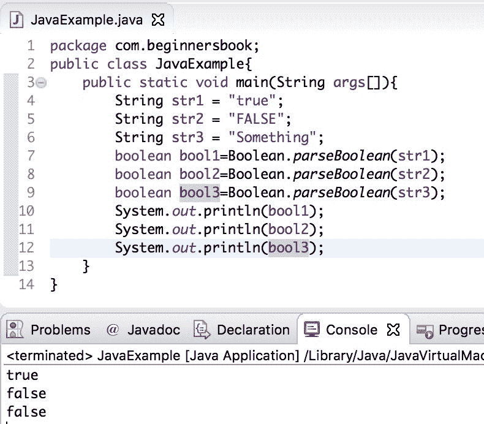
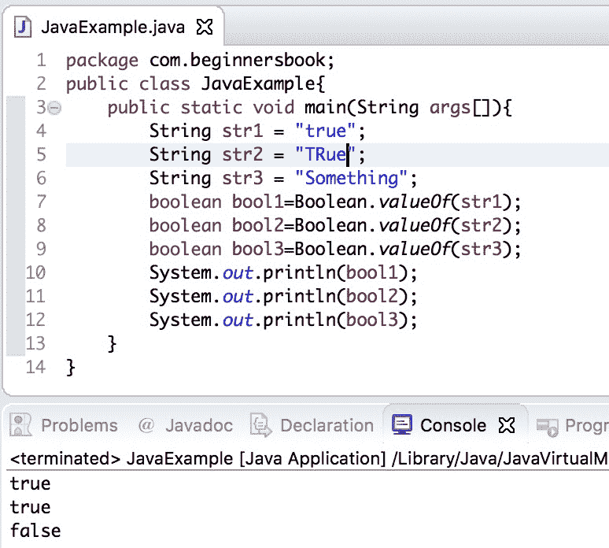

# Java String to boolean 使用示例进行转换

> 原文： [https://beginnersbook.com/2019/04/java-string-to-boolean-conversion/](https://beginnersbook.com/2019/04/java-string-to-boolean-conversion/)

在本指南中，我们将看到如何**在示例的帮助下将 String 转换为布尔值**。

将 **String 转换为布尔值**时，如果字符串包含值“true”（大小写无关紧要），则转换后的布尔值为 true，如果该字符串包含任何其他值，则比“true”那么转换后的布尔值将为“false”。

## Java String 使用 Boolean.parseBoolean（）方法示例进行布尔转换

这里我们有三个字符串 str1，str2 和 str3，我们使用 Boolean.parseBoolean（）方法将它们转换为布尔值，此方法接受 String 作为参数并返回布尔值 true 或 false。如果字符串的值为“true”（在任何情况下为大写，小写或混合），则此方法返回 true，否则返回 false。

```java
public class JavaExample{  
   public static void main(String args[]){  
	String str1 = "true";  
	String str2 = "FALSE";  
	String str3 = "Something";  
	boolean bool1=Boolean.parseBoolean(str1);  
	boolean bool2=Boolean.parseBoolean(str2);  
	boolean bool3=Boolean.parseBoolean(str3);  
	System.out.println(bool1);  
	System.out.println(bool2);  
	System.out.println(bool3);  
   }
}
```

**输出：**


## 使用 Boolean.valueOf（）示例的 Java String to boolean

在这里，我们将看到另一种方法，我们可以使用它来进行字符串到布尔转换。与 Boolean.parseBoolean（）方法类似，Boolean.valueOf（）方法接受字符串作为参数，并返回布尔值 true 或 false。

```java
public class JavaExample{  
   public static void main(String args[]){  
	String str1 = "true";  
	String str2 = "TRue";  
	String str3 = "Something";  
	boolean bool1=Boolean.valueOf(str1);  
	boolean bool2=Boolean.valueOf(str2);  
	boolean bool3=Boolean.valueOf(str3);  
	System.out.println(bool1);  
	System.out.println(bool2);  
	System.out.println(bool3);  
   }
}
```

**输出：**


[❮ Previous](https://beginnersbook.com/2015/05/java-boolean-to-string/)[Next ❯](https://beginnersbook.com/2019/04/java-binary-to-octal-conversion/)