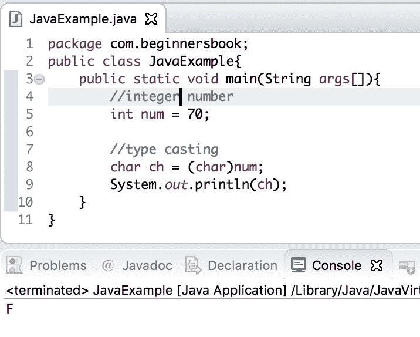

# 使用示例将 Java int 转换为 char

> 原文： [https://beginnersbook.com/2019/04/java-int-to-char-conversion/](https://beginnersbook.com/2019/04/java-int-to-char-conversion/)

在上一个教程中，我们讨论了 [char 到 int 转换](https://beginnersbook.com/2019/04/java-char-to-int-conversion/)。在本指南中，我们将看到如何借助示例将 int 转换为 char。

## Java int to char 转换示例

要将更高的数据类型转换为更低的数据类型，我们需要进行类型转换。由于 int 是比 char（2 字节）更高的数据类型（4 字节），因此我们需要为转换明确地对 int 进行类型转换。

```java
//implicit type casting - automatic conversion
char ch = 'A'; // 2 bytes
int num = ch; // 2 bytes to 4 bytes

/* explicit type casting - no automatic conversion
 * because converting higher data type to lower data type
 */
int num = 100; //4 bytes
char ch = (char)num; //4 bytes to 2 bytes
```

让我们举个例子。

在下面的示例中，我们有一个值为 70 的整数`num`，我们通过进行类型转换将其转换为 char。

```java
public class JavaExample{  
   public static void main(String args[]){  
	//integer number
	int num = 70;

	//type casting
	char ch = (char)num;  
	System.out.println(ch);  
   }
}
```

**输出：**



[❮ Previous](https://beginnersbook.com/2019/04/java-char-to-int-conversion/)[Next ❯](https://beginnersbook.com/2015/05/java-float-to-string/)