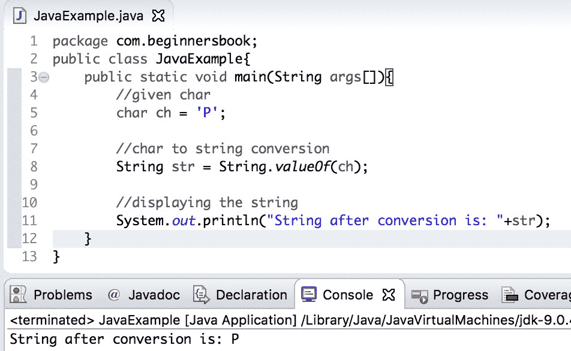
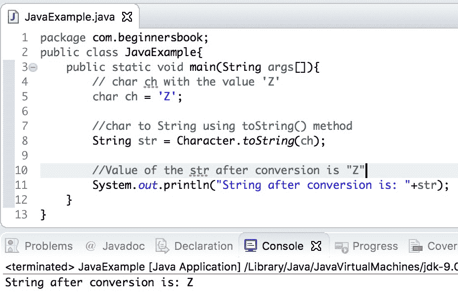

# Java 使用示例将 char 转换为 String

> 原文： [https://beginnersbook.com/2019/04/java-char-to-string-conversion/](https://beginnersbook.com/2019/04/java-char-to-string-conversion/)

在本教程中，我们将看到如何在示例的帮助下将 char 转换为字符串。

有两种方法可以对字符串进行字符串转换 -
1.使用 String.valueOf（char ch）方法
2.使用 Character.toString（char ch）方法

## 使用 String.valueOf（char ch）的 Java char to String 示例

我们可以使用 String 类的 valueOf（char ch）方法将传递的 char ch 转换为 String。此方法接受 char 作为参数，并返回与参数等效的字符串。

在下面的示例中，我们有一个 char `ch`，其值为`'P'`，我们使用 String.valueOf（）方法将其转换为 String `str`。转换后字符串的值为`"P"`。

```java
public class JavaExample{  
    public static void main(String args[]){  
	//given char
	char ch = 'P';

	//char to string conversion
	String str = String.valueOf(ch);  

	//displaying the string
	System.out.println("String after conversion is: "+str);    
   }
}
```

**输出：**


## 使用 Character.toString（char ch）进行 Java char 转换为 String

我们还可以使用 Character 类的`toString(char ch)`方法将传递的 char ch 转换为 String。与 String.valueOf（char ch）方法类似，此方法也接受 char 作为参数并返回等效的 String。

在下面的示例中，我们使用 Character.toString（char ch）方法将 char 转换为 String。

```java
public class JavaExample{  
   public static void main(String args[]){  
	// char ch with the value 'Z'
	char ch = 'Z';

	//char to String using toString() method
	String str = Character.toString(ch);  

	//Value of the str after conversion is "Z"
	System.out.println("String after conversion is: "+str);    
   }
}
```

**输出：**


[❮ Previous](https://beginnersbook.com/2019/04/java-long-to-int-conversion/)[Next ❯](https://beginnersbook.com/2019/04/java-char-to-int-conversion/)