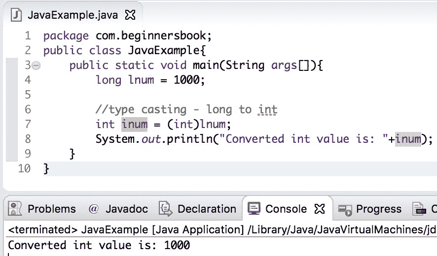

# Java 使用示例将 long 转换为 int

> 原文： [https://beginnersbook.com/2019/04/java-long-to-int-conversion/](https://beginnersbook.com/2019/04/java-long-to-int-conversion/)

在本指南中，我们将看到如何**通过示例将 long 转换为 int** 。由于 long 是比 int 更大的数据类型，我们需要为转换显式执行类型转换。

## Java long to int 示例

在下面的示例中，我们使用显式类型转换将长数据类型转换为 int 数据类型。这里我们有一个长数据类型的变量`lnum`，我们将它的值转换为一个 int 值，我们存储在 int 数据类型的变量`inum`中。

```java
public class JavaExample{  
   public static void main(String args[]){  
	long lnum = 1000;  

	//type casting - long to int
	int inum = (int)lnum;  
	System.out.println("Converted int value is: "+inum);  
   }
}
```

**输出：**


## Java long to int 示例使用 Long 包装类的 intValue（）方法

在下面的示例中，我们有一个 Long 对象`lnum`，我们使用 Long 类的`intValue()`方法将其转换为 int 基本类型。

```java
public class JavaExample{  
   public static void main(String args[]){  
	//Long object
	Long lnum = 99L;

	//Converting Long object to int primitive type
	int inum = lnum.intValue();  
	System.out.println("Converted int value: "+inum);  
   }
}
```

**输出：**


[❮ Previous](https://beginnersbook.com/2019/04/java-int-to-long-conversion/)[Next ❯](https://beginnersbook.com/2019/04/java-char-to-string-conversion/)