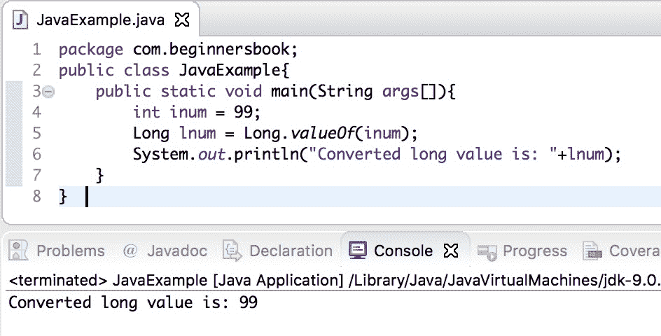

# Java 使用示例将 int 转换为 long

> 原文： [https://beginnersbook.com/2019/04/java-int-to-long-conversion/](https://beginnersbook.com/2019/04/java-int-to-long-conversion/)

在本教程中，我们将看到如何**通过示例将 int 转换为 long** 。

由于 int 是比 long 更小的数据类型，因此可以通过简单的赋值将其转换为 long。这称为隐式类型转换或类型提升，编译器自动将较小的数据类型转换为较大的数据类型。我们还可以使用 Long 包装类的 valueOf（）方法将 int 转换为 long。

## Java int to long 使用隐式类型转换

在下面的示例中，我们只是将整数数据类型分配给长数据类型。由于整数是一个较小的数据类型而不是 long，编译器会自动将 int 转换为 long，这称为类型提升。

```java
public class JavaExample{  
   public static void main(String args[]){  
	int num = 10;  

	/* Implicit type casting, automatic
	 * type conversion by compiler
	 */
	long lnum = num;  
	System.out.println(lnum);  
   }
}
```

**输出：**


## Java int to long 使用 Long.valueOf（）方法的示例

在下面的示例中，我们使用 [Long Wrapper 类](https://beginnersbook.com/2017/09/wrapper-class-in-java/)的 valueOf（）方法将 int 转换为 long。 valueOf（）方法接受 integer 作为参数，并在转换后返回 long 值。

```java
public class JavaExample{  
   public static void main(String args[]){  
	int inum = 99;  
	Long lnum = Long.valueOf(inum);  
	System.out.println("Converted long value is: "+lnum);  
   }
}
```

**输出：**


[❮ Previous](https://beginnersbook.com/2018/09/java-convert-int-to-double/)[Next ❯](https://beginnersbook.com/2019/04/java-long-to-int-conversion/)