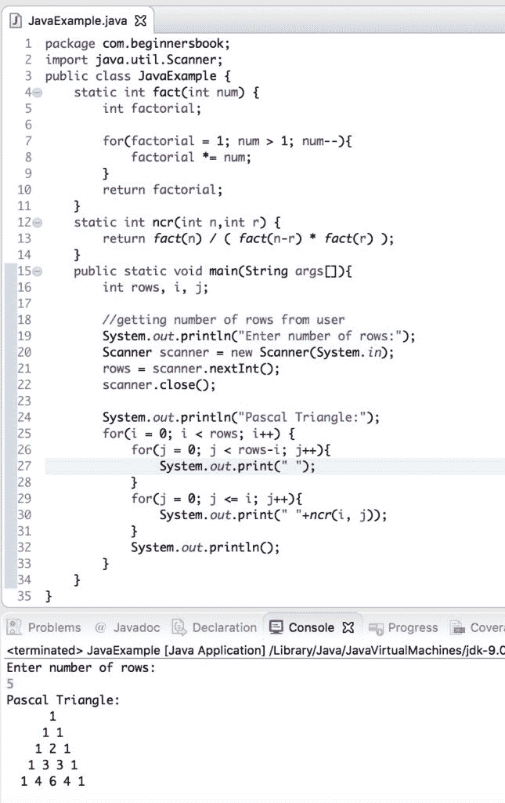

# 用于打印 Pascal Triangle 的 Java 程序

> 原文： [https://beginnersbook.com/2019/02/java-program-to-print-pascal-triangle/](https://beginnersbook.com/2019/02/java-program-to-print-pascal-triangle/)

在本教程中，我们将编写一个 java 程序来打印 [Pascal Triangle](https://en.wikipedia.org/wiki/Pascal's_triangle) 。

## Java 示例打印 Pascal 的三角形

在此程序中，要求用户输入行数，并根据输入，使用输入的行数打印 pascal 三角形。

```java
package com.beginnersbook;
import java.util.Scanner;
public class JavaExample {
    static int fact(int num) {
	int factorial;

	for(factorial = 1; num > 1; num--){
		factorial *= num;
	}
	return factorial;
    }
    static int ncr(int n,int r) {
	return fact(n) / ( fact(n-r) * fact(r) );
    }
    public static void main(String args[]){
	int rows, i, j;

	//getting number of rows from user
	System.out.println("Enter number of rows:");
	Scanner scanner = new Scanner(System.in);
	rows = scanner.nextInt();
	scanner.close();

	System.out.println("Pascal Triangle:");
	for(i = 0; i < rows; i++) {
		for(j = 0; j < rows-i; j++){
			System.out.print(" ");
		}
		for(j = 0; j <= i; j++){
			System.out.print(" "+ncr(i, j));
		}
		System.out.println();
 	}
    }
}

```

**输出：**


#### 相关的 Java 示例

1\. [Java 程序找到一个数字的平方根](https://beginnersbook.com/2019/02/java-program-to-find-square-root-of-a-number-without-sqrt/)
2\. [Java 程序检查一个数字是否完美正方](https://beginnersbook.com/2019/02/java-program-to-check-if-given-number-is-perfect-square/)
3\. [Java 程序提取来自输入数字的数字](https://beginnersbook.com/2019/02/java-program-to-break-integer-into-digits/)
4\. [使用`switch-case`制作计算器的 Java 程序](https://beginnersbook.com/2017/09/java-program-to-make-a-calculator-using-switch-case/)