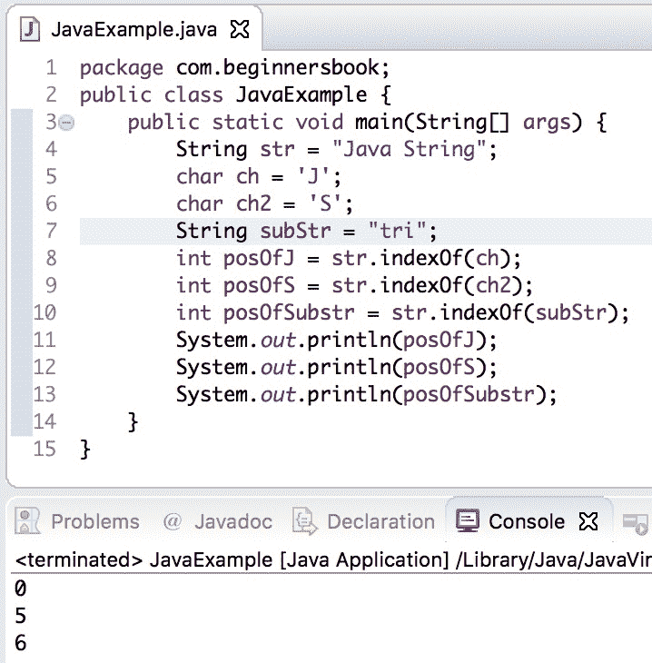

# Java String indexOf（）带示例的方法

> 原文： [https://beginnersbook.com/2013/12/java-string-indexof-method-example/](https://beginnersbook.com/2013/12/java-string-indexof-method-example/)

**Java String indexOf（）方法**用于查找给定 String 中指定字符或子字符串的索引。 [String 类](https://beginnersbook.com/2013/12/java-strings/)中有 4 种变体：

## indexOf（）方法签名

`int indexOf(int ch)`：返回给定 String 中第一次出现的字符 ch 的索引。

`int indexOf(int ch, int fromIndex)`：返回指定索引“fromIndex”后给定字符串中第一次出现字符 ch 的索引。例如，如果像这个 str.indexOf（'A'，20）那样调用 indexOf（）方法，那么它将开始在索引 20 之后的字符串`str`中查找字符'A'。

`int indexOf(String str)`：返回特定 String 中字符串 str 的索引。

`int indexOf(String str, int fromIndex)`：返回指定索引“fromIndex”后给定字符串中字符串 str 的索引。

如果在特定`String`中找不到指定的 char / substring，则上述所有变量**都返回-1** 。

## Java String indexOf（）方法示例

```
public class IndexOfExample{
   public static void main(String args[]) {
       String str1 = new String("This is a BeginnersBook tutorial");
       String str2 = new String("Beginners");
       String str3 = new String("Book");
       String str4 = new String("Books");
       System.out.println("Index of B in str1: "+str1.indexOf('B'));
       System.out.println("Index of B in str1 after 15th char:"+str1.indexOf('B', 15));
       System.out.println("Index of B in str1 after 30th char:"+str1.indexOf('B', 30));
       System.out.println("Index of string str2 in str1:"+str1.indexOf(str2));
       System.out.println("Index of str2 after 15th char"+str1.indexOf(str2, 15));
       System.out.println("Index of string str3:"+str1.indexOf(str3));
       System.out.println("Index of string str4"+str1.indexOf(str4));
       System.out.println("Index of hardcoded string:"+str1.indexOf("is"));
       System.out.println("Index of hardcoded string after 4th char:"+str1.indexOf("is", 4));
   }
}
```

**输出：**

```
Index of B in str1: 10
Index of B in str1 after 15th char:19
Index of B in str1 after 30th char:-1
Index of string str2 in str1:10
Index of str2 after 15th char-1
Index of string str3:19
Index of string str4-1
Index of hardcoded string:2
Index of hardcoded string after 4th char:5
```

## indexOf（）方法的另一个例子

让我们举一个简短的例子，我们使用 indexOf（）方法找到给定字符和[子字符串](https://beginnersbook.com/2013/12/java-string-substring-method-example/)的索引。

```
public class JavaExample {  
   public static void main(String[] args) {  
	String str = "Java String";
	char ch = 'J';
	char ch2 = 'S';
	String subStr = "tri";
	int posOfJ = str.indexOf(ch);
	int posOfS = str.indexOf(ch2);
	int posOfSubstr = str.indexOf(subStr);
	System.out.println(posOfJ);
	System.out.println(posOfS);
	System.out.println(posOfSubstr);
   }  
}
```

**输出：**

