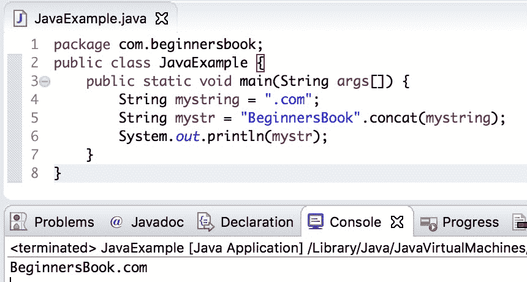

# Java String concat（）方法示例

> 原文： [https://beginnersbook.com/2013/12/java-string-concat-method-example/](https://beginnersbook.com/2013/12/java-string-concat-method-example/)

Java 字符串 concat（）方法连接多个字符串。此方法将指定的字符串附加到给定字符串的末尾，并返回组合的字符串。我们可以使用 concat（）方法连接多个字符串。

## concat（）方法签名

```
public String concat(String str)
```

此方法将字符串 str 连接到当前字符串的末尾。例如 - `s1.concat("Hello");`会在`String s1`的末尾连接字符串“Hello”。可以在这样的单个语句中多次调用此方法

```
String s1="Beginners";
s1= s1.concat("Book").concat(".").concat("com");
```

执行上述声明后，s1 的值将为 BeginnersBook.com。

## Java String concat 方法示例

在这个例子中，我们将看到使用 concat（）方法进行 String 连接的两种方法。

```
public class ConcatenationExample {
   public static void main(String args[]) {
       //One way of doing concatenation
       String str1 = "Welcome";
       str1 = str1.concat(" to ");
       str1 = str1.concat(" String handling ");
       System.out.println(str1);

       //Other way of doing concatenation in one line
       String str2 = "This";
       str2 = str2.concat(" is").concat(" just a").concat(" String");
       System.out.println(str2);
   }
}
```

**输出：**

```
Welcome to  String handling 
This is just a String
```

## Java String concat 方法的另一个例子

正如我们在上面看到的那样，concat（）方法将[字符串](https://beginnersbook.com/2013/12/java-strings/)附加到当前字符串的末尾。但是我们可以做一个解决方法，在给定字符串的开头附加**指定的字符串。**

```
public class JavaExample {
   public static void main(String args[]) {
	String mystring = ".com";
	String mystr = "BeginnersBook".concat(mystring);
	System.out.println(mystr);
   }
}
```

**输出：**
