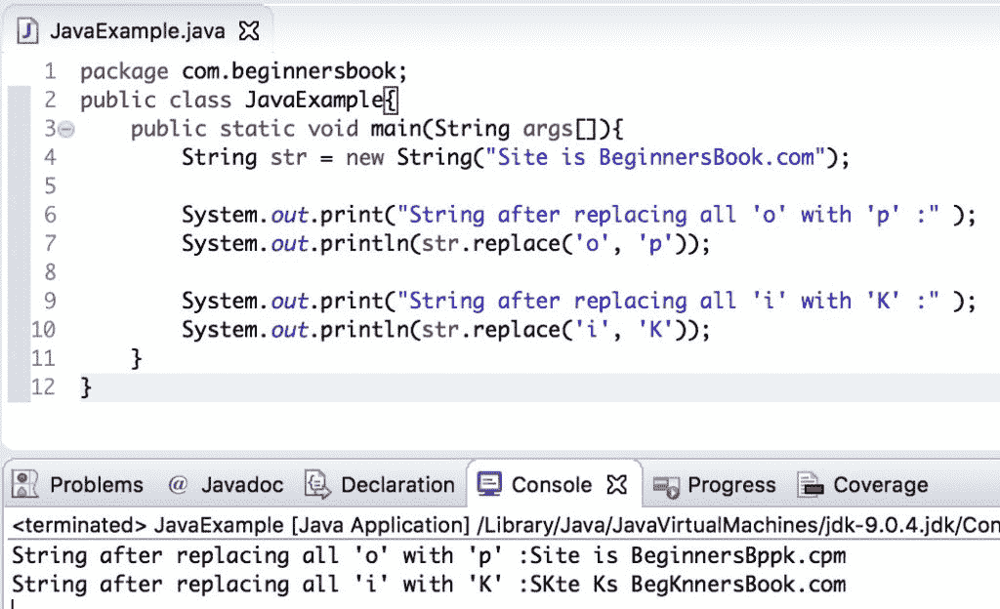
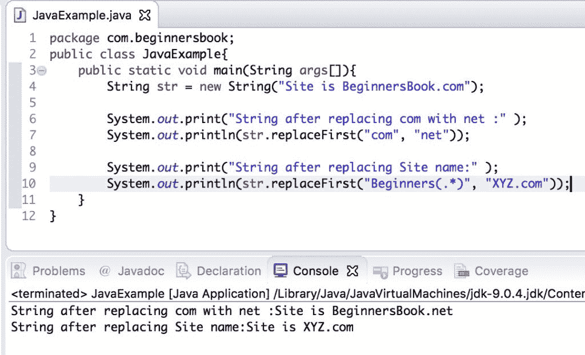
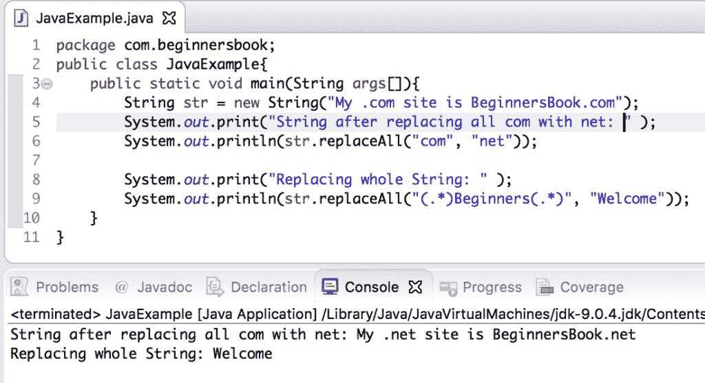

# Java `String replace()`，`replaceFirst()`和`replaceAll()`方法

> 原文： [https://beginnersbook.com/2013/12/java-string-replace-replacefirst-replaceall-method-examples/](https://beginnersbook.com/2013/12/java-string-replace-replacefirst-replaceall-method-examples/)

在本教程中，我们将讨论`replace()`，`replaceFirst()`和`replaceAll()`方法。所有这些 [Java `String`](https://beginnersbook.com/2013/12/java-strings/)方法主要用于用另一个`String`替换`String`的一部分。

## Java `String`替换方法签名

`String replace(char oldChar, char newChar)`：它用`newChar`字符替换`oldChar`字符的所有出现。对于例如`"pog pance".replace('p', 'd')`将返回`dog dance`。

`String replaceFirst(String regex, String replacement)`：它用替换字符串替换符合指定[正则表达式](https://docs.oracle.com/javase/7/docs/api/java/util/regex/Pattern.html#sum)的第一个子字符串。如果指定的正则表达式（正则表达式）无效抛出[`PatternSyntaxException`](https://docs.oracle.com/javase/7/docs/api/java/util/regex/PatternSyntaxException.html)。

`String replaceAll(String regex, String replacement)`：它用替换`String`替换所有符合给定正则表达式的子串。

## Java `String replace()`方法示例

在下面的例子中，我们有一个字符串`str`，我们正在演示使用`String str`的`replace()`方法。我们用`char 'p'`替换了`char 'o'`的所有出现。在第二个`print`语句中，我们用`char 'K'`替换了`char 'i'`的所有出现。

这里我们使用`print`语句显示修改后的字符串，但我们实际上没有更改字符串`str`，为了实现我们需要在字符串中分配返回的`replace()`方法字符串，然后该字符串可以进行永久性更改。

```java
public class JavaExample{
   public static void main(String args[]){
	String str = new String("Site is BeginnersBook.com");

	System.out.print("String after replacing all 'o' with 'p' :" );
	System.out.println(str.replace('o', 'p'));

	System.out.print("String after replacing all 'i' with 'K' :" );
	System.out.println(str.replace('i', 'K'));
   }
}

```

**输出：**



## Java `String replaceFirst()`方法示例

在下面的示例中，我们将演示如何使用`replaceFirst()`方法。此方法用新指定的字符串替换字符串的一部分。`replaceFirst()`和`replaceAll()`方法之间的区别在于`replaceFirst()`替换第一个匹配项，而`replaceAll()`替换所有匹配项。

```java
public class JavaExample{
   public static void main(String args[]){
	String str = new String("Site is BeginnersBook.com");

	System.out.print("String after replacing com with net :" );
	System.out.println(str.replaceFirst("com", "net"));

	System.out.print("String after replacing Site name:" );
	System.out.println(str.replaceFirst("Beginners(.*)", "XYZ.com"));
   }
}

```

**输出：**



## Java `String replaceAll()`方法示例

在下面的示例中，我们使用`replaceAll()`方法用新字符串替换给定子字符串的所有出现。

`replace()`和`replaceAll()`方法之间的区别在于`replace()`方法用新`char`替换旧`char`的所有出现，而`replaceAll()`方法用新字符串替换旧字符串的所有出现。基本上，`replace()`适用于替换字符，而`replaceAll()`适用于替换部分字符串。

```java
public class JavaExample{
   public static void main(String args[]){
	String str = new String("My .com site is BeginnersBook.com");
	System.out.print("String after replacing all com with net: " );
	System.out.println(str.replaceAll("com", "net"));

	System.out.print("Replacing whole String: " );
	System.out.println(str.replaceAll("(.*)Beginners(.*)", "Welcome"));
   }
}
```

**输出：**

