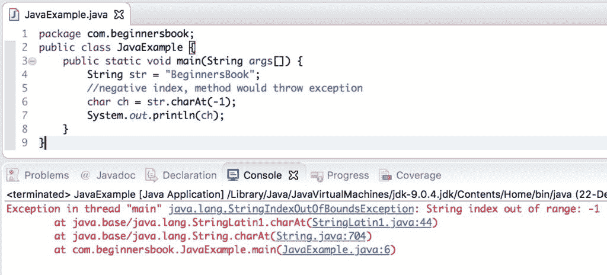
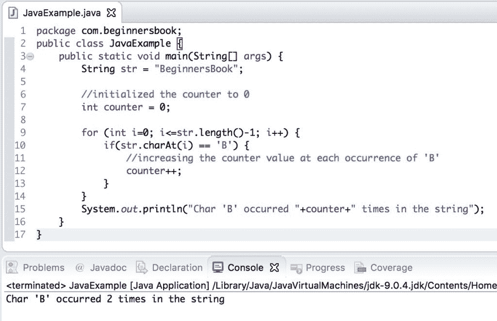

# Java String charAt（）方法示例

> 原文： [https://beginnersbook.com/2013/12/java-string-charat-m​​ethod-example/](https://beginnersbook.com/2013/12/java-string-charat-method-example/)

**Java String charAt（int index）**方法返回字符串中指定索引处的字符。我们在此方法中传递的索引值应介于 0 和（string-1 的长度）之间。例如：s.charAt（0）将返回实例 s 表示的字符串的第一个字符。如果在 charAt（）方法中传递的索引值小于或大于或等于字符串的长度（`index&lt;0|| index&gt;=length()`），则 Java String charAt 方法抛出 [IndexOutOfBoundsException](https://docs.oracle.com/javase/7/docs/api/java/lang/IndexOutOfBoundsException.html) 。

## Java String charAt（）方法示例

让我们举一个例子来理解 charAt（）方法的使用。在这个例子中，我们有一个字符串，我们使用 charAt（）方法打印字符串的第 1，第 6，第 12 和第 21 个字符。

```
public class CharAtExample {
   public static void main(String args[]) {
	String str = "Welcome to string handling tutorial";
	//This will return the first char of the string
	char ch1 = str.charAt(0);

	//This will return the 6th char of the string
	char ch2 = str.charAt(5);

	//This will return the 12th char of the string
	char ch3 = str.charAt(11);

	//This will return the 21st char of the string
	char ch4 = str.charAt(20);

	System.out.println("Character at 0 index is: "+ch1);
	System.out.println("Character at 5th index is: "+ch2);
	System.out.println("Character at 11th index is: "+ch3);
	System.out.println("Character at 20th index is: "+ch4);
   }
}
```

**输出：**

```
Character at 0 index is: W
Character at 5th index is: m
Character at 11th index is: s
Character at 20th index is: n
```

## 使用 charAt（）方法时 IndexOutOfBoundsException

当我们传递负索引或大于 length（） - 1 的索引时，charAt（）方法抛出 IndexOutOfBoundsException。在下面的示例中，我们在 charAt（）方法中传递负索引，让我们看看我们在输出中得到了什么。

```
public class JavaExample {
   public static void main(String args[]) {
	String str = "BeginnersBook";
	//negative index, method would throw exception
	char ch = str.charAt(-1);
	System.out.println(ch);
   }
}

```

**输出：**


## Java String charAt（）示例打印字符串的所有字符

为了打印字符串的所有字符，我们运行 [for 循环](https://beginnersbook.com/2015/03/for-loop-in-java-with-example/)从 0 到字符串-1 的长度，并使用 charAt（）方法在循环的每次迭代中显示字符。

```
public class JavaExample {
   public static void main(String args[]) {
	String str = "BeginnersBook";
	for(int i=0; i<=str.length()-1; i++) {
		System.out.println(str.charAt(i));
	}
   }
}
```

输出：

```
B
e
g
i
n
n
e
r
s
B
o
o
k
```

## Java String charAt（）示例计算字符的出现次数

在此示例中，我们将使用 charAt（）方法计算给定字符串中特定字符的出现次数。这里我们有一个字符串，我们正在计算字符串中字符'B'的出现次数。

```
public class JavaExample {
   public static void main(String[] args) {  
        String str = "BeginnersBook"; 

        //initialized the counter to 0
        int counter = 0;  

        for (int i=0; i<=str.length()-1; i++) {  
            if(str.charAt(i) == 'B') { 
            	//increasing the counter value at each occurrence of 'B'
                counter++;  
            }  
        }  
        System.out.println("Char 'B' occurred "+counter+" times in the string");  
   }  
}
```

**输出：**


#### 参考

[String charAt（）javadoc](https://docs.oracle.com/javase/7/docs/api/java/lang/String.html#charAt(int))