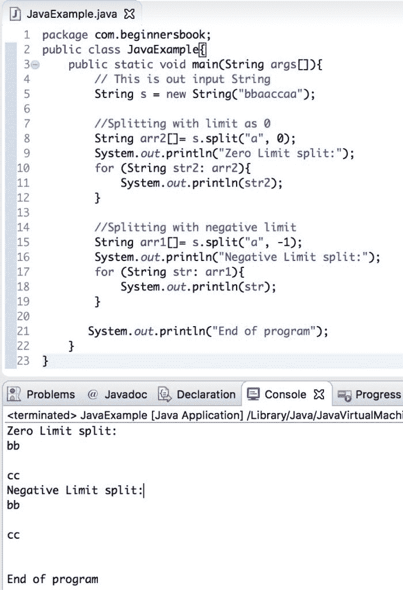
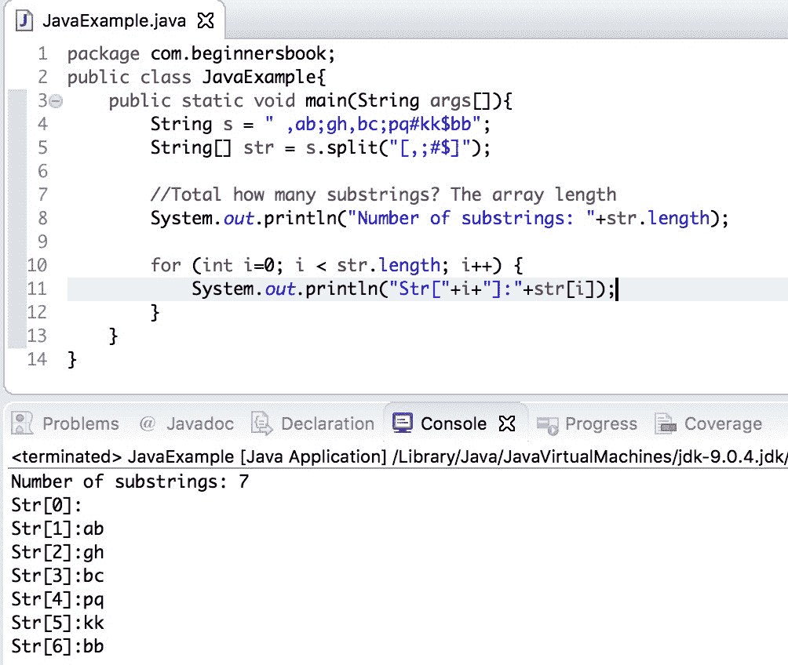

# Java String split（）方法和示例

> 原文： [https://beginnersbook.com/2013/12/java-string-split-method-example/](https://beginnersbook.com/2013/12/java-string-split-method-example/)

Java [String](https://beginnersbook.com/2013/12/java-strings/) split 方法用于根据给定的分隔符或[正则表达式](https://beginnersbook.com/2014/08/java-regex-tutorial/)将 String 拆分为其子串。

例如：

```
String: [email protected]
Regular Expression: @ 
Output : {"chaitanya", "singh"}
```

## Java 字符串拆分方法

我们在 String 类中有两种 split（）方法。

1\. `String[] split(String regex)`：在根据分隔正则表达式拆分输入 String 后返回一个字符串数组。

2\. `String[] split(String regex, int limit)`：当我们想要限制子串时，使用这个 Java String split 方法。此方法与上述方法的唯一区别在于它限制了拆分后返回的字符串数。对于例如`split("anydelimiter", 3)`将返回仅 3 个字符串的数组，即使字符串中的分隔符超过 3 次也是如此。

如果**限制为负**，则返回的数组将具有尽可能多的子串，但是当**限制为零**时，返回的数组将具有除尾随空字符串之外的所有子串。

如果指定正则表达式的语法无效，则抛出 [`PatternSyntaxException`](https://docs.oracle.com/javase/7/docs/api/java/util/regex/PatternSyntaxException.html) 。

## Java String 拆分示例

```
public class SplitExample{
   public static void main(String args[]){
	// This is out input String
	String str = new String("28/12/2013");

	System.out.println("split(String regex):");
	/* Here we are using first variation of java string split method
	 * which splits the string into substring based on the regular
	 * expression, there is no limit on the substrings
	 */
	String array1[]= str.split("/");
	for (String temp: array1){
	      System.out.println(temp);
	}

	/* Using second variation of split method here. Since the limit is passed 
	 * as 2\. This method would only produce two substrings. 
	 */
	System.out.println("split(String regex, int limit) with limit=2:");
	String array2[]= str.split("/", 2);
	for (String temp: array2){
	      System.out.println(temp);
	}

	System.out.println("split(String regex, int limit) with limit=0:");
	String array3[]= str.split("/", 0);
	for (String temp: array3){
	      System.out.println(temp);
	}

	/* When we pass limit as negative. The split method works same as the first variation
	 * because negative limit says that the method returns substrings with no limit.
	 */
	System.out.println("split(String regex, int limit) with limit=-5:");
	String array4[]= str.split("/", -5);
	for (String temp: array4){
	      System.out.println(temp);
	}
   }
}

```

**输出：**

```
split(String regex):
28
12
2013
split(String regex, int limit) with limit=2:
28
12/2013
split(String regex, int limit) with limit=0:
28
12
2013
split(String regex, int limit) with limit=-5:
28
12
2013

```

## java 字符串拆分方法中零和负限制之间的差异

在上面的示例中，split（“/”，0）和 split（“/”， - 5）返回相同的值，但在某些情况下，结果会有所不同。让我们通过一个例子来看看这两者之间的区别：

```
String s="bbaaccaa";
String arr1[]= s.split("a", -1);
String arr2[]= s.split("a", 0);
```

在这种情况下，arr1 将具有{“bb”，“”，“cc”，“”，“”}但是 arr2 将具有{“bb”，“”，“cc”}，因为极限零不包括试验空字符串。

让我们看看完整的程序。

```
public class JavaExample{
   public static void main(String args[]){
	// This is out input String
	String s = new String("bbaaccaa");

	//Splitting with limit as 0
	String arr2[]= s.split("a", 0);
	System.out.println("Zero Limit split:");
	for (String str2: arr2){
	   System.out.println(str2);
	}

	//Splitting with negative limit
	String arr1[]= s.split("a", -1);
	System.out.println("Negative Limit split:");
	for (String str: arr1){
	   System.out.println(str);
	}

       System.out.println("End of program");
   }
}
```

**输出：**


## Java 字符串拆分有多个分隔符（特殊字符）

让我们看看我们如何在使用 split（）方法时传递多个分隔符。在这个例子中，我们基于多个特殊字符拆分输入字符串。

```
public class JavaExample{
   public static void main(String args[]){
	String s = " ,ab;gh,bc;pq#kk$bb";
	String[] str = s.split("[,;#$]");

	//Total how many substrings? The array length
	System.out.println("Number of substrings: "+str.length);

	for (int i=0; i < str.length; i++) {
		System.out.println("Str["+i+"]:"+str[i]);
	}
   }
}
```

**输出：**


让我们再练习几个例子：

**示例：word 作为 Java String split 方法中的正则表达式**

```
public class SplitExample1 { 
    public static void main(String args[]) 
    { 
        String str = "helloxyzhixyzbye"; 
        String[] arr = str.split("xyz"); 

        for (String s : arr) 
            System.out.println(s); 
    } 
}
```

**Output:**

```
hello
hi
bye

```

**示例：基于空格分割字符串**

```
public class SplitExample2 { 
    public static void main(String args[]) 
    { 
        String str = "My name is Chaitanya";
        //regular expression is a whitespace here 
        String[] arr = str.split(" "); 

        for (String s : arr) 
            System.out.println(s); 
    } 
}
```

**Output:**

```
My
name
is
Chaitanya

```