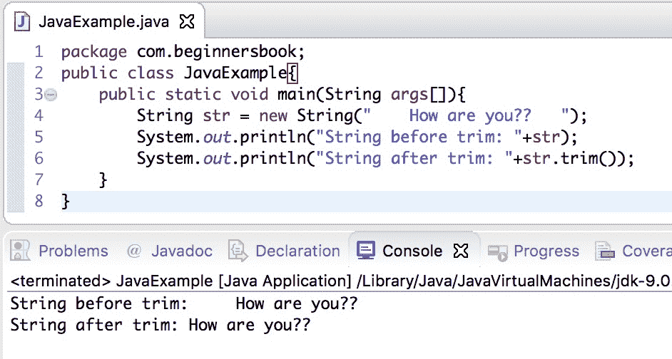
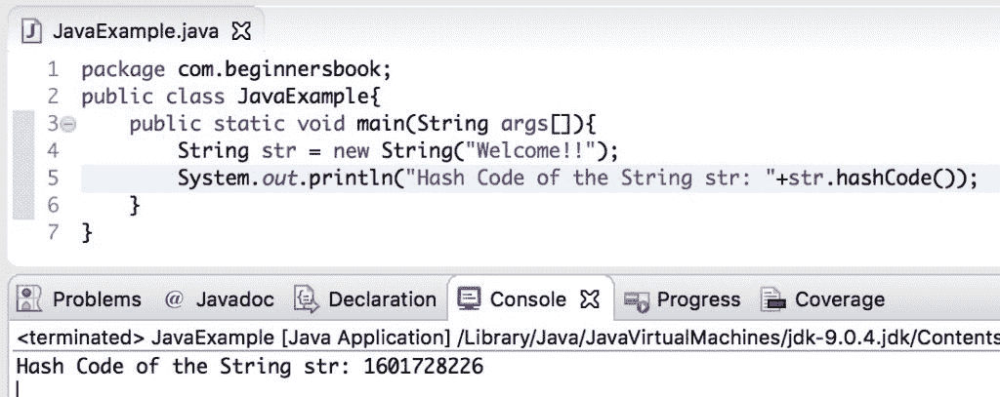

# Java String trim（）和 hashCode（）带示例的方法

> 原文： [https://beginnersbook.com/2013/12/java-string-trim-and-hashcode-methods/](https://beginnersbook.com/2013/12/java-string-trim-and-hashcode-methods/)

在本教程中，我们将在示例的帮助下讨论 Java String `trim()`和`hashCode()`方法。

## Java String trim（）方法签名

从输入 String 中删除前导和尾随空格后，它返回一个 String。对于例如`"     Hello".trim()`将返回 String `"Hello"`。

```java
public String trim()
```

## Java String trim（）方法示例

在下面的例子中，我们有一个带有前导和尾随空格的字符串，我们使用 trim（）方法去除这些前导和尾随空格，但是我们想要保留给定字符串的单词之间的空格`str`。 trim（）方法仅删除前导和尾随空格，并将空格保留在空格中。

```java
public class JavaExample{
   public static void main(String args[]){
	String str = new String("    How are you??   ");
	System.out.println("String before trim: "+str);
	System.out.println("String after trim: "+str.trim());
   }
}

```

**输出：**



## Java String hashCode（）方法签名

此方法返回 String 的哈希码。计算如下：

```java
s[0]*31^(n-1) + s[1]*31^(n-2) + ... + s[n-1]
```

```java
public int hashCode()
```

## Java hashCode（）方法示例

在下面的示例中，我们有一个字符串`str`，其值为“Welcome !!”，我们使用 hashCode（）方法显示该值的哈希码。

```java
public class JavaExample{
   public static void main(String args[]){
	String str = new String("Welcome!!");
	System.out.println("Hash Code of the String str: "+str.hashCode());	      
   }
}

```

**输出：**



#### 参考文献：

1.  [HashCode JavaDoc](https://docs.oracle.com/javase/7/docs/api/java/lang/Object.html#hashCode())
2.  [hashCode（）JavaDoc](https://docs.oracle.com/javase/7/docs/api/java/lang/String.html#hashCode())
3.  [trim（）JavaDoc](https://docs.oracle.com/javase/7/docs/api/java/lang/String.html#trim())