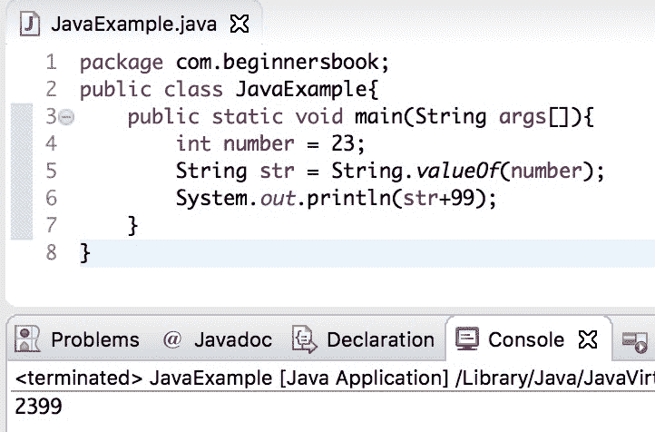
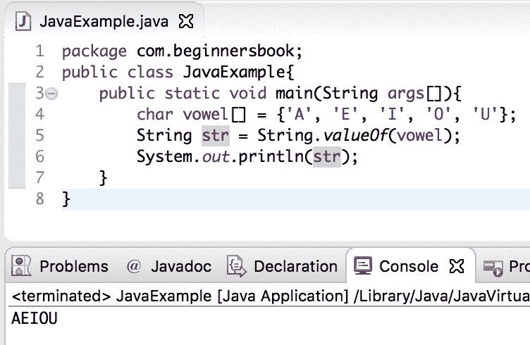

# Java String valueOf（）方法用示例解释

> 原文： [https://beginnersbook.com/2017/10/java-string-valueof-method/](https://beginnersbook.com/2017/10/java-string-valueof-method/)

**Java String valueOf（）**方法返回 boolean，char，char 数组，int，long，float 和 double 参数的 String 表示形式。对于每种类型的参数，我们有不同版本的此方法。

## java 字符串 valueOf（）方法的不同变体

```
public static String valueOf(boolean b): Used for converting boolean value to a String
public static String valueOf(char c): char to String
public static String valueOf(int i): int to String
public static String valueOf(long l): long to String
public static String valueOf(float f): float to String
public static String valueOf(double d): double to String
```

## Java String valueOf（）简单示例

让我们举一个简单的例子来理解这种方法的用法。在这个例子中，我们将 double nines 连接到给定值的末尾。给定的值是一个整数，为了在整数的末尾附加 99，我们必须首先将给定的整数转换为字符串。我们使用 valueOf（）方法将`number`转换为等效字符串`str`，然后我们[将](https://beginnersbook.com/2013/12/java-string-concat-method-example/)连接到转换字符串末尾的 99。

```
public class JavaExample{  
   public static void main(String args[]){  
	int number = 23;  
	String str = String.valueOf(number);  
	System.out.println(str+99); 
   }
}
```

**输出：**



## 方法 valueOf（）示例 2

在此示例中，我们使用 valueOf（）方法将数组转换为字符串。

```
public class JavaExample{  
   public static void main(String args[]){  
	char vowel[] = {'A', 'E', 'I', 'O', 'U'}; 
	String str = String.valueOf(vowel);  
	System.out.println(str); 
   }
}
```

**输出：**



## Java String valueOf（）示例

让我们举个例子，我们使用了 valueOf（）方法的所有变体。在这个例子中，我们使用 valueOf（）方法将 integer，float，long，double，char 和 char 数组转换为 String。

```
public class Example{  
   public static void main(String args[]){  
	int i = 10; //int value
	float f = 10.10f; //float value
	long l = 111L; //long value
	double d = 2222.22; //double value
	char ch = 'A'; //char value
	char array[] = {'a', 'b', 'c'}; //char array

	//converting int to String
	String str1 = String.valueOf(i); 

	//converting float to String
	String str2 = String.valueOf(f); 

	//converting long to String
	String str3 = String.valueOf(l);

	//converting double to String
	String str4 = String.valueOf(d);

	//converting char to String
	String str5 = String.valueOf(ch);

	//converting char array to String
	String str6 = String.valueOf(array);
	System.out.println(str1);
	System.out.println(str2);
	System.out.println(str3);
	System.out.println(str4);
	System.out.println(str5);
	System.out.println(str6);
   }
}
```

**输出：**

```
10
10.1
111
2222.22
A
abc
```

**参考：** [String valueOf（）方法 - JavaDoc](https://docs.oracle.com/javase/7/docs/api/java/lang/String.html#valueOf(boolean))