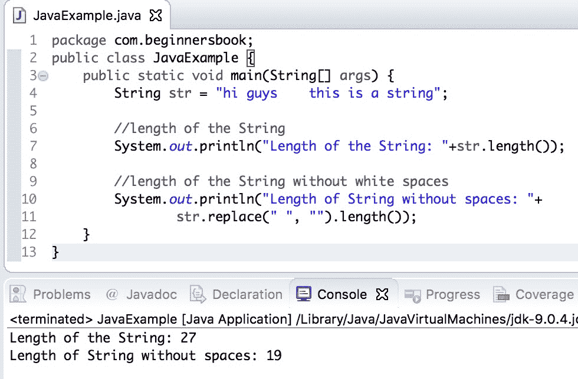

# Java String length（）带示例的方法

> 原文： [https://beginnersbook.com/2013/12/java-string-length-method-example/](https://beginnersbook.com/2013/12/java-string-length-method-example/)

**Java String length（）方法**用于查找 String 的长度。此方法计算 String 中包含空格的字符数，并返回计数。

## Java String length（）方法

```
int length()
```

此方法返回一个整数，表示给定字符串（包括空格）中的字符数（长度）。

**字符串长度限制：**字符串可以具有的最大长度为：2 &lt;sup&gt;31&lt;/sup&gt; -1。

## Java String length（）方法示例

在这个例子中，我们有三个不同的字符串，我们使用`length()`方法找出它们的长度

```
public class LengthExample{
   public static void main(String args[]) {
       String str1= new String("Test String");
       String str2= new String("Chaitanya");
       String str3= new String("BeginnersBook");
       System.out.println("Length of str1:"+str1.length());
       System.out.println("Length of str2:"+str2.length());
       System.out.println("Length of str3:"+str3.length());
   }
}
```

**输出：**

```
Length of str1:11
Length of str2:9
Length of str3:13
```

## Java String length（）方法计算没有空格的 String 的长度

正如我们在上面的例子中已经看到的那样，这个方法在计算给定字符串中的字符数时计算空格。如果您只想计算字符串中除白色空格之外的字符数，那么您可以使用[字符串替换方法](https://beginnersbook.com/2013/12/java-string-replace-replacefirst-replaceall-method-examples/)来完成此操作，如下例所示。

这里我们使用 replace 方法省略给定 String 中的空格，然后在其上使用 **length（）方法**。

在这里，我们使用 replace（）方法替换所有空格（删除它们），然后在更新的字符串上使用 length 方法。

```
public class JavaExample {
   public static void main(String[] args) {
	String str = "hi guys    this is a string";

	//length of the String
	System.out.println("Length of the String: "+str.length());

	//length of the String without white spaces
	System.out.println("Length of String without spaces: "+
	str.replace(" ", "").length());
   }
}
```

**输出：**
