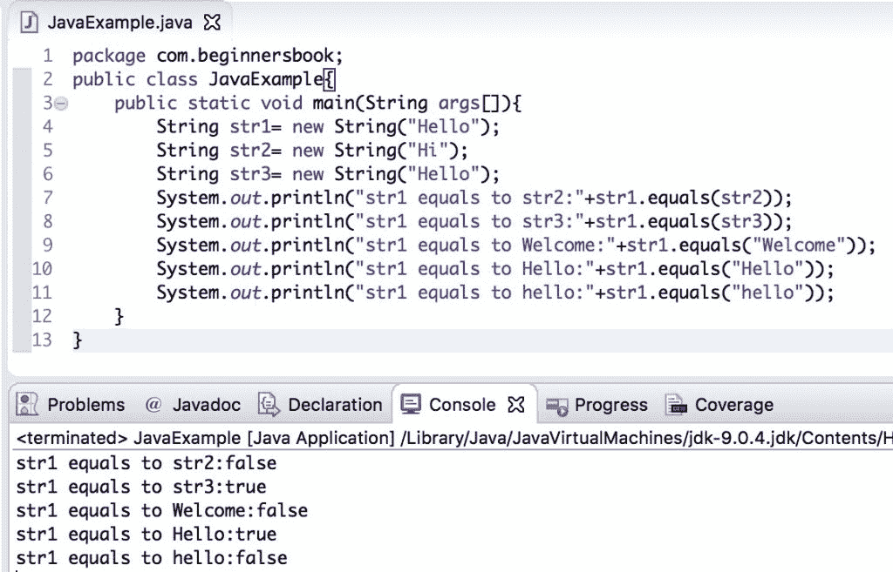
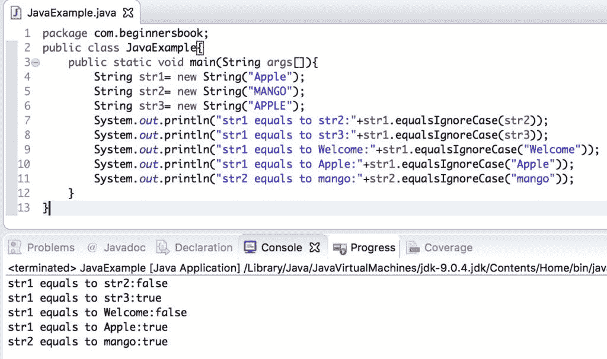

# Java String`equals()`和`equalsIgnoreCase()`方法

> 原文： [https://beginnersbook.com/2013/12/java-string-equals-and-equalsignorecase-methods-example/](https://beginnersbook.com/2013/12/java-string-equals-and-equalsignorecase-methods-example/)

在本教程中，我们将讨论`equals()`和`equalsIgnoreCase()`方法。这两种方法都用于比较两个字符串。它们之间的唯一区别是`equals()`方法考虑了大小写，而`equalsIgnoreCase()`方法在比较期间忽略了大小写。对于例如如果我们比较字符串`"TEXT"`和`"text"`，`equals()`方法将返回`false`，但`equalsIgnoreCase()`将返回`true`。

`boolean equals(String str)`：区分大小写
`boolean equalsIgnoreCase(String str)`：不区分大小写

## Java `String equals()`方法示例

在这个例子中，我们将看到`equals()`方法在不同场景中的工作原理。我们可以使用`equals()`方法比较两个`String`实例（`str1`，`str2`，`str3`），就像我们在下面的例子中所做的那样，或者我们也可以比较字符串实例和作为参数传递给`equals()`方法的硬编码字符串，如以下示例。

您可以在输出中观察到，当我们将`String str1`（值`"Hello"`）与字符串`"hello"`进行比较时，`equals()`方法返回`false`，因为此方法区分大小写并在比较字符串时考虑了大小写。另一方面，`equalsIgnoreCase()`方法在忽略它们的情况时比较字符串，我们将在下一节中看到。

```
public class JavaExample{
   public static void main(String args[]){
	String str1= new String("Hello");
	String str2= new String("Hi");
	String str3= new String("Hello");
	System.out.println("str1 equals to str2:"+str1.equals(str2));
	System.out.println("str1 equals to str3:"+str1.equals(str3));
	System.out.println("str1 equals to Welcome:"+str1.equals("Welcome"));
	System.out.println("str1 equals to Hello:"+str1.equals("Hello"));
	System.out.println("str1 equals to hello:"+str1.equals("hello"));
   }
}

```

**输出：**



## Java `String equalsIgnoreCase()`方法示例

方法`equalsIgnoreCase()`在比较两个字符串时忽略大小写。在下面的示例中，我们将字符串`"Apple"`与字符串`"APPLE"`进行了比较，并返回`true`。

```
public class JavaExample{
   public static void main(String args[]){
	String str1= new String("Apple");
	String str2= new String("MANGO");
	String str3= new String("APPLE");
	System.out.println("str1 equals to str2:"+str1.equalsIgnoreCase(str2));
	System.out.println("str1 equals to str3:"+str1.equalsIgnoreCase(str3));
	System.out.println("str1 equals to Welcome:"+str1.equalsIgnoreCase("Welcome"));
	System.out.println("str1 equals to Apple:"+str1.equalsIgnoreCase("Apple"));
	System.out.println("str2 equals to mango:"+str2.equalsIgnoreCase("mango"));
   }
}

```

**输出：**

