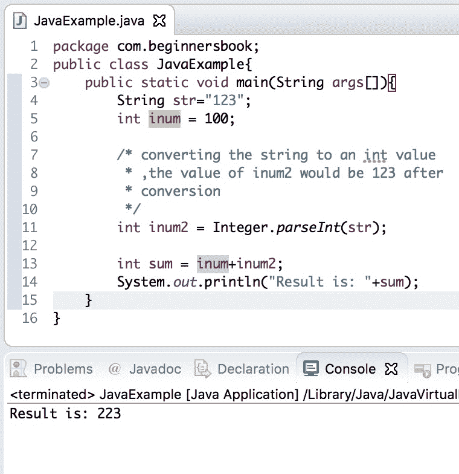
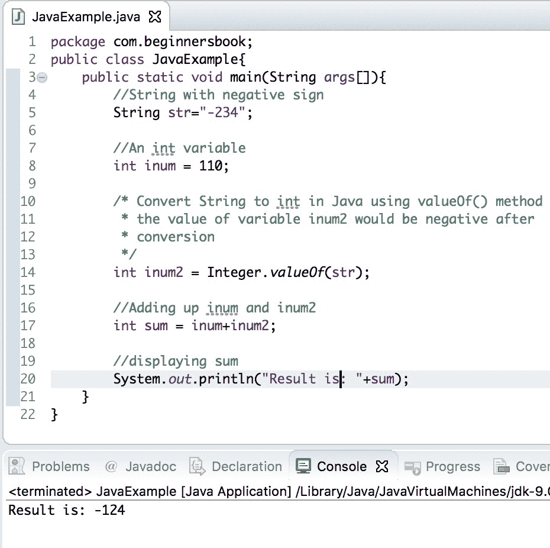
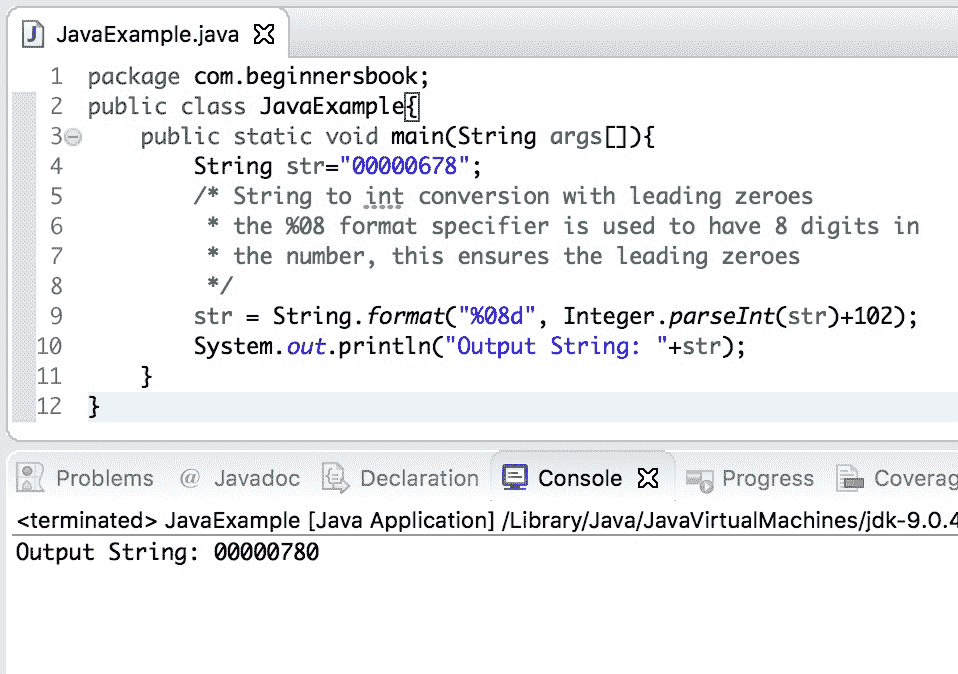

# Java 将 String 转换为 int 示例

> 原文： [https://beginnersbook.com/2013/12/how-to-convert-string-to-int-in-java/](https://beginnersbook.com/2013/12/how-to-convert-string-to-int-in-java/)

在这个[教程](https://beginnersbook.com/java-tutorial-for-beginners-with-examples/)中，我们将学习如何**在 Java** 中将 String 转换为 int。如果[字符串](https://beginnersbook.com/2013/12/java-strings/)由 1,2,3 等数字组成，则在将其转换为整数值之前，不能对其执行任何算术运算。在本教程中，我们将看到两种将 String 转换为 int 的方法 -

1\. Java - 使用 Integer.parseInt（String）方法将字符串转换为 int
2\. Java - 使用 Integer.valueOf（String）方法将 String 转换为 int

## 1\. Java - 使用 Integer.parseInt（String）将 String 转换为 int

[整数包装类](https://beginnersbook.com/2017/09/wrapper-class-in-java/)的 parseInt（）方法将字符串解析为有符号整数。这就是我们进行转换的方式 -

这里我们有一个字符串`str`，其值为“1234”，方法 parseInt（）将`str`作为参数，并在解析后返回整数值。

```
String str = "1234";
int inum = Integer.parseInt(str);
```

让我们看看完整的例子 -

### Java 使用 Integer.parseInt（String）将 String 转换为 int 示例

```
public class JavaExample{
   public static void main(String args[]){
	String str="123";
	int inum = 100;

	/* converting the string to an int value
	 * ,the value of inum2 would be 123 after
	 * conversion
	 */
	int inum2 = Integer.parseInt(str);

	int sum = inum+inum2;
	System.out.println("Result is: "+sum);
   }
}

```

输出：


**注**：**字符串中的所有字符必须是数字**，但第一个字符可以是减号' - '。例如：

```
String str="-1234";
int inum = Integer.parseInt(str);
```

`inum`的值为-1234

如果 String 对转换无效，Integer.parseInt（）将抛出 NumberFormatException。例如：

```
String str="1122ab";
int num = Integer.valueOf(str);
```

这会抛出`NumberFormatException`。你会看到像这样的编译错误：

```
Exception in thread "main" java.lang.NumberFormatException: For input string: "1122ab"
 at java.lang.NumberFormatException.forInputString(Unknown Source)
 at java.lang.Integer.parseInt(Unknown Source)
 at java.lang.Integer.parseInt(Unknown Source)
```

让我们看一下 String 到 int 转换的完整代码。

## 2\. Java - 使用 Integer.valueOf（String）将 String 转换为 int

`Integer.valueOf(String)`与`Integer.parseInt(String)`的作用相同。它还将 String 转换为 int 值。但是`Integer.valueOf()`和`Integer.parseInt()`之间存在差异，`valueOf(String)`方法返回 Integer 类的对象，而`parseInt(String)`方法返回原始 int 值。无论您选择哪种方法，转换的输出都是相同的。这是它的使用方法：

```
String str="1122";
int inum = Integer.valueOf(str);
```

inum 的值为 1122。

此方法还允许 String 的第一个字符为减号 - “”符号。

```
String str="-1122";
int inum = Integer.valueOf(str);
```

inum 的值为-1122。

与 parseInt（String）方法类似，当 String 中的所有字符都不是数字时，它也会抛出`NumberFormatException`。例如，值为“11aa22”的 String 将引发异常。

让我们看看使用此方法进行转换的完整代码。

### Java 使用 Integer.valueOf（String）将 String 转换为 int 示例

```
public class JavaExample{
   public static void main(String args[]){
	//String with negative sign
	String str="-234";

	//An int variable
	int inum = 110;

	/* Convert String to int in Java using valueOf() method
	 * the value of variable inum2 would be negative after 
	 * conversion
	 */
	int inum2 = Integer.valueOf(str);

	//Adding up inum and inum2
	int sum = inum+inum2;

	//displaying sum
	System.out.println("Result is: "+sum);
   }
}

```

输出：


让我们看一下 String 到 int 转换的另一个有趣的例子。

## 将 String 转换为带有前导零的 int

在这个例子中，我们有一个由带有前导零的数字组成的字符串，我们想对保留前导零的字符串执行算术运算。为此，我们将字符串转换为 int 并执行算术运算，稍后我们将使用 format（）方法将输出值转换为字符串。

```
public class JavaExample{
   public static void main(String args[]){
       String str="00000678";
       /* String to int conversion with leading zeroes
        * the %08 format specifier is used to have 8 digits in
        * the number, this ensures the leading zeroes
        */
       str = String.format("%08d", Integer.parseInt(str)+102);
       System.out.println("Output String: "+str);
   }
}
```

输出：


#### 参考文献：

*   [Integer.parseInt（String）JavaDoc](https://docs.oracle.com/javase/7/docs/api/java/lang/Integer.html#parseInt(java.lang.String))
*   [Integer.valueOf（String）JavaDoc](https://docs.oracle.com/javase/7/docs/api/java/lang/Integer.html#valueOf(java.lang.String))
*   [NumberFormatException JavaDoc](https://docs.oracle.com/javase/7/docs/api/java/lang/NumberFormatException.html)