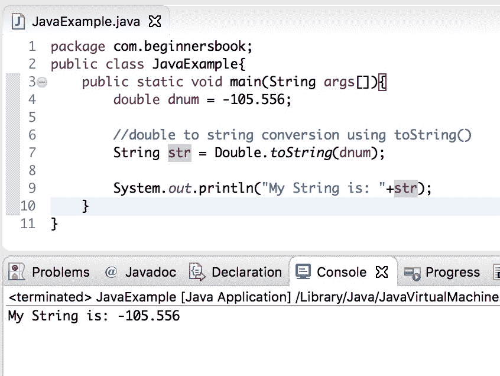
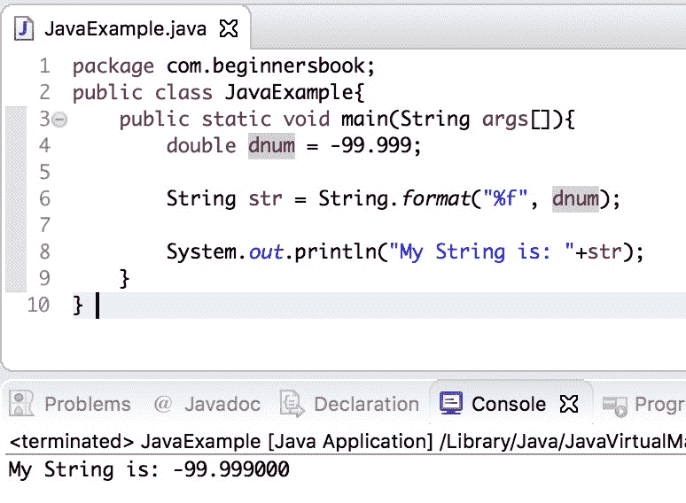
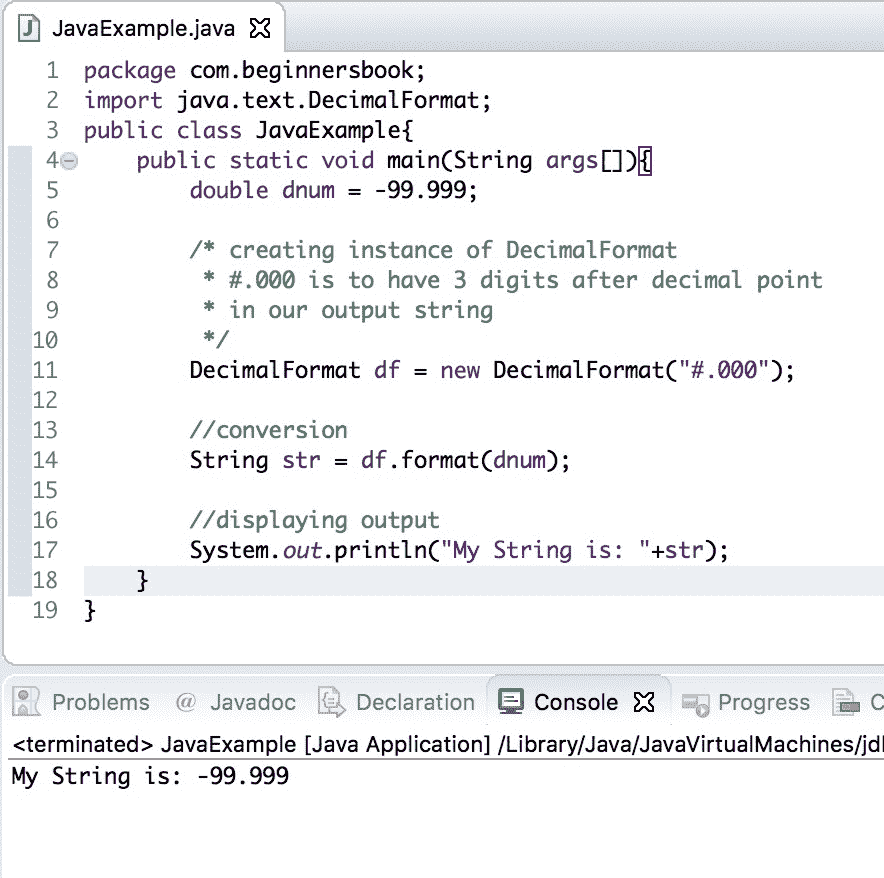
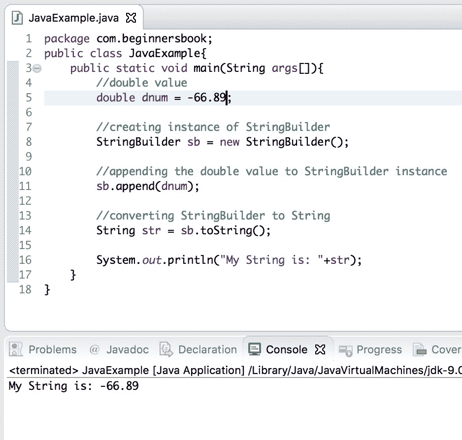

# Java - 将 double 转换为字符串示例

> 原文： [https://beginnersbook.com/2015/05/java-double-to-string/](https://beginnersbook.com/2015/05/java-double-to-string/)

在 [java 教程](https://beginnersbook.com/java-tutorial-for-beginners-with-examples/)中，我们将学习如何**在 Java** 中将 double 转换为字符串。我们可以通过多种方式进行此转换 -
1\. Java - 使用 String.valueOf（double）方法将 double 转换为字符串。
2.使用 Double [包装类](https://beginnersbook.com/2017/09/wrapper-class-in-java/)的 toString（）方法在 Java 中将 double 转换为字符串。
3\. Java - 使用 String.format（）方法进行双字符串转换
4.使用 DecimalFormat.format（）
将 double 转换为字符串 5.使用 [StringBuffer 和 StringBuilder 将 Java 转换为字符串](https://beginnersbook.com/2014/08/stringbuilder-vs-stringbuffer/)。

## 1\. Java - 使用 String.valueOf（double）方法将 double 转换为字符串

`public static String valueOf(double d)`：我们可以通过调用 String 类的 valueOf（）方法将 double 原语转换为 [String](https://beginnersbook.com/2013/12/java-strings/) 。此方法返回 double 参数的字符串表示形式。

```
public class JavaExample{  
   public static void main(String args[]){ 
	//double value
	double dnum = 99.9999;  

	//convert double to string using valueOf() method
	String str = String.valueOf(dnum);  

	//displaying output string after conversion
	System.out.println("My String is: "+str);  
   }
}
```

输出：


## 2.使用 Double 包装类的 toString（）方法在 Java 中将 double 转换为字符串

`public String toString( )`：这是另一种可用于**将 double 转换为 String** 的方法。此方法返回 Double 对象的字符串表示形式。此对象表示的原始 double 值将转换为字符串。

```
public class JavaExample{  
   public static void main(String args[]){ 
	double dnum = -105.556;  

	//double to string conversion using toString()
	String str = Double.toString(dnum);  

	System.out.println("My String is: "+str);
   }
}
```

输出：


## 3\. Java - 使用 String.format（）方法进行双字符串转换

String.format（）方法可用于双字符串转换。

```
public class JavaExample{  
   public static void main(String args[]){ 
	double dnum = -99.999;  

	String str = String.format("%f", dnum); 

	System.out.println("My String is: "+str);
   }
}
```

输出：


我们可以使用这种方法调整字符串中的小数位数。例如：如果我们在字符串中只需要小数点后两位数，那么我们可以像这样更改代码：

```
double dnum = -99.999;  
String str = String.format("%.2f", dnum);
```

此代码的输出将是：`My String is: -100.00`

这是因为这个方法的双倍值。

## 4.使用 DecimalFormat.format（）将 double 转换为字符串

与 String.format（）方法类似。要使用它，我们必须在我们的代码中导入包：java.text.DecimalFormat。

```
import java.text.DecimalFormat;
public class JavaExample{  
   public static void main(String args[]){ 
	double dnum = -99.999;  

	/* creating instance of DecimalFormat
	 * #.000 is to have 3 digits after decimal point 
	 * in our output string
	 */
	DecimalFormat df = new DecimalFormat("#.000");

	//conversion
	String str = df.format(dnum);

	//displaying output
	System.out.println("My String is: "+str);
   }
}
```

输出：


## 5\. Java 使用 StringBuffer 和 StringBuilder 将 double 转换为字符串

我们也可以使用 StringBuffer 和 StringBuilder 将 double 转换为 string。两者的转换步骤相同。步骤如下 -
1.创建 StringBuffer / StringBuilder 实例
2.追加双值
3.将 StringBuffer / StringBuilder 转换为 String
**double - ＆gt; StringBuffer - ＆gt; String**

```
public class JavaExample{  
   public static void main(String args[]){ 
	//double value
	double dnum = 89.891;

	//creating instance of StringBuffer
	StringBuffer sb = new StringBuffer();

	//appending the double value to StringBuffer instance
	sb.append(dnum);

	//converting StringBuffer to String
	String str = sb.toString();

	System.out.println("My String is: "+str);
   }
}
```

输出：

```
My String is: 89.891
```

**double - ＆gt; StringBuilder - ＆gt; String**

```
public class JavaExample{  
   public static void main(String args[]){ 
	//double value
	double dnum = -66.89;

	//creating instance of StringBuilder
	StringBuilder sb = new StringBuilder();

	//appending the double value to StringBuilder instance
	sb.append(dnum);

	//converting StringBuilder to String
	String str = sb.toString();

	System.out.println("My String is: "+str);
   }
}
```

输出：
