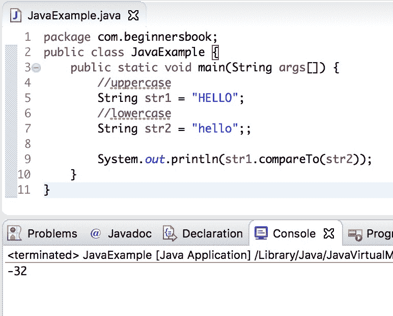

# Java `String compareTo()`方法

> 原文： [https://beginnersbook.com/2013/12/java-string-compareto-method-example/](https://beginnersbook.com/2013/12/java-string-compareto-method-example/)

Java `String compareTo()`方法用于按字典顺序比较两个字符串。两个字符串的每个字符都转换为 Unicode 值以进行比较。如果两个字符串都相等，则此方法返回 0，否则返回正值或负值。如果第一个字符串按字典顺序大于第二个字符串，则结果为正，否则结果为负。

## Java `String compareTo()`方法

我们有以下两种使用`compareTo()`方法的方法：

```java
int compareTo(String str)
```

这里比较字符串。例如`string1.compareTo(string2)`，其中`string1`和`string2`是`String`。

```java
int compareTo(Object obj)
```

这里比较是在字符串和对象之间。例如`string1.compareTo("Just a String object")`，其中`string1`是一个字符串，它的值与方法参数中指定的字符串进行比较。

## Java `String compareTo()`方法示例

这里我们有三个字符串，我们使用`compareTo()`方法将它们相互比较。

```java
public class CompareToExample {
   public static void main(String args[]) {
       String str1 = "String method tutorial";
       String str2 = "compareTo method example";
       String str3 = "String method tutorial";

       int var1 = str1.compareTo( str2 );
       System.out.println("str1 & str2 comparison: "+var1);

       int var2 = str1.compareTo( str3 );
       System.out.println("str1 & str3 comparison: "+var2);

       int var3 = str2.compareTo("compareTo method example");
       System.out.println("str2 & string argument comparison: "+var3);
   }
}
```

输出：

```java
str1 & str2 comparison: -16
str1 & str3 comparison: 0
str2 & string argument comparison: 0
```

## 如何使用`String compareTo()`方法查找字符串的长度

在这里，我们将看到一个有趣的示例，说明如何使用`compareTo()`方法来查找字符串的长度。如果我们使用`compareTo()`方法将字符串与**空字符串**进行比较，则该方法将返回非空字符串的长度。

例如：

```java
String str1 = "Negan";  
String str2 = ""; //empty string

//it would return the length of str1 in positive number
str1.compareTo(str2); // 5

//it would return the length of str1 in negative number
str2.compareTo(str1); //-5

```

在上面的代码片段中，第二个`compareTo()`语句以负数返回长度，这是因为我们将空字符串与`str1`进行了比较，而在第一个`compareTo()`语句中，我们将`str1`与空字符串进行了比较。

让我们看看完整的例子：

```java
public class JavaExample {
    public static void main(String args[]) {
	String str1 = "Cow"; 
	//This is an empty string
	String str2 = "";
	String str3 = "Goat";

	System.out.println(str1.compareTo(str2));

	System.out.println(str2.compareTo(str3));
   }
}
```

**输出：**


## Java `String compareTo()`方法区分大小写吗？

在这个例子中，我们将使用`compareTo()`方法比较两个字符串。两个字符串都相同，但其中一个字符串为大写，另一个字符串为小写。

```java
public class JavaExample {
   public static void main(String args[]) {
	//uppercase
	String str1 = "HELLO"; 
	//lowercase
	String str2 = "hello";;

	System.out.println(str1.compareTo(str2));
   }
}
```

**输出：**



如您所见，输出不为零，这意味着`compareTo()`方法区分大小写。但是我们在字符串类中有一个不区分大小写的比较方法，它是[`compareToIgnoreCase()`](https://beginnersbook.com/2013/12/java-string-comparetoignorecase-method-example/)，这个方法在比较两个字符串时忽略了大小写。