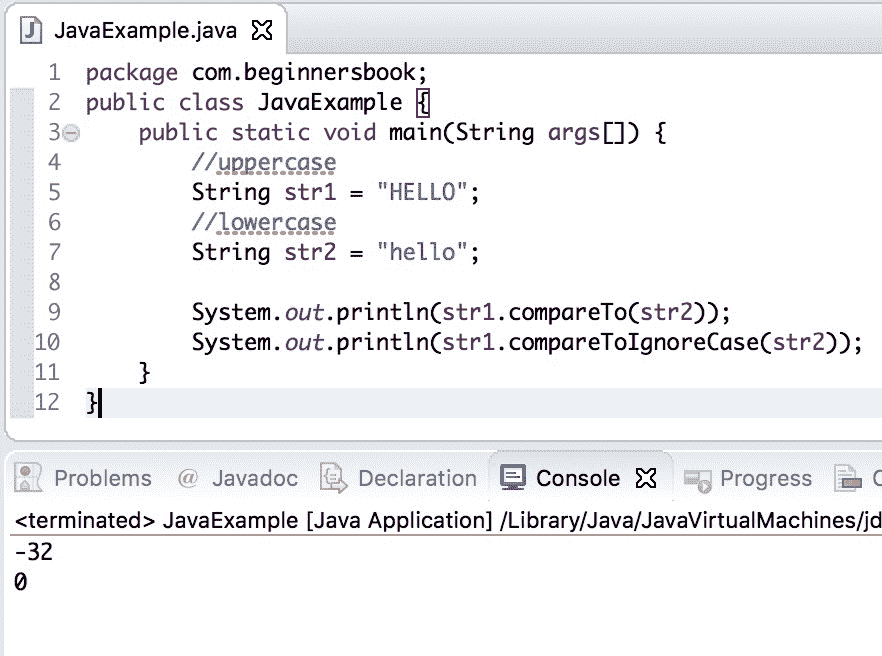

# Java `String compareToIgnoreCase()`方法

> 原文： [https://beginnersbook.com/2013/12/java-string-comparetoignorecase-method-example/](https://beginnersbook.com/2013/12/java-string-comparetoignorecase-method-example/)

Java `String compareToIgnoreCase()`方法按字典顺序比较两个字符串，如果它们相等则返回 0。正如我们所知[`compareTo()`方法](https://beginnersbook.com/2013/12/java-string-compareto-method-example/)做同样的事情，但这两种方法之间存在差异。与`compareTo()`方法不同，`compareToIgnoreCase()`方法在比较字符串时忽略大小写（大写或小写）。

## Java `String compareToIgnoreCase()`方法

**方法签名：**

```java
int compareToIgnoreCase(String str)
```

**例如：**

```java
String s1 = "BEGINNERSBOOK"; //uppercase
String s2 = "beginnersBOOK"; //mixedcase
s1.compareTo(s2); //this would return non-zero value
s1.compareToIgnoreCase(s2); //this would return zero

```

与`compareTo()`方法类似，`compareToIgnoreCase()`方法根据每个字符的 Unicode 值比较字符串。当字符串相等时返回 0，否则返回正值或负值。

## Java `String compareToIgnoreCase()`示例

在下面的示例中，我们有三个字符串，所有三个字符串都相同，但它们的字母大小写不同。`string1`是大写字母，`string2`是小写字母，`string3`是大写和小写字母的混合。我们使用`compareToIgnoreCase()`方法来比较这些字符串。

```java
public class CompareExample {
   public static void main(String args[]) {
	String string1 = "HELLO";
	String string2 = "hello";
	String string3 = "HellO";

	int var1 = string1.compareToIgnoreCase(string2);
	System.out.println("string1 and string2 comparison: "+var1);

	int var2 = string1.compareToIgnoreCase(string3);
	System.out.println("string1 and string3 comparison: "+var2);

	int var3 = string1.compareToIgnoreCase("HeLLo");
	System.out.println("string1 and HeLLo comparison: "+var3);
   }
}
```

**输出：**

```java
string1 and string2 comparison: 0
string1 and string3 comparison: 0
string1 and HeLLo comparison: 0
```

## Java `String compareToIgnoreCase()` vs `compareTo()`示例

让我们举一个例子来理解这两种方法之间的区别。这里我们比较两个字符串，它们是相同的，但它们的字母大小写不同。其中一个字符串为大写，第二个字符串为小写。

```java
public class JavaExample {
   public static void main(String args[]) {
	//uppercase
	String str1 = "HELLO";
	//lowercase
	String str2 = "hello";

	System.out.println(str1.compareTo(str2));
	System.out.println(str1.compareToIgnoreCase(str2));
   }
}
```

**输出：**

