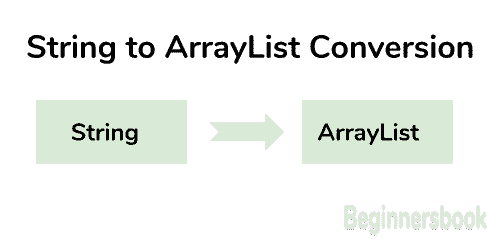

# Java - `String`到`ArrayList`转换

> 原文： [https://beginnersbook.com/2015/05/java-string-to-arraylist-conversion/](https://beginnersbook.com/2015/05/java-string-to-arraylist-conversion/)

在这个 [java 教程](https://beginnersbook.com/java-tutorial-for-beginners-with-examples/)中，我们将[`String`](https://beginnersbook.com/2013/12/java-strings/)转换为[`ArrayList`](https://beginnersbook.com/2013/12/java-arraylist/)。转换的步骤如下：



1）首先使用[`String split()`方法](https://beginnersbook.com/2013/12/java-string-split-method-example/)分割字符串，并将子字符串分配给字符串数组。我们可以根据任何字符，表达式等拆分字符串。

2）创建[`ArrayList`](https://beginnersbook.com/2013/12/java-arraylist/)并使用`Arrays.asList()`方法将字符串数组的元素复制到新创建的`ArrayList`。此方法返回基于指定数组的元素创建的列表。

## 将`String`转换为`ArrayList`的程序

在这个 [java 程序](https://beginnersbook.com/2017/09/java-examples/)中，我们有一个字符串，其中包含一些带分隔符的数字作为逗号（`,`）。我们基于分隔符拆分字符串，然后将这些数字分配给字符串数组。
稍后我们使用`Arrays`的`asList()`方法将字符串数组的所有元素复制到`ArrayList`。

```java
import java.util.ArrayList;
import java.util.List;
import java.util.Arrays;
public class JavaExample {
    public static void main(String args[]){
	String num = "22,33,44,55,66,77";
	String str[] = num.split(",");
	List<String> al = new ArrayList<String>();
	al = Arrays.asList(str);
	for(String s: al){
	   System.out.println(s);
	}
   }
}
```

**输出：**

```java
22
33
44
55
66
77

```

**注意：**在上面的例子中，分隔符是逗号但是我们可以根据任何分隔符分割字符串。例如 - 如果字符串是`"hello hi namaste bye"`，那么我们可以使用空格作为分隔符来拆分字符串，如下所示 -

```java
Here we have provided whitespace as delimiter
String str[] = num.split(" ");
```