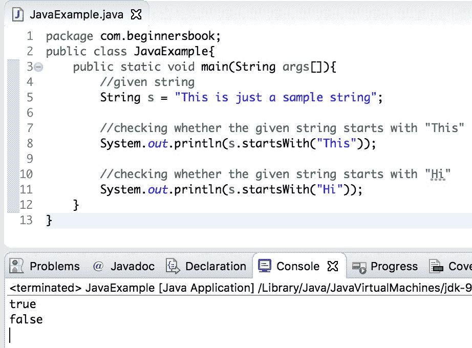

# Java `String startsWith()`方法

> 原文： [https://beginnersbook.com/2013/12/java-string-startswith-method-example/](https://beginnersbook.com/2013/12/java-string-startswith-method-example/)

[字符串类](https://beginnersbook.com/2013/12/java-strings/)的`startsWith()`方法用于检查字符串的前缀。它根据给定的字符串是否以指定的字母或单词开头，返回布尔值`true`或`false`。

**例如：**

```
String str = "Hello";

//This will return true because string str starts with "He"
str.startsWith("He"); 

```

## Java `String startsWith()`方法

`StarsWith()`方法有两种变体。

`boolean startsWith(String str)`：如果`String str`是`String`的前缀，则返回`true`。

`boolean startsWith(String str, index fromIndex)`：如果`String`以`str`开头，则返回`true`，它从指定的索引`fromIndex`开始查找。例如，假设`String s`的值是`"Hi there"`，我们调用这样的`starsWith()`方法 - `s.startsWith("there", 3)`然后这将返回`true`，因为我们已经将值 3 作为`fromIndex`传递，搜索关键字`"there"`从给定字符串`s`的索引 3 开始，并在字符串`s`的开头找到。

## `startsWith()`方法的一个简单示例

这是一个简单的例子，我们有一个字符串`s`，我们正在使用`startsWith()`方法检查字符串`s`是否以特定的单词开头。

```
public class JavaExample{  
   public static void main(String args[]){ 
	//given string
	String s = "This is just a sample string";  

	//checking whether the given string starts with "This"
	System.out.println(s.startsWith("This"));  

	//checking whether the given string starts with "Hi"
	System.out.println(s.startsWith("Hi"));  
   }
}
```

**输出：**



## Java `String startsWith()`方法示例

让我们举一个例子，我们使用`startsWith()`方法的两种变体。

```
public class StartsWithExample{
   public static void main(String args[]) {
       String str= new String("quick brown fox jumps over the lazy dog");
       System.out.println("String str starts with quick: "+str.startsWith("quick"));
       System.out.println("String str starts with brown: "+str.startsWith("brown"));
       System.out.println("substring of str(starting from 6th index) has brown prefix: "
+str.startsWith("brown", 6));
       System.out.println("substring of str(starting from 6th index) has quick prefix: "
+str.startsWith("quick", 6));

   }
}
```

**输出：**

```
String str starts with quick: true
String str starts with brown: false
substring of str(starting from 6th index) has brown prefix: true
substring of str(starting from 6th index) has quick prefix: false

```