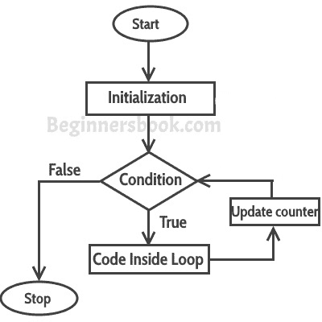

# 对于 Java 中的循环示例

> 原文： [https://beginnersbook.com/2015/03/for-loop-in-java-with-example/](https://beginnersbook.com/2015/03/for-loop-in-java-with-example/)

循环用于重复执行一组语句，直到满足特定条件。在 Java 中，我们有三种类型的基本循环：for，while 和 do-while。在本教程中，我们将学习如何在 Java 中使用“ **for loop** ”。

#### for 循环的语法：

```java
for(initialization; condition ; increment/decrement)
{
   statement(s);
}
```

## for 循环的执行流程

当程序执行时，解释器总是跟踪将要执行的语句。我们将其称为控制流程或程序的执行流程。


**第一步**：在 for 循环中，初始化只发生一次，这意味着 for 循环的初始化部分只执行一次。

**第二步**：在每次迭代时评估 for 循环中的条件，如果条件为真则执行循环体内的语句。一旦条件返回 false，for 循环中的语句就不会执行，并且控制在 for 循环后被转移到程序中的下一个语句。

**第三步**：每次执行 for 循环体后，for 循环的递增/递减部分执行更新**循环计数器**。

**第四步**：第三步后，控制跳转到第二步，重新评估条件。

## Simple For 循环的示例

```java
class ForLoopExample {
    public static void main(String args[]){
         for(int i=10; i>1; i--){
              System.out.println("The value of i is: "+i);
         }
    }
}
```

该程序的输出是：

```java
The value of i is: 10
The value of i is: 9
The value of i is: 8
The value of i is: 7
The value of i is: 6
The value of i is: 5
The value of i is: 4
The value of i is: 3
The value of i is: 2
```

在上面的程序中：
int i = 1 是初始化表达式
i＆gt; 1 是条件（布尔表达式）
i-递减运算

## 循环无限

布尔表达式和递增/递减操作协调的重要性：

```java
class ForLoopExample2 {
    public static void main(String args[]){
         for(int i=1; i>=1; i++){
              System.out.println("The value of i is: "+i);
         }
    }
}
```

这是一个无限循环，因为条件永远不会返回 false。初始化步骤是将变量 i 的值设置为 1，因为我们正在递增 i 的值，它总是大于 1（布尔表达式：i＆gt; 1）所以它永远不会返回 false。这最终会导致无限循环条件。因此，重要的是看到布尔表达式和递增/递减操作之间的协调以确定循环是否将在某个时间点终止。

这是无限 for 循环的另一个例子：

```java
// infinite loop
for ( ; ; ) {
    // statement(s)
}
```

## For 循环示例迭代数组：

这里我们使用 for 循环迭代并显示数组元素。

```java
class ForLoopExample3 {
    public static void main(String args[]){
         int arr[]={2,11,45,9};
         //i starts with 0 as array index starts with 0 too
         for(int i=0; i<arr.length; i++){
              System.out.println(arr[i]);
         }
    }
}
```

输出：

```java
2
11
45
9
```

### 增强 For 循环

当您想要迭代数组/集合时，增强的 for 循环很有用，它易于编写和理解。

让我们采用上面写的相同的例子，并使用**增强的 for 循环**重写它。

```java
class ForLoopExample3 {
   public static void main(String args[]){
      int arr[]={2,11,45,9};
      for (int num : arr) {
         System.out.println(num);
      }
   }
}
```

**输出：**

```java
2
11
45
9
```

**注意：**在上面的例子中，我在增强的 for 循环中声明了 num 为 int。这将根据数组的数据类型而改变。例如，字符串类型的增强 for 循环如下所示：

```java
String arr[]={"hi","hello","bye"};
for (String str : arr) {
         System.out.println(str);
}
```

查看与 for 循环相关的这些 [java 编程实例](https://beginnersbook.com/2017/09/java-examples/)：

1.  [使用 for 循环查找自然数之和的 Java 程序](https://beginnersbook.com/2017/09/java-program-to-find-sum-of-natural-numbers/)
2.  [Java 程序使用循环](https://beginnersbook.com/2017/09/java-program-to-find-factorial-using-for-and-while-loop/)查找数字的阶乘
3.  [使用 for 循环打印 Fibonacci 系列的 Java 程序](https://beginnersbook.com/2017/09/java-program-to-display-fibonacci-series-using-loops/)