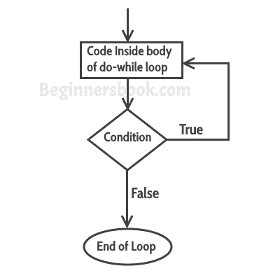

# Java 中的`do-while`循环

> 原文： [https://beginnersbook.com/2015/03/do-while-loop-in-java-with-example/](https://beginnersbook.com/2015/03/do-while-loop-in-java-with-example/)

在上一个教程中，我们讨论了 [while 循环](https://beginnersbook.com/2015/03/while-loop-in-java-with-examples/)。在本教程中，我们将讨论 java 中的 do-while 循环。 do-while 循环类似于 while 循环，但是它们之间存在差异：在 while 循环中，在执行循环体之前评估条件，但是在执行循环体之后评估 do-while 循环条件。

#### `do-while`循环的语法：

```java
do
{
   statement(s);
} while(condition);
```

## `do-while`循环如何工作？

首先，循环内的语句执行，然后条件得到评估，如果条件返回 true，则控件转移到“do”，否则它会在 do-while 之后跳转到下一个语句。


## `do-while`循环示例

```java
class DoWhileLoopExample {
    public static void main(String args[]){
         int i=10;
         do{
              System.out.println(i);
              i--;
         }while(i>1);
    }
}
```

**输出：**

```java
10
9
8
7
6
5
4
3
2
```

## 示例：使用`do-while`循环迭代数组

这里我们有一个整数数组，我们正在迭代数组并使用 do-while 循环显示每个元素。

```java
class DoWhileLoopExample2 {
    public static void main(String args[]){
         int arr[]={2,11,45,9};
         //i starts with 0 as array index starts with 0
         int i=0;
         do{
              System.out.println(arr[i]);
              i++;
         }while(i<4);
    }
}
```

输出：
2
11
45
9