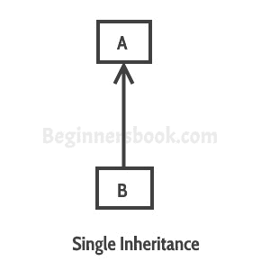
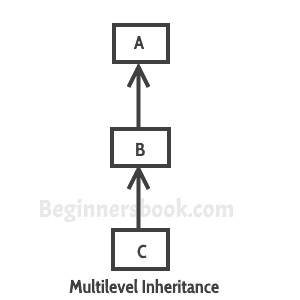
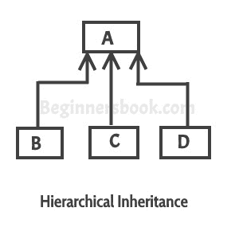
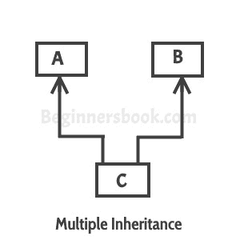

# Java 编程中的继承与实例

> 原文： [https://beginnersbook.com/2013/03/inheritance-in-java/](https://beginnersbook.com/2013/03/inheritance-in-java/)

一个类获取另一个类的属性（数据成员）和功能（方法）的过程称为**继承**。继承的目的是提供代码的可重用性，以便类只需要编写唯一的特性，其余的公共属性和功能可以从另一个类扩展。
**子类：**
扩展另一个类的特性的类称为子类，子类或派生类。

**父类：**
其属性和功能由另一个类使用（继承）的类称为父类，超类或基类。

> 继承是通过扩展其公共数据成员和方法，基于现有类定义新类的过程。
> 继承允许我们重用代码，它提高了 java 应用程序的可重用性。
> 注意：继承的最大**优势是，基类中已经存在的代码不需要在子类中重写。**

这意味着父类的数据成员（实例变量）和方法可以在子类中使用。

> 如果您发现很难理解什么是类和对象，那么请参考我在面向对象编程上分享的指南： [OOPs Concepts](https://beginnersbook.com/2013/04/oops-concepts/)

让我们回到主题：

## 语法：Java 中的继承

要继承一个类，我们使用 extends 关键字。这里的类 XYZ 是子类，类 ABC 是父类。 XYZ 类继承了 ABC 类的属性和方法。

```
class XYZ extends ABC
{
}
```

## 继承示例

在这个例子中，我们有一个基类`Teacher`和一个子类`PhysicsTeacher`。由于类`PhysicsTeacher`扩展了基类的指定和大学属性以及 work（）方法，我们不需要在子类中声明这些属性和方法。
这里我们有大学名称，名称和工作（）方法，这些方法对于所有老师都是通用的，所以我们在基类中声明了它们，这样像`MathTeacher`，`MusicTeacher`和`PhysicsTeacher`这样的子类不会需要编写此代码，可以直接从基类中使用。

```
class Teacher {
   String designation = "Teacher";
   String collegeName = "Beginnersbook";
   void does(){
	System.out.println("Teaching");
   }
}

public class PhysicsTeacher extends Teacher{
   String mainSubject = "Physics";
   public static void main(String args[]){
	PhysicsTeacher obj = new PhysicsTeacher();
	System.out.println(obj.collegeName);
	System.out.println(obj.designation);
	System.out.println(obj.mainSubject);
	obj.does();
   }
}

```

输出：

```
Beginnersbook
Teacher
Physics
Teaching

```

> 基于上述例子，我们可以说`PhysicsTeacher` **IS-A** `Teacher`。这意味着子类与父类具有 IS-A 关系。这是继承被称为子类和父类之间的 **IS-A 关系**

**注意：**
派生类继承声明为 public 或 protected 的所有成员和方法。如果超类的成员或方法声明为 private，则派生类不能直接使用它们。私有成员只能在自己的类中访问。只能使用公共或受保护的超类 getter 和 setter 方法访问此类私有成员，如下例所示。

```
class Teacher {
   private String designation = "Teacher";
   private String collegeName = "Beginnersbook";
   public String getDesignation() {
	return designation;
   }
   protected void setDesignation(String designation) {
	this.designation = designation;
   }
   protected String getCollegeName() {
	return collegeName;
   }
   protected void setCollegeName(String collegeName) {
	this.collegeName = collegeName;
   }
   void does(){
	System.out.println("Teaching");
   }
}

public class JavaExample extends Teacher{
   String mainSubject = "Physics";
   public static void main(String args[]){
	JavaExample obj = new JavaExample();
	/* Note: we are not accessing the data members 
	 * directly we are using public getter method 
	 * to access the private members of parent class
	 */
	System.out.println(obj.getCollegeName());
	System.out.println(obj.getDesignation());
	System.out.println(obj.mainSubject);
	obj.does();
   }
}

```

输出是：

```
Beginnersbook
Teacher
Physics
Teaching

```

在上面的例子中需要注意的重要一点是，子类能够通过父类的**受保护方法**访问父类的私有成员。当我们创建一个实例变量（数据成员）或方法**受保护**时，这意味着它们只能在类本身和子类中访问。这些公共，受保护，私有等都是访问说明符，我们将在接下来的教程中讨论它们。

## 继承的类型

要详细了解继承类型，请参阅： [Java 中的继承类型](https://beginnersbook.com/2013/05/java-inheritance-types/)。
**单一继承**：指的是一个子类和父类关系，其中一个类扩展另一个类。


[多级继承](https://beginnersbook.com/2013/12/multilevel-inheritance-in-java-with-example/)：指一个类扩展子类的子类和父类关系。例如，C 类扩展了 B 类，B 类扩展了 A 类。


[分层继承](https://beginnersbook.com/2013/10/hierarchical-inheritance-java-program/)：指的是子类和父类关系，其中多个类扩展同一个类。例如，B，C 和 B 类。 D 扩展了相同的 A 类。


**Multiple Inheritance** ：指一个类扩展多个类的概念，这意味着子类有两个父类。例如，类 C 扩展了类 A 和 B. Java 不支持多重继承，请阅读 [](https://beginnersbook.com/2013/05/java-multiple-inheritance/) 。


[混合继承](https://beginnersbook.com/2013/10/hybrid-inheritance-java-program/)：在单个程序中组合多种类型的继承。例如 A 类和 A 类。 B 扩展了类 C，另一个类 D 扩展了类 A，然后这是一个混合继承示例，因为它是单继承和层次继承的组合。

## 构造函数和继承

当我们创建子类的对象时，会调用子类的[构造函数](https://beginnersbook.com/2013/03/constructors-in-java/)，它默认调用超类的默认构造函数。因此，在继承中，对象是自上而下构造的。可以使用[超级关键字](https://beginnersbook.com/2014/07/super-keyword-in-java-with-example/)显式调用超类构造函数，但它应该是构造函数中的第一个语句。 super 关键字指的是超类，紧接在层次结构中的调用类之上。不允许使用多个超级关键字来访问除直接父级之外的祖先类。

```
class ParentClass{
   //Parent class constructor
   ParentClass(){
	System.out.println("Constructor of Parent");
   }
}
class JavaExample extends ParentClass{
   JavaExample(){
	/* It by default invokes the constructor of parent class
	 * You can use super() to call the constructor of parent.
	 * It should be the first statement in the child class
	 * constructor, you can also call the parameterized constructor
	 * of parent class by using super like this: super(10), now
	 * this will invoke the parameterized constructor of int arg
	 */
	System.out.println("Constructor of Child");
   }
   public static void main(String args[]){
	//Creating the object of child class
	new JavaExample();
   }
}
```

Output:

```
Constructor of Parent
Constructor of Child
```

## 继承和方法覆盖

当我们在父类中已经存在的子类中声明相同的方法时，这称为[方法覆盖](https://beginnersbook.com/2014/01/method-overriding-in-java-with-example/)。在这种情况下，当我们从子类对象调用该方法时，将调用该方法的子类版本。但是我们可以使用 super 关键字调用父类方法，如下例所示：

```
class ParentClass{
   //Parent class constructor
   ParentClass(){
	System.out.println("Constructor of Parent");
   }
   void disp(){
	System.out.println("Parent Method");
   }
}
class JavaExample extends ParentClass{
   JavaExample(){
	System.out.println("Constructor of Child");
   }
   void disp(){
	System.out.println("Child Method");
        //Calling the disp() method of parent class
	super.disp();
   }
   public static void main(String args[]){
	//Creating the object of child class
	JavaExample obj = new JavaExample();
	obj.disp();
   }
}

```

输出是：

```
Constructor of Parent
Constructor of Child
Child Method
Parent Method

```