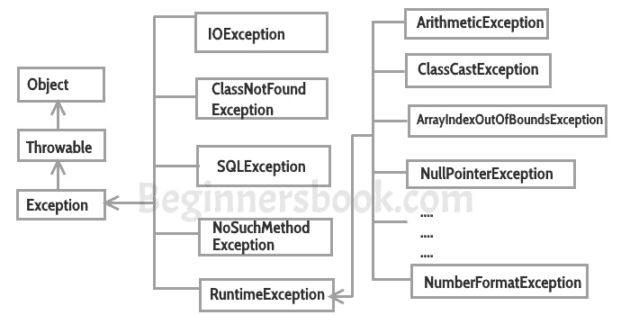

# 使用示例在 java 中进行异常处理

> 原文： [https://beginnersbook.com/2013/04/java-exception-handling/](https://beginnersbook.com/2013/04/java-exception-handling/)

异常处理是 java 编程最重要的特性之一，它允许我们处理异常引起的运行时错误。在本指南中，我们将学习什么是异常，它的类型，异常类以及如何使用示例处理 java 中的异常。

## 什么是例外？

异常是一个不需要的事件，它会中断程序的正常流程。当发生异常时，程序执行将终止。在这种情况下，我们会收到系统生成的错误消息。关于异常的好处是它们可以用 Java 来处理。通过处理异常，我们可以向用户提供有关问题的有意义的消息，而不是系统生成的消息，这可能是用户无法理解的。

### 为什么会发生异常？

可能有几个原因导致程序抛出异常。例如：在程序中打开一个不存在的文件，网络连接问题，用户提供的错误输入数据等。

## 异常处理

如果发生异常（程序员尚未处理），则程序执行将终止，并向用户显示系统生成的错误消息。例如，查看下面的系统生成异常：
**系统生成的异常在**下面给出

```java
 Exception in thread "main" java.lang.ArithmeticException: / by zero at ExceptionDemo.main(ExceptionDemo.java:5)
 ExceptionDemo : The class name
 main : The method name
 ExceptionDemo.java : The filename
 java:5 : Line number
```

此消息不是用户友好的，因此用户将无法理解出错的地方。为了让他们用简单的语言知道原因，我们处理异常。我们处理这些条件，然后向用户输出用户友好的警告消息，这使得他们可以纠正错误，因为大多数时候由于用户提供的错误数据而发生异常。

### 异常处理的优点

异常处理可确保在发生异常时程序流不会中断。例如，如果一个程序有一堆语句，并且在执行某些语句后中途发生异常，则异常后的语句将不会执行，程序将突然终止。
通过处理，我们确保所有语句都执行，程序流程不会中断。

## 错误和异常之间的区别

**错误**表示出现了严重问题，应用程序应该崩溃而不是尝试处理错误。

**异常**是代码中发生的事件。程序员可以处理这些情况并采取必要的纠正措施。几个例子：
NullPointerException - 当你尝试使用指向 null 的引用时。
ArithmeticException - 当用户提供错误数据时，例如，当您尝试将数字除以零时，会发生此异常，因为将数字除以零是未定义的。
ArrayIndexOutOfBoundsException - 当您尝试从其边界外访问数组的元素时，例如，数组大小为 5（这意味着它有五个元素），并且您尝试访问第 10 个元素。



## 例外的类型

Java 中有两种类型的异常：
1）已检查的异常
2）未经检查的异常

我已在单独的教程中详细介绍了这一点： [Java](https://beginnersbook.com/2013/04/java-checked-unchecked-exceptions-with-examples/) 中的 Checked 和 Unchecked 异常。

### 检查异常

除运行时异常之外的所有异常都称为已检查异常，因为编译器在编译期间检查它们以查看程序员是否已处理它们。如果在程序中未处理/声明这些异常，则会出现编译错误。例如，SQLException，IOException，ClassNotFoundException 等。

### 未经检查的例外情况

运行时异常也称为未经检查的异常。这些异常不会在编译时检查，因此编译器不会检查程序员是否已经处理过它们，但程序员有责任处理这些异常并提供安全退出。例如，ArithmeticException，NullPointerException，ArrayIndexOutOfBoundsException 等。

> 编译器永远不会强制您捕获此类异常或强制您使用 throws 关键字在方法中声明它。

## 下一个教程将介绍哪些主题

1.  [Java 中的 try-catch](https://beginnersbook.com/2013/04/try-catch-in-java/)
2.  [Nested Try Catch](https://beginnersbook.com/2013/04/nested-try-catch/)
3.  [已检查和未检查的异常](https://beginnersbook.com/2013/04/java-checked-unchecked-exceptions-with-examples/)
4.  [最后在 Java 中阻塞](https://beginnersbook.com/2013/04/java-finally-block/)
5.  [try-catch-finally](https://beginnersbook.com/2013/05/flow-in-try-catch-finally/)
6.  [终于阻止＆amp;退货声明](https://beginnersbook.com/2013/05/java-finally-return/)
7.  [在 Java](https://beginnersbook.com/2013/04/throw-in-java/) 中抛出异常
8.  [throw 关键字](https://beginnersbook.com/2013/12/throw-keyword-example-in-java/)的示例
9.  [投掷条款](https://beginnersbook.com/2013/12/throws-keyword-example-in-java/)的例子
10.  [投掷 Java](https://beginnersbook.com/2013/04/java-throws/)
11.  [投掷 vs 投掷](https://beginnersbook.com/2013/04/difference-between-throw-and-throws-in-java/)
12.  [异常处理示例](https://beginnersbook.com/2013/04/exception-handling-examples/)