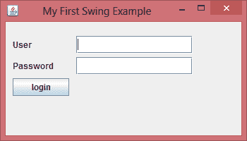

# 适合初学者的 Java Swing 教程

> 原文： [https://beginnersbook.com/2015/07/java-swing-tutorial/](https://beginnersbook.com/2015/07/java-swing-tutorial/)

Swing 是 Java Foundation 类（JFC）的一部分，JFC 的其他部分是 java2D 和 Abstract window 工具包（AWT）。 AWT，Swing&amp; Java 2D 用于在 java 中构建图形用户界面（GUI）。在本教程中，我们将主要讨论用于在 AWT 顶部构建 GUI 的 Swing API，与 AWT 相比，它更轻量级。

## 一个简单的例子

在下面的示例中，我们将使用您在本教程中到目前为止尚未学习的几个 swing 组件。我们将在即将到来的摇摆教程中详细讨论每一个和所有内容。
下面的 swing 程序会创建一个登录界面。

```java
import javax.swing.JButton;
import javax.swing.JFrame;
import javax.swing.JLabel;
import javax.swing.JPanel;
import javax.swing.JPasswordField;
import javax.swing.JTextField; 
public class SwingFirstExample {

    public static void main(String[] args) {    
        // Creating instance of JFrame
        JFrame frame = new JFrame("My First Swing Example");
        // Setting the width and height of frame
        frame.setSize(350, 200);
        frame.setDefaultCloseOperation(JFrame.EXIT_ON_CLOSE);

        /* Creating panel. This is same as a div tag in HTML
         * We can create several panels and add them to specific 
         * positions in a JFrame. Inside panels we can add text 
         * fields, buttons and other components.
         */
        JPanel panel = new JPanel();    
        // adding panel to frame
        frame.add(panel);
        /* calling user defined method for adding components
         * to the panel.
         */
        placeComponents(panel);

        // Setting the frame visibility to true
        frame.setVisible(true);
    }

    private static void placeComponents(JPanel panel) {

        /* We will discuss about layouts in the later sections
         * of this tutorial. For now we are setting the layout 
         * to null
         */
        panel.setLayout(null);

        // Creating JLabel
        JLabel userLabel = new JLabel("User");
        /* This method specifies the location and size
         * of component. setBounds(x, y, width, height)
         * here (x,y) are cordinates from the top left 
         * corner and remaining two arguments are the width
         * and height of the component.
         */
        userLabel.setBounds(10,20,80,25);
        panel.add(userLabel);

        /* Creating text field where user is supposed to
         * enter user name.
         */
        JTextField userText = new JTextField(20);
        userText.setBounds(100,20,165,25);
        panel.add(userText);

        // Same process for password label and text field.
        JLabel passwordLabel = new JLabel("Password");
        passwordLabel.setBounds(10,50,80,25);
        panel.add(passwordLabel);

        /*This is similar to text field but it hides the user
         * entered data and displays dots instead to protect
         * the password like we normally see on login screens.
         */
        JPasswordField passwordText = new JPasswordField(20);
        passwordText.setBounds(100,50,165,25);
        panel.add(passwordText);

        // Creating login button
        JButton loginButton = new JButton("login");
        loginButton.setBounds(10, 80, 80, 25);
        panel.add(loginButton);
    }

}

```

**输出：**



在上面的例子中，我们使用了几个组件。我们先讨论一下它们，然后我们将在下一个教程中详细讨论它们。
**JFrame** - 帧是 JFrame 的一个实例。框架是一个窗口，可以有标题，边框，菜单，按钮，文本字段和其他几个组件。 Swing 应用程序必须有一个框架才能添加组件。
**JPanel** - 面板是 JPanel 的一个实例。一个框架可以有多个面板，每个面板可以有几个组件。你也可以称它们为 Frame 的一部分。面板可用于对组件进行分组并将它们放置在框架中的适当位置。

**JLabel** - 标签是 JLabel 类的一个实例。标签是不可选择的文本和图像。如果要在框架上显示字符串或图像，可以使用标签。在上面的例子中，我们想要显示文本“User”&amp; “密码”就在文本字段之前，我们通过创建标签并将其添加到适当的位置来实现此目的。

**JTextField** - 用于捕获用户输入，这些是用户输入数据的文本框。

**JPasswordField** - 与文本字段类似，但输入的数据被隐藏并在 GUI 上显示为点。

**JButton** - 一个按钮是 JButton 类的一个实例。在上面的例子中，我们有一个“登录”按钮。