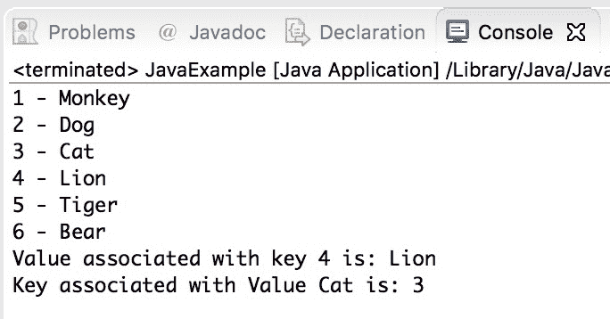

# Java 8 `forEach`方法

> 原文： [https://beginnersbook.com/2017/10/java-8-foreach/](https://beginnersbook.com/2017/10/java-8-foreach/)

在 Java 8 中，我们有一个新引入的 forEach 方法来迭代 Java 中的[集合](https://beginnersbook.com/java-collections-tutorials/)和[流](https://beginnersbook.com/2017/10/java-8-stream-tutorial/)。在本指南中，我们将学习如何使用`forEach()`和`forEachOrdered()`方法来循环特定的集合和流。

## Java 8 - `forEach`迭代`Map`

```java
import java.util.Map;
import java.util.HashMap;
public class Example {
   public static void main(String[] args) {
      Map<Integer, String> hmap = new HashMap<Integer, String>();
      hmap.put(1, "Monkey");
      hmap.put(2, "Dog"); 
      hmap.put(3, "Cat");  
      hmap.put(4, "Lion");   
      hmap.put(5, "Tiger");   
      hmap.put(6, "Bear");
      /* forEach to iterate and display each key and value pair
       * of HashMap.    
       */  
      hmap.forEach((key,value)->System.out.println(key+" - "+value));
      /* forEach to iterate a Map and display the value of a particular  
       * key     
       */ 
      hmap.forEach((key,value)->{ 
         if(key == 4){ 
            System.out.println("Value associated with key 4 is: "+value); 
         }  
      });    
      /* forEach to iterate a Map and display the key associated with a
       * particular value     
       */
      hmap.forEach((key,value)->{
         if("Cat".equals(value)){ 
            System.out.println("Key associated with Value Cat is: "+key);
         }
      }); 
   }
}
```

**输出：**



## Java 8 - `forEach`迭代`List`

在这个例子中，我们使用`forEach()`方法迭代[`ArrayList`](https://beginnersbook.com/2013/12/java-arraylist/)。在`forEach`中，我们使用[ lambda 表达式](https://beginnersbook.com/2017/10/java-lambda-expressions-tutorial-with-examples/)来打印列表的每个元素。

```java
import java.util.List;
import java.util.ArrayList;
public class Example {
   public static void main(String[] args) {
      List<String> fruits = new ArrayList<String>();
      fruits.add("Apple");
      fruits.add("Orange");
      fruits.add("Banana");
      fruits.add("Pear"); 
      fruits.add("Mango");
      //lambda expression in forEach Method 
      fruits.forEach(str->System.out.println(str));
   }
}
```

**输出：**

```java
Apple
Orange
Banana
Pear
Mango
```

我们也可以在`forEach()`方法中使用[方法引用](https://beginnersbook.com/2017/10/method-references-in-java-8/)，如下所示：

```java
fruits.forEach(System.out::println);
```

## Java 8 - `forEach`迭代`Stream`的方法

在这个例子中，我们使用`forEach()`方法在 Java 中迭代[流](https://beginnersbook.com/2017/10/java-8-stream-tutorial/)。

```java
import java.util.List;
import java.util.ArrayList;
public class Example {
   public static void main(String[] args) {
      List<String> names = new ArrayList<String>();
      names.add("Maggie");
      names.add("Michonne");
      names.add("Rick");
      names.add("Merle");
      names.add("Governor");
      names.stream() //creating stream 
     .filter(f->f.startsWith("M")) //filtering names that starts with M 
     .forEach(System.out::println); //displaying the stream using forEach
   }
}
```

输出：

```java
Maggie
Michonne
Merle
```

## Java - Stream `forEachOrdered()`方法示例

对于顺序流，元素的顺序与源中的顺序相同，因此无论使用`forEach`还是`forEachOrdered`，输出都是相同的。但是，在处理并行流时，您总是希望在订单对您很重要时使用`forEachOrdered()`方法，因为此方法可确保元素的顺序与源相同。让我们举个例子来理解`forEach()`和`forEachOrdered()`之间的区别。

```java
import java.util.List;
import java.util.ArrayList;
public class Example {
   public static void main(String[] args) {
      List<String> names = new ArrayList<String>();
      names.add("Maggie"); 
      names.add("Michonne");
      names.add("Rick");
      names.add("Merle");
      names.add("Governor"); 
      //forEach - the output would be in any order
      System.out.println("Print using forEach");
      names.stream() 
     .filter(f->f.startsWith("M"))
     .parallel() 
     .forEach(n->System.out.println(n)); 

     /* forEachOrdered - the output would always be in this order: 
      * Maggie, Michonne, Merle 
      */ 
     System.out.println("Print using forEachOrdered"); 
     names.stream()  
     .filter(f->f.startsWith("M"))  
     .parallel() 
     .forEachOrdered(n->System.out.println(n));
   }
}
```

输出：

```java
Print using forEach
Merle
Maggie
Michonne
Print using forEachOrdered
Maggie
Michonne
Merle
```

#### 参考文献：

*   [Java 8 - foreach JavaDoc](https://docs.oracle.com/javase/8/docs/api/java/util/Map.html#forEach-java.util.function.BiConsumer-)
*   [Java 8 - 用于 vs foreach 循环 JavaDoc](https://docs.oracle.com/javase/8/docs/technotes/guides/language/foreach.html)