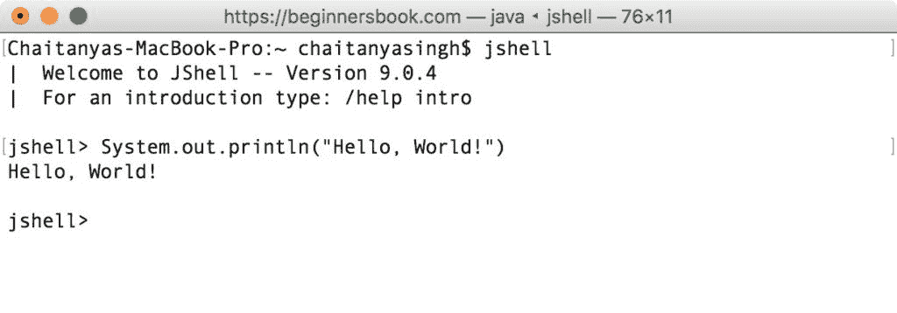
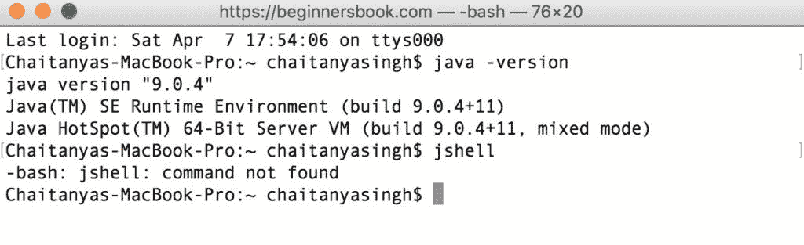
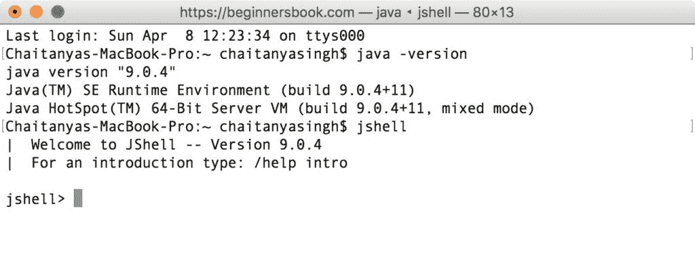
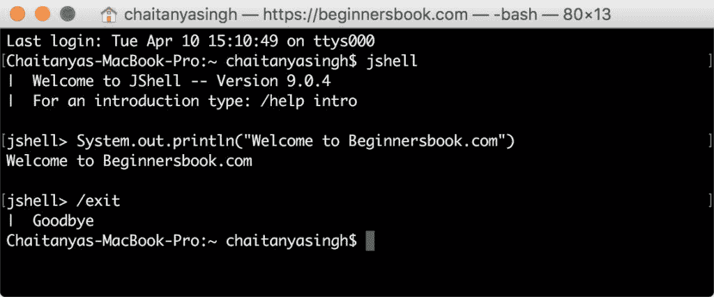

# Java 9 JShell（Java Shell） - REPL

> 原文： [https://beginnersbook.com/2018/04/java-9-jshell-repl/](https://beginnersbook.com/2018/04/java-9-jshell-repl/)

**JShell** 代表 java shell。它也被称为 **REPL（读取评估打印循环）**。这个工具的目的是提供一种学习 Java 的简单方法，但是如何？让我们看看它。我们知道我们必须编写几行代码才能在屏幕上打印内容，例如 - 要在屏幕上打印“Hello World”，我们必须编写以下代码。

```java
public class HelloWorld {

    public static void main(String[] args) {
        // Prints "Hello, World!" on the screen
        System.out.println("Hello, World!");
    }

}
```

如果你是一个 java 初学者，这段代码不容易掌握。为了以有趣和互动的方式学习 Java，Oracle 公司提出了一个名为 jshell 的工具。这些工具已经可以在其他流行的编程语言中使用，例如 [Python](https://beginnersbook.com/2018/03/python-tutorial-learn-programming/) ，Scala 等。

要在 JShell 中显示“Hello World”，您只需编写：

```java
jshell> System.out.println("Hello, World!")
Hello, World!
```



## 为什么要使用 JShell？

使用 jshell 的主要优点是，您可以在此处测试您的部分代码（单个语句，方法等），而无需编写完整的程序，然后检查各种可能的方案。一旦您对代码感到满意，就可以将它从 jshell 复制到主程序。

这允许您在不破坏主程序的情况下尝试多个场景，并让您有机会**尝试学习**。

## 如何启动 JShell？

要启动 jshell，你必须在你的系统上安装 java 9，如果你有旧版本的 java，那么你可以通过从[这里](http://www.oracle.com/technetwork/java/javase/downloads/jdk9-downloads-3848520.html)下载最新版本来升级它。

要启动 jshell，请打开命令提示符（如果您使用的是 Mac OS X，请打开终端），键入`jshell`并按 Enter 键。

如果你得到如下错误： **jshell：找不到命令**（如下面的屏幕截图所示），那么你必须[设置系统](https://beginnersbook.com/2018/04/jshell-command-not-found-on-mac-os-x/)的路径。


如果一切正常，那么你应该看到这样的屏幕。


## 如何退出 JShell？

要停止 JShell，请键入`/exit`并按 Enter 键。


#### 有关 JShell 的更多教程

1\. [JShell - 使用变量](https://beginnersbook.com/2018/04/java-9-jshell-variables/)
2\. [JShell - 使用方法](https://beginnersbook.com/2018/04/java-9-jshell-methods/)

#### 参考：

[Oracle JDK 9 文档](https://docs.oracle.com/javase/9/jshell/toc.htm)