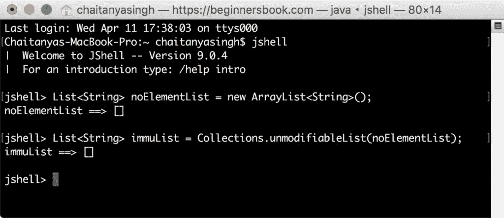
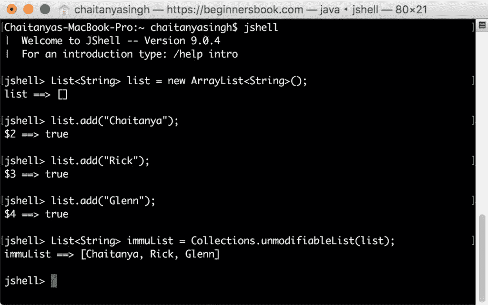
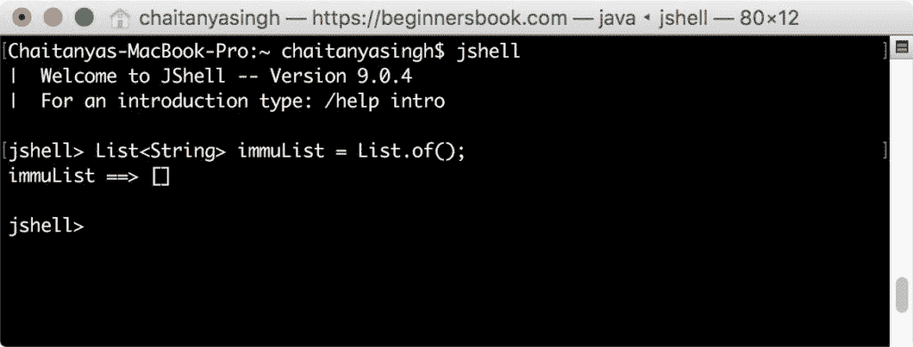
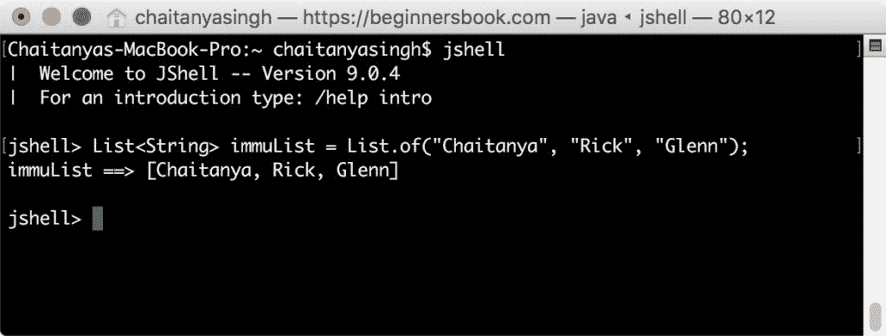
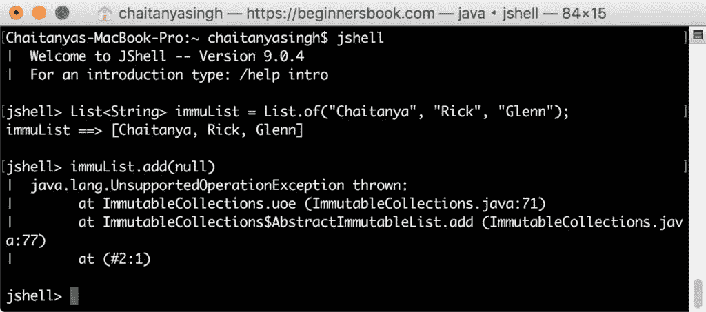

# Java 9 - 创建不可变列表的工厂方法

> 原文： [https://beginnersbook.com/2018/04/java-9-factory-method-to-create-immutable-list/](https://beginnersbook.com/2018/04/java-9-factory-method-to-create-immutable-list/)

[Java 9](https://beginnersbook.com/2018/04/java-9-features-with-examples/) 到**中引入了几种有用的工厂方法，创建了不可变（不可修改）列表**。

## 1.在 Java 9 之前创建不可变列表

在我们看到 Java 9 中引入的工厂方法之前。让我们看看我们在 Java 9 之前如何创建不可变列表。

### 1.1 在 java SE 9 之前创建空的不可变列表

在 Java 9 之前，我们必须使用 Collections 类的 **unmodifiableList（）方法**来创建不可变列表。

```java
List<String> noElementList = new ArrayList<String>();
List<String> immuList = Collections.unmodifiableList(noElementList);
```

**注意：**让我们测试 [Java Shell（JShell）](https://beginnersbook.com/2018/04/java-9-jshell-repl/)中的代码。


### 1.2 在 Java SE 9 之前创建非空的不可变列表

```java
List<String> list = new ArrayList<String>();
list.add("Chaitanya");
list.add("Rick");
list.add("Glenn");
List<String> immuList = Collections.unmodifiableList(list);
```



## 2\. Java 9 - 使用（）的静态工厂方法创建不可变列表

Java 9 引入了（HTG0）of（）方法的几个版本来创建不可修改的列表。

```java
static <E> List<E> of()
```

### 2.1 Java 9 - 创建空的不可变列表

```java
List<String> immuList = List.of();
```



### 2.2 Java 9 - 创建非空的不可变列表

让我们采用与上面使用 unmodifiableList（）方法相同的示例。您可以看到在 Java 9 中创建此类列表是多么简单。我们使用（）的工厂方法将 5 行代码减少到一行。

```java
List<String> immuList = List.of("Chaitanya", "Rick", "Glenn");
```



## 什么是不可变列表？

1.不可变列表不允许添加，删除和更新其元素。

```java
jshell> List<String> immuList = List.of("Chaitanya", "Rick", "Glenn");
immuList ==> [Chaitanya, Rick, Glenn]

jshell> immuList.add("Negan")
|  java.lang.UnsupportedOperationException thrown: 
|        at ImmutableCollections.uoe (ImmutableCollections.java:71)
|        at ImmutableCollections$AbstractImmutableList.add 
(ImmutableCollections.java:77)
|        at (#2:1)
```

2.我们不能将 null 元素添加到不可变列表中。

```java
jshell> List<String> immuList = List.of("Chaitanya", "Rick", "Glenn");
immuList ==> [Chaitanya, Rick, Glenn]

jshell> immuList.add(null)
|  java.lang.UnsupportedOperationException thrown: 
|        at ImmutableCollections.uoe (ImmutableCollections.java:71)
|        at ImmutableCollections$AbstractImmutableList.add 
(ImmutableCollections.java:77)
|        at (#2:1)
```

