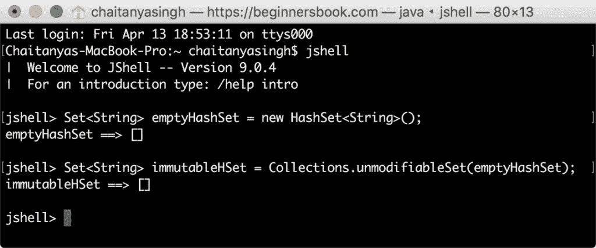
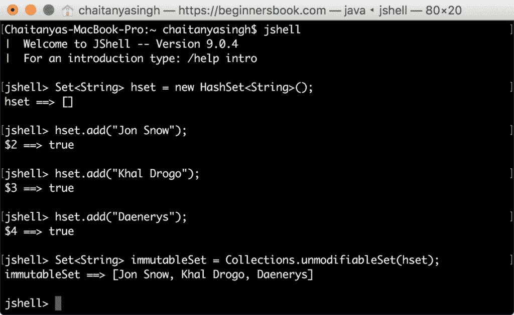
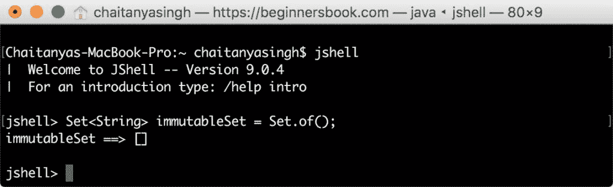
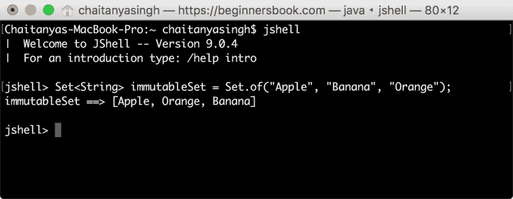

# Java 9 - 创建不可变集的工厂方法

> 原文： [https://beginnersbook.com/2018/04/java-9-factory-methods-to-create-immutable-set/](https://beginnersbook.com/2018/04/java-9-factory-methods-to-create-immutable-set/)

在上一个教程中，我们学习了如何[使用 Java 9](https://beginnersbook.com/2018/04/java-9-factory-method-to-create-immutable-list/) 中引入的工厂方法轻松创建不可变列表。在本指南中，我们将看到使用新引入的工厂方法来创建不可变[集](https://beginnersbook.com/2013/12/hashset-class-in-java-with-example/)。

## 1.在 Java 9 之前创建不可变集

在我们讨论如何使用工厂方法创建不可修改的集合之前，让我们看看我们如何在 [Java 9](https://beginnersbook.com/2018/04/java-9-features-with-examples/) 之前创建不可变集合。

### 1.1 在 java SE 9 之前创建空的不可变`Set`

在 Java 9 之前，我们必须使用[`Collections`](https://beginnersbook.com/java-collections-tutorials/)类的`unmodifiableSet()`方法来创建不可变的`Set`。在以下示例中，我们将创建一个空集。

```java
Set<String> emptyHashSet = new HashSet<String>();
Set<String> immutableHSet = Collections.unmodifiableSet(emptyHashSet);
```

让我们在 [JShell](https://beginnersbook.com/2018/04/java-9-jshell-repl/) （Java 9 中引入的新工具）中测试此代码




### 1.2 在 Java SE 9 之前创建非空的不可变集合

这就是我们在 Java 9 之前用来创建非空的不可变集合的方法。正如您所看到的，我们必须编写几行代码来实现这一点。在 Java 9 中，我们可以在一行中编写此代码，我们将在下一节中看到。

```java
Set<String> hset = new HashSet<String>();
hset.add("Jon Snow");
hset.add("Khal Drogo");
hset.add("Daenerys");
Set<String> immutableSet = Collections.unmodifiableSet(hset); 
```




## 2\. Java 9 - 使用`Set`的静态工厂方法创建不可变集

Java 9 引入了几个版本的`of()`方法来创建不可修改的集合。

```java
static <E> Set<E> of()
```

### 2.1 Java 9 - 创建空的不可变集合

```java
Set<String> immutableSet = Set.of();
```




### 2.2 Java 9 - 创建非空的不可变集

正如您所看到的，在 Java 9 中创建不可变集是多么简单。

```java
Set<String> immutableSet = Set.of("Apple", "Banana", "Orange");
```




## 3.什么是不可变集？

1.不可变集不允许添加，删除和更新其元素，如果我们尝试这样做，那么我们将得到 UnsupportedOperationException 异常。让我们举个例子来看看这个。

```java
jshell> Set immutableSet = Set.of("Paul", "Lora", "Steve");
immutableSet ==> [Paul, Lora, Steve]

jshell> immutableSet.add("Harry")
|  java.lang.UnsupportedOperationException thrown: 
|        at ImmutableCollections.uoe (ImmutableCollections.java:71)
|        at ImmutableCollections$AbstractImmutableSet.add (ImmutableCollections.java:281)
|        at (#2:1)
```

2.我们不能将 null 元素添加到不可变集。

```java
jshell> Set immutableSet = Set.of("Paul", "Lora", "Steve");
immutableSet ==> [Lora, Steve, Paul]

jshell> immutableSet.add(null)
|  java.lang.UnsupportedOperationException thrown: 
|        at ImmutableCollections.uoe (ImmutableCollections.java:71)
|        at ImmutableCollections$AbstractImmutableSet.add (ImmutableCollections.java:281)
|        at (#2:1)
```