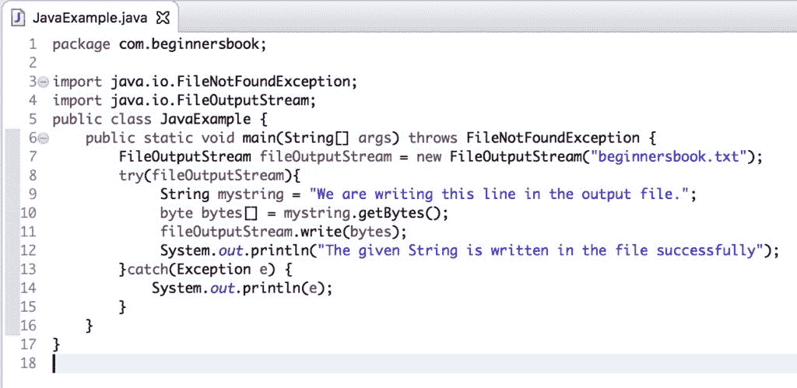

# Java 9 - `try-with-resource`改进

> 原文： [https://beginnersbook.com/2018/05/java-9-try-with-resources-enhancements/](https://beginnersbook.com/2018/05/java-9-try-with-resources-enhancements/)

**尝试使用资源语句**首先在 Java 7 中引入。该语句在 [Java 9](https://beginnersbook.com/2018/04/java-9-features-with-examples/) 中得到了重大改进。在本指南中，我们将讨论 Java 9 中 try-with-resource 语句的**改进。**

## 什么是`try-with-resource`？

这个语句最初是在 Java 7 中引入的，以避免我们为异常处理编写的冗余代码。这句话的优点是：
1.尝试用资源自动关闭所有资源（文件，数据库连接，网络连接等）。无需明确关闭它们。这可以防止内存泄漏。
2.借助 try 资源，我们可以减少不必要的代码行，使代码更具可读性。

## 我们以前如何使用`try-with-resource`在 Java 7 中编写代码？

这就是我们在 Java 7 中使用 Try-With-Resource 语句的方式。

```java
import java.io.FileNotFoundException;  
import java.io.FileOutputStream;  
public class JavaExample {  
    public static void main(String[] args) throws FileNotFoundException {  
        try(FileOutputStream fileOutputStream = new FileOutputStream("beginnersbook.txt");){ 
             //We are writing this string in the output file using FileOutputStream
             String mystring = "We are writing this line in the output file."; 

             //Converting the given string in bytes
             byte bytes[] = mystring.getBytes();       

             //Writing the bytes into the file
             fileOutputStream.write(bytes);      

             //Displaying success message after the successful write operation
             System.out.println("The given String is written in the file successfully");           
        }catch(Exception e) {  
            System.out.println(e);  
        }         
    }  
}
```

输出：

```java
The given String is written in the file successfully
```

## Java 7 中的`try-with-resource`问题

Java 7 中的 Try-With-Resource 语句存在某些问题。此语句不允许在语句块（范围）之外声明资源。让我们举一个例子来理解这一点。

**Java 7 - 在 Try-With-Resources 块**之外声明的资源

```java
import java.io.FileNotFoundException;  
import java.io.FileOutputStream;  
public class JavaExample {  
    public static void main(String[] args) throws FileNotFoundException { 
       FileOutputStream fileOutputStream = new FileOutputStream("beginnersbook.txt");
       try(fileOutputStream){ 
            String mystring = "We are writing this line in the output file."; 
            byte bytes[] = mystring.getBytes();       
            fileOutputStream.write(bytes);      
            System.out.println("The given String is written in the file successfully");           
        }catch(Exception e) {  
            System.out.println(e);  
        }         
    }  
}
```

Java 7 中的输出：

```java
Compile-time error
```

上面的示例抛出编译时错误，因为资源是在 Try-With-Resource 语句的范围之外声明的。

**Java 7 - 外部声明的资源 - 重复资源作为变通方法**
为了解决上述错误，我们不得不在 Java 7 中做一个解决方法。我们过去常常复制资源引用，如下所示：

```java
import java.io.FileNotFoundException;  
import java.io.FileOutputStream;  
public class JavaExample {  
    public static void main(String[] args) throws FileNotFoundException { 
       FileOutputStream fileOutputStream = new FileOutputStream("beginnersbook.txt");
       try(FileOutputStream fileOutputStream2 = fileOutputStream){ 
            String mystring = "We are writing this line in the output file."; 
            byte bytes[] = mystring.getBytes();       
            fileOutputStream2.write(bytes);      
            System.out.println("The given String is written in the file successfully");           
        }catch(Exception e) {  
            System.out.println(e);  
        }         
    }  
}
```

这段代码在 Java 7 中运行良好。
注意 try 块中的`FileOutputStream fileOutputStream2 = fileOutputStream`行。我们在 Try-With-Resource 的范围内创建了对已声明的输出流的另一个引用。

## Java 9 - `try-with-resource`改进

**Java 9 为传统的 Try-With-Resource 语句提供了一个重要的改进**。 Java 9 允许我们在 **Try-With-Resource 块**之外声明资源。我们不再需要创建局部变量来访问资源。让我们采用与 Java 7 相同的示例，但遇到了编译错误。在 Java 9 中，此代码运行得非常好。

```java
import java.io.FileNotFoundException;  
import java.io.FileOutputStream;  
public class JavaExample {  
    public static void main(String[] args) throws FileNotFoundException { 
       FileOutputStream fileOutputStream = new FileOutputStream("beginnersbook.txt");
       try(fileOutputStream){ 
            String mystring = "We are writing this line in the output file."; 
            byte bytes[] = mystring.getBytes();       
            fileOutputStream.write(bytes);      
            System.out.println("The given String is written in the file successfully");           
        }catch(Exception e) {  
            System.out.println(e);  
        }         
    }  
}
```

输出：

```java
The given String is written in the file successfully
```

Eclipse Oxygen 运行 Java SE 9 中此代码的屏幕截图。
