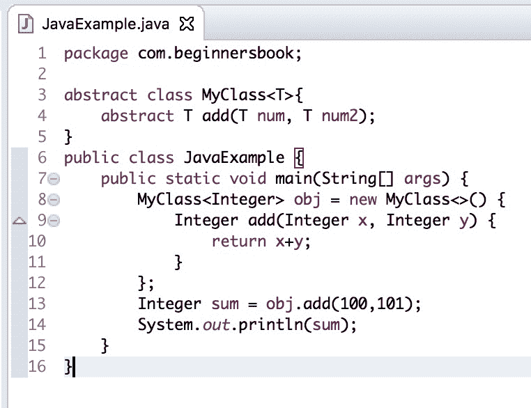

# Java 9 - 匿名内部类和钻石操作员

> 原文： [https://beginnersbook.com/2018/05/java-9-anonymous-inner-classes-and-diamond-operator/](https://beginnersbook.com/2018/05/java-9-anonymous-inner-classes-and-diamond-operator/)

在这篇文章中，我们将讨论 [Java SE 9](https://beginnersbook.com/2018/04/java-9-features-with-examples/) 中引入的**菱形算子增强**。

## 什么是钻石运营商？

Diamond 操作符是作为 java SE 7 中的新功能引入的。diamond 操作符的目的是通过将泛型类型保留在表达式的右侧来避免冗余代码。

```java
// This is before Java 7\. We have to explicitly mention generic type 
// in the right side as well. 
List<String> myList = new ArrayList<String>();

// Since Java 7, no need to mention generic type in the right side
// instead we can use diamond operator. Compiler can infer type.
List<String> myList = new ArrayList<>();
```

## 使用匿名内部类时钻石操作员的问题

Java 7 允许我们在普通类中使用菱形运算符，但它不允许我们在匿名内部类中使用它们。让我们举一个例子：

```java
abstract class MyClass<T>{  
    abstract T add(T num, T num2);  
}  
public class JavaExample {  
    public static void main(String[] args) {  
        MyClass<Integer> obj = new MyClass<>() {  
            Integer add(Integer x, Integer y) {  
                return x+y;   
            }  
        };    
        Integer sum = obj.add(100,101);  
        System.out.println(sum);  
    }  
}
```

输出：

```java
$javac JavaExample.java
JavaExample.java:7: error: cannot infer type arguments for MyClass
        MyClass obj = new MyClass<>() {  
                                        ^
  reason: cannot use '<>' with anonymous inner classes
  where T is a type-variable:
    T extends Object declared in class MyClass
1 error
```

当我们在 Java SE 8 中运行上面的代码时，我们遇到了编译错误。

## Java 9 - Diamond 运算符增强功能

Java 9 改进了菱形运算符的使用，并允许我们将菱形运算符与匿名内部类一起使用。让我们采用我们在上面看到的相同的例子。
**在 Java SE 9** 中运行此代码

```java
abstract class MyClass<T>{  
    abstract T add(T num, T num2);  
}  
public class JavaExample {  
    public static void main(String[] args) {  
        MyClass<Integer> obj = new MyClass<>() {  
            Integer add(Integer x, Integer y) {  
                return x+y;   
            }  
        };    
        Integer sum = obj.add(100,101);  
        System.out.println(sum);  
    }  
}
```

Output:

```java
201
```

Eclipse Oxygen 中使用 jdk 9
的上述代码的屏幕截图