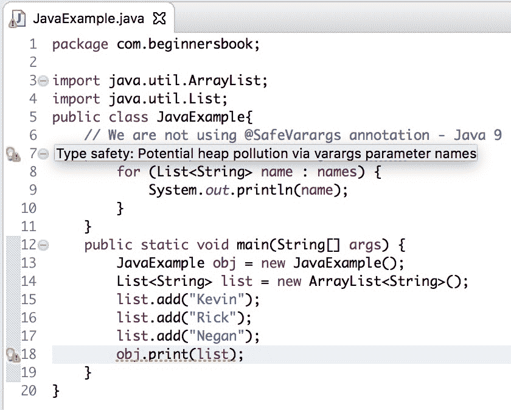

# Java 9 - @SafeVarargs 注释（带示例）

> 原文： [https://beginnersbook.com/2018/05/java-9-safevarargs-annotation/](https://beginnersbook.com/2018/05/java-9-safevarargs-annotation/)

Java 7 引入了 **@SafeVarargs 注释**来抑制当方法具有 varargs（可变数量的参数）时出现的不安全操作警告。 @SafeVarargs 注释只能用于无法覆盖的方法（最终或静态方法或构造函数），因为[重写方法](https://beginnersbook.com/2014/01/method-overriding-in-java-with-example/)仍然可以对其 varargs（可变数量的参数）执行不安全操作。

Java 9 扩展了@SafeVarargs 注释的使用，它现在也可以与私有方法一起使用。这是因为无法覆盖私有方法。之前这个注释仅限于最终或静态方法或构造函数，但现在它可以与私有方法一起使用。

## Java 9 示例 - 当我们不使用@SafeVarargs 注释时？

```java
import java.util.ArrayList;  
import java.util.List;  
public class JavaExample{  
    // We are not using @SafeVarargs annotation - Java 9
    private void print(List... names) {  
        for (List<String> name : names) {  
            System.out.println(name);  
        }  
    }  
    public static void main(String[] args) {  
        JavaExample obj = new JavaExample();  
        List<String> list = new ArrayList<String>();  
        list.add("Kevin");  
        list.add("Rick"); 
        list.add("Negan");
        obj.print(list);  
    }     
}

```

**警告：**

```java
Type safety: Potential heap pollution via varargs parameter names
Type safety: A generic array of List is created for a varargs 
 parameter
```

**输出：**

```java
[Kevin, Rick, Negan]
```

**正如你所看到的，代码运行良好但却没有产生任何警告。**

Eclipse Oxygen IDE 中此代码的屏幕截图，显示警告。


## Java 9 - @SafeVarargs 注释示例

让我们在使用@SafeVarargs 注释后再次运行相同的代码。

```java
import java.util.ArrayList;  
import java.util.List;  
public class JavaExample{  
    @SafeVarargs
    private void print(List... names) {  
        for (List<String> name : names) {  
            System.out.println(name);  
        }  
    }  
    public static void main(String[] args) {  
        JavaExample obj = new JavaExample();  
        List<String> list = new ArrayList<String>();  
        list.add("Kevin");  
        list.add("Rick"); 
        list.add("Negan");
        obj.print(list);  
    }      
}
```

相同的输出没有任何警告。

**注意：**如果您尝试在 Java 7 和 Java 8 中编译上述代码，您将收到编译错误，因为此增强功能在 Java 9 中完成，在 Java 9 之前 - 不允许使用私有方法标有此注释。