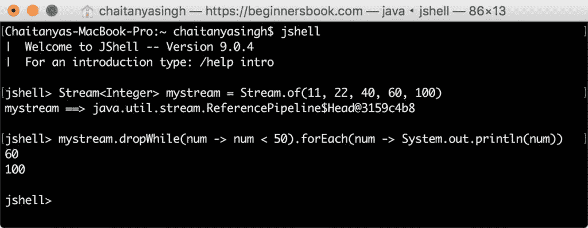
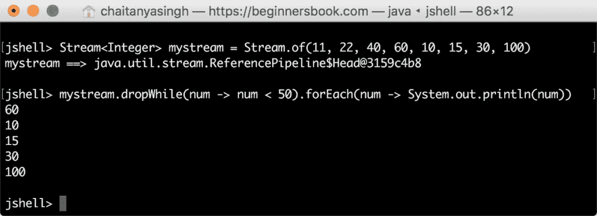
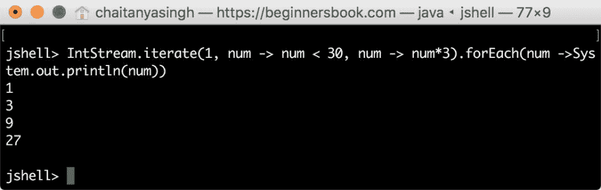
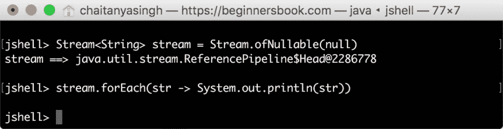

# Java 9 - Stream API 改进

> 原文： [https://beginnersbook.com/2018/06/java-9-stream-api-enhancements/](https://beginnersbook.com/2018/06/java-9-stream-api-enhancements/)

我们已经了解到 [Java 8](https://beginnersbook.com/2017/10/java-8-features-with-examples/) 引入了 Stream API 以及其他一些很酷的功能。如果您不熟悉 Streams，请参阅本指南： [Java 8 - Stream API](https://beginnersbook.com/2017/10/java-8-stream-tutorial/) 。 Java 9 为 Stream API 引入了四种新方法。这些方法添加在 java.util.Stream 接口中。

## Java 9 - Stream API 改进

Java 9 在 Stream 中添加了以下四种方法。由于 Stream 是一个接口，添加到它的方法是默认的和静态的。这是因为 [java 8 允许我们在接口](https://beginnersbook.com/2017/10/java-8-interface-changes-default-method-and-static-method/)中使用默认和静态方法。
1\. `dropWhile()` - 默认方法
2\. `takeWhile()` - 默认方法
3\. `iterate()` - 静态方法
4\. `ofNullable()` - 静态方法

## Java 9 - Stream `dropWhile()`方法

方法`dropWhile()`删除流的所有元素，直到给定的谓词失败。

**例如：**

```java
jshell> Stream<Integer> mystream = Stream.of(11, 22, 40, 60, 100)
mystream ==> [email protected]

jshell> mystream.dropWhile(num -> num < 50).forEach(num -> System.out.println(num))
60
100

```



**注意：当流是无序的**时，`dropWhile()`会丢弃所​​有元素，直到给定的谓词失败，一旦谓词失败，此方法不会检查流的其他元素。这意味着结果流可能具有与谓词匹配的元素，让我们举一个例子来理解这一点。

```java
jshell> Stream<Integer> mystream = Stream.of(11, 22, 40, 60, 10, 15, 30, 100)
mystream ==> [email protected]

jshell> mystream.dropWhile(num -> num < 50).forEach(num -> System.out.println(num))
60
10
15
30
100
```

这里，元素 60 之后的流中存在的元素 10,15,30 与谓词匹配但是它们没有被`dropWhile()`删除，因为当谓词在元素 60 上失败时，该方法没有检查其他元素。


## Java 9 - Stream `takeWhile()`方法

方法`takeWhile()`与`dropWhile()`方法相反。此方法在结果流中获取流的所有元素，直到谓词失败。简而言之，当谓词失败时，它会丢弃该元素以及流中该元素之后的所有元素。让我们举几个例子来理解这一点。

**对有序流**
使用`takeWhile()`方法这里对流进行排序，`takeWhile()`方法获取所有元素，直到谓词在元素值 60 处失败。

```java
jshell> Stream<Integer> mystream = Stream.of(10, 20, 30, 40, 60, 90, 120)
mystream ==> [email protected]

jshell> mystream.takeWhile(num -> num < 50).forEach(num -> System.out.println(num))
10
20
30
40
```

**对无序流**
使用`takeWhile()`方法与`dropWhile()`方法类似，一旦谓词失败，此方法也不会进一步检查元素。这就是元素 10 和 15 被丢弃的原因，因为它们位于元素 60 之后（谓词失败）。

```java
jshell> Stream<Integer> mystream = Stream.of(10, 20, 40, 60, 70, 10, 15, 100)
mystream ==> [email protected]

jshell> mystream.takeWhile(num -> num < 50).forEach(num -> System.out.println(num))
10
20
40
```

## Java 9 - Stream `iterate()`方法

Java 9 中的 iterate 方法有三个参数。
**第一个参数**是初始化值，返回的流以此值开始。
**第二个参数**是谓词，迭代继续，直到这个给定的谓词返回 false。
**第三个参数**更新上一次迭代的值。

**示例：**
在此示例中，第一个参数为 1.流以元素 1 开头。

num - &gt; num&lt; 30 是第二个参数，它是一个谓词。迭代继续，直到返回 false。 num - &gt; num * 3 是更新从上一次迭代返回的值的第三个参数。这类似于循环的计数器变量。

```java
jshell> IntStream.iterate(1, num -> num < 30, num -> num*3).forEach(num ->System.out.println(num))
1
3
9
27
```

从值 1 开始，我们将返回值乘以 3，这将一直持续到返回值大于 30。



## Java 9 - Stream `ofNullable()`方法

引入此方法是为了避免 NullPointerException。如果流为 null，则此方法返回空流。它也可以在非空流上使用，返回单个元素的顺序流。

**空流示例**

```java
jshell> Stream<String> stream = Stream.ofNullable(null)
stream ==> [email protected]

jshell> stream.forEach(str -> System.out.println(str))

jshell>
```



**非空流示例**

```java
jshell> Stream<String> stream = Stream.ofNullable("Rose")
stream ==> [email protected]

jshell> stream.forEach(str -> System.out.println(str))
Rose

jshell>
```

这些是在 Java SE 9 中完成的四种 Stream API 增强功能。