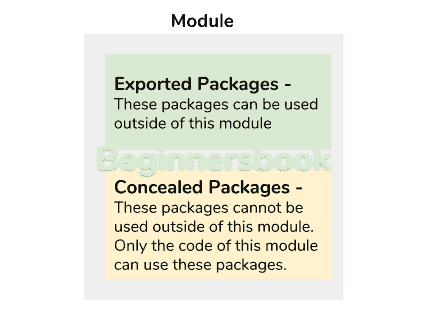
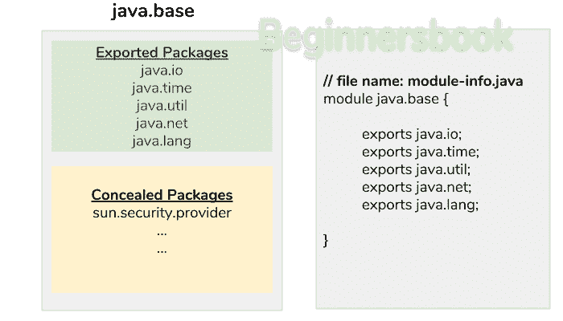
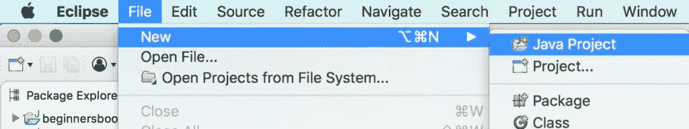
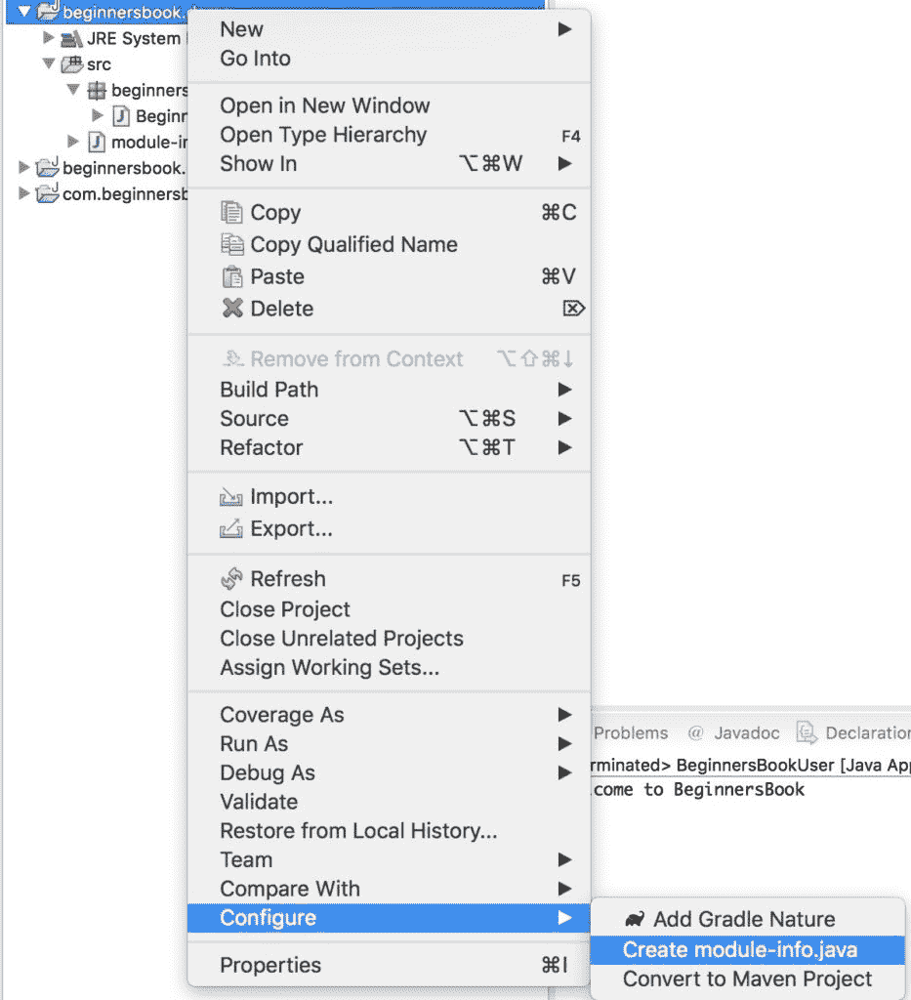
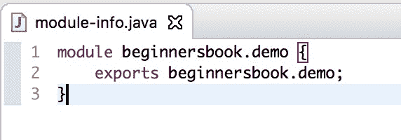
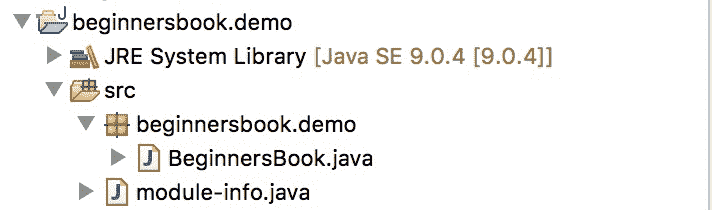
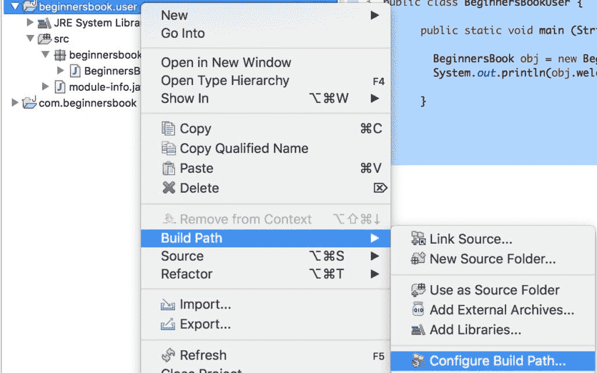
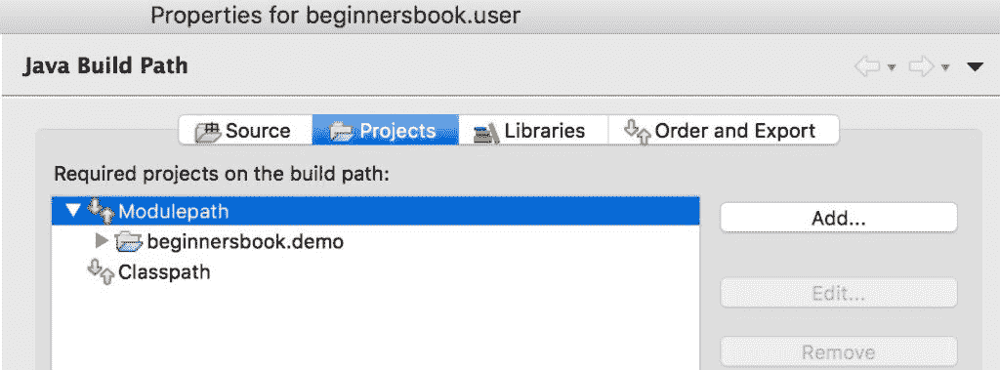
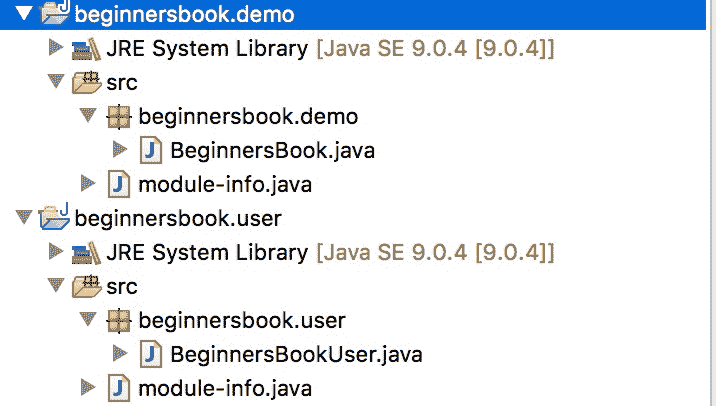

# 在 15 分钟内学习 Java 9 模块

> 原文： [https://beginnersbook.com/2018/09/java-9-modules/](https://beginnersbook.com/2018/09/java-9-modules/)

在本文中，我们将学习 Java 9 最重要的特性 - [“**Java 9 模块**”](https://beginnersbook.com/2018/04/java-9-features-with-examples/)。我们将涵盖所有内容，例如我们需要模块的原因，什么是模块，如何在 Java 中创建和使用模块。让我们开始吧。

#### 关于模块的小背景

**Java 模块系统**是 Java 早就应该实现的。模块系统是 Jigsaw 计划的一部分，最初计划在 Java SE 7 中发布但延迟并推迟到 Java SE 8 发布，但又因为它是一个巨大而有声望的项目，它已经从 Java SE8 推迟发布并最终在 **Java SE 9** 中发布。**

在下一节中，我将从基础知识中进行解释，以便每个人都能理解模块的需求。您可能会发现它是一个巨大的文本墙，但我向您保证，如果您仔细阅读它，您将能够理解模块背后的原因和想法。

## 为什么我们需要 Java 中的模块？

java 最重要的特性是可重用性，它允许我们在[继承](https://beginnersbook.com/2013/03/inheritance-in-java/)和[接口](https://beginnersbook.com/2013/05/java-interface/)的帮助下重用我们创建的类。我们可以在继承的帮助下继承类的行为，并且可以使用接口继承抽象。

为了有效地重用这些类，java 将它们分组在[包](https://beginnersbook.com/2013/03/packages-in-java/)中，并且它以这样的方式完成，以便类似类型的类在单个包中。对于例如当我们处理[集合](https://beginnersbook.com/java-collections-tutorials/)时，我们需要的大多数类和接口都在`java.util`包中。

随着我们的代码大小的增加，java 中的包也增加了。想象一下，使用数百个包来处理一个非常大的程序，在这种情况下，很难理解哪些类正在使用什么。包是组织类的好方法，但**我们需要在代码中使用包时组织它们**。

此外，使类可以在包之间重用的唯一方法是将其公开，当我们公开它时，任何人都可以使用它。这也需要解决。

**Java 9** 引入了一个很酷的新功能来解决我们上面讨论过的问题。它引入了一个名为“模块”的新功能。 **“模块是一组包”**。模块不仅可以组织包，还可以处理可访问性，以便可以使用我们想要重用的模块的部分，以及我们不想重用的部分，不能重复使用。

直到现在我们在理论上讨论了所有内容，让我们在代码和图表的帮助下讨论模块。

## 什么是 Java 9 模块？

模块是一组包。我们在一个模块中有两种类型的包 - 1）导出的包 2）隐藏的包。

**导出的软件包：**这些软件包旨在在模块外部使用，这意味着任何其他模块中的任何程序都可以使用这些软件包。

**隐藏包：**这些包不在外面使用，它们在模块内部，只能在模块内部使用。



为了进一步理解导出包和隐藏包的概念，我们举一个`java.base`模块的例子。

让我们借助下图了解这一点。在下图中，`java.base`中的绿色块表示“导出的包”，有几个导出的包，但我只提到了其中的一些。绿色块中提到的这些包可以由外部类使用。

黄色块中的包装是隐藏包装，在模块外部无法访问。这些包仅用于模块内部。

在 java 中我们在`module-info.java`文件中定义模块，并提及任何包作为导出包我们在`export`关键字之后提到包的名称，如右侧所示（灰色）在下图中阻止。


让我们在 Eclipse IDE 中编写程序并使用模块的概念。

## Java 9 模块 - 在 Eclipse IDE 中创建和使用模块

我们将在一个模块中创建一个类，并在另一个模块中使用该类。

#### 1.创建 Java 项目



我们正在 Eclipse IDE 中创建一个 java 项目。我们使用的项目名称是`beginnersbook.demo`。

#### 2.创建`module-info.java`文件

创建项目后，右键单击项目名称，转到`Configure`选项，然后单击`create module-info.java`选项如下截图所示。给出与项目名称`beginnersbook.demo`相同的模块名称。


现在请将文件留空。我们稍后会来。

#### 3.创建包和类

我们在这个模块中创建了一个类，我们将在另一个模块中使用这个类。我们正在`beginnersbook.demo`包中创建一个类`BeginnersBook`。

`BeginnersBook`类的源代码：

```java
package beginnersbook.demo;

public class BeginnersBook {
   public String welcomeMessage() {
      return "Welcome to BeginnersBook";
   }

}
```

#### 4.导出我们创建的包

由于我们计划在另一个模块中使用`BeginnersBook`类，因此我们可以将此包导出，以便可以在模块外部使用。为此，请在`module-info.java`文件：

中编写此代码

```java
module beginnersbook.demo {
   exports beginnersbook.demo;
}
```

**项目`beginnersbook.demo`的最终结构如下：**


#### 5.让我们创建另一个模块

让我们创建一个新的 java 项目，将其命名为`beginnersbook.user`，并按照我们上面创建的方式创建`module-info.java`文件，并将其命名为`beginnersbook.user`。该项目的`module-info.java`文件包含以下代码：

```java
//module-info.java file
module beginnersbook.user {
   exports beginnersbook.user;
   requires beginnersbook.demo;
}
```

由于我们计划使用`beginnersbook.demo`包，因此我们在`require`关键字后面提到了包名，如上面的代码所示。

注意：您很可能会收到一条错误消息，指出包名称未解析，这是因为其他模块不在构建路径中。要解决此错误，请右键单击项目`beginnersbook.user`，转到`Build Path -> 配置构建路径`，如以下屏幕截图所示：


转到`Projects`选项卡，单击`Modulepath`，然后单击右侧的`Add`按钮，添加我们创建的上一个 java 项目`beginnersbook.demo`。你的最终屏幕应如下所示：


您的错误现在应该得到解决。

#### 6.让我们在第二个模块中创建一个类

在包含`beginnersbook.user`包的项目中创建一个类`BeginnersBookUser`。

`BeginnersBookUser`类的源代码：

```java
package beginnersbook.user;
import beginnersbook.demo.BeginnersBook;
public class BeginnersBookUser {
   public static void main (String arg[]) {
      BeginnersBook obj = new BeginnersBook();
      System.out.println(obj.welcomeMessage());
   }
}
```

**两个项目的最终结构如下：**


#### 7.最后一步

让我们运行`BeginnersBookUser`类，你应该得到以下输出：

```java
Welcome to BeginnersBook
```

多数民众赞成。为了简要说明，我们在模块中创建了一个类并导出了包，以便可以在模块外部使用该类。
为了测试它，我们在另一个模块中创建了另一个类，并使用了导出的包，最后使用了我们首先创建的类。