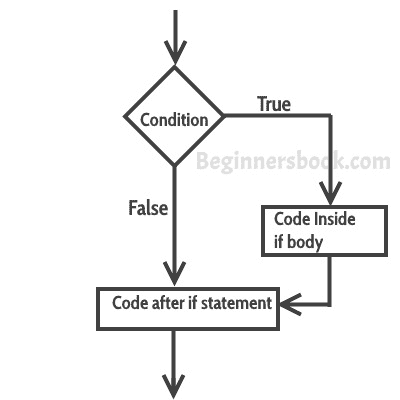

# Java 中的`if`和`if-else`语句

> 原文： [https://beginnersbook.com/2017/08/if-else-statement-in-java/](https://beginnersbook.com/2017/08/if-else-statement-in-java/)

当我们需要根据条件执行一组语句时，我们需要使用**控制流语句**。例如，如果一个数字大于零，那么我们要打印“正数”，但如果它小于零，那么我们要打印“负数”。在这种情况下，程序中有两个`print`语句，但根据输入值一次只执行一个`print`语句。我们将看到如何使用控制语句在 java 程序中编写这种类型的条件。

在本教程中，我们将看到四种类型的控制语句，您可以根据需求在 java 程序中使用：在本教程中，我们将介绍以下条件语句：

a）`if`语句

b）嵌套`if`语句

c）`if-else`语句

d）`if-else-if`语句

## `if`语句

`if`语句包含条件，后跟语句或一组语句，如下所示：

```java
if(condition){
  Statement(s);
}
```

只有在给定条件为真时才会执行语句。如果条件为`false`，那么`if`语句体内的语句将被完全忽略。




### `if`语句的示例

```java
public class IfStatementExample {

   public static void main(String args[]){
      int num=70;
      if( num < 100 ){
	  /* This println statement will only execute,
	   * if the above condition is true
	   */
	  System.out.println("number is less than 100");
      }
   }
}
```

**输出：**

```java
number is less than 100
```

## Java 中的嵌套`if`语句

当在另一个`if`语句中有`if`语句时，它被称为**嵌套`if`语句**。

嵌套的结构如下所示：

```java
if(condition_1) {
   Statement1(s);

   if(condition_2) {
      Statement2(s);
   }
}
```

如果`condition_1`为`true`，则执行`Statement1`。只有条件（`condition_1`和`condition_2`）都为真时，`Statement2`才会执行。

### 嵌套`if`语句的示例

```java
public class NestedIfExample {

   public static void main(String args[]){
        int num=70;
	if( num < 100 ){ 
           System.out.println("number is less than 100"); 
           if(num > 50){
	      System.out.println("number is greater than 50");
	   }
	}
   }
}
```

**输出：**

```java
number is less than 100
number is greater than 50

```

## 在 Java 中使用`if-else`语句

这是`if-else`语句的外观：

```java
if(condition) {
   Statement(s);
}
else {
   Statement(s);
}
```

如果条件为真，则`if`内的语句将执行，如果条件为假，则`else`内的语句将执行。


### `if-else`语句的示例

```java
public class IfElseExample {

   public static void main(String args[]){
     int num=120;
     if( num < 50 ){
	System.out.println("num is less than 50");
     }
     else {
	System.out.println("num is greater than or equal 50");
     }
   }
}
```

**输出：**

```java
num is greater than or equal 50

```

## `if-else-if`语句

当我们需要检查多个条件时使用`if-else-if`语句。在这个声明中，我们只有一个`if`和一个`else`，但是我们可以有多个`else if`。它也被称为`if else if`梯子。这是它的样子：

```java
if(condition_1) {
   /*if condition_1 is true execute this*/
   statement(s);
}
else if(condition_2) {
   /* execute this if condition_1 is not met and
    * condition_2 is met
    */
   statement(s);
}
else if(condition_3) {
   /* execute this if condition_1 & condition_2 are
    * not met and condition_3 is met
    */
   statement(s);
}
.
.
.
else {
   /* if none of the condition is true
    * then these statements gets executed
    */
   statement(s);
}
```

**注意：**这里要注意的最重要的一点是，在`if-else-if`语句中，只要满足条件，就会执行相应的语句集，忽略其余。如果没有满足条件，则执行`else`内的语句。

### `if-else-if`的示例

```java
public class IfElseIfExample {

   public static void main(String args[]){
	int num=1234;
	if(num <100 && num>=1) {
	  System.out.println("Its a two digit number");
	}
	else if(num <1000 && num>=100) {
	  System.out.println("Its a three digit number");
	}
	else if(num <10000 && num>=1000) {
	  System.out.println("Its a four digit number");
	}
	else if(num <100000 && num>=10000) {
	  System.out.println("Its a five digit number");			
	}
	else {
	  System.out.println("number is not between 1 & 99999");			
	}
   }
}
```

**输出：**

```java
Its a four digit number

```

查看这些相关的 [java 示例](https://beginnersbook.com/2017/09/java-examples/)：

1.  [Java 程序：使用`if..else..if`](https://beginnersbook.com/2017/09/java-program-to-find-largest-of-three-numbers/) 查找三个数字中最大的一个
2.  [Java 程序：检查数字是正数还是负数](https://beginnersbook.com/2017/09/java-program-to-check-if-number-is-positive-or-negative/)
3.  [Java 程序：检查数字是偶数还是奇数](https://beginnersbook.com/2014/02/java-program-to-check-even-or-odd-number/)