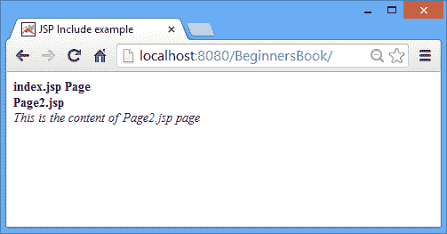
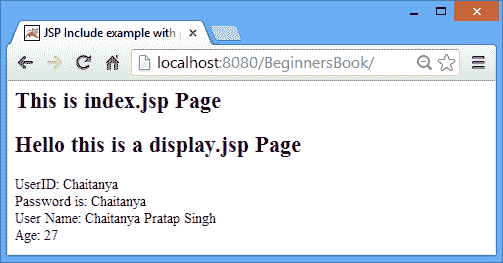

# JSP 包含动作标记 - JSP Tutorial

> 原文： [https://beginnersbook.com/2013/11/jsp-include-action-tag/](https://beginnersbook.com/2013/11/jsp-include-action-tag/)

Include 动作标记用于将另一个资源包含到当前 JSP 页面。包含的资源可以是 HTML，JSP 页面或 Servlet 中的静态页面。我们还可以将参数及其值传递给我们所包含的资源。下面我分享了两个&lt; jsp：include&gt;的示例，其中一个包含一个页面而没有传递任何参数，在第二个示例中，我们将几个参数传递给正在包含的页面。

**语法：**

1）包括参数。

```html
<jsp:include page="Relative_URL_Of_Page"> 
<jsp:param ... /> 
<jsp:param ... /> 
<jsp:param ... /> 
...
<jsp:param ... /> 
</jsp:include>
```

2）包含另一个没有共享参数的资源。

```html
<jsp:include page="Relative_URL_of_Page" />
```

如果页面位于当前 JSP 所在的同一目录中，Relative_URL_of_Page 将是页面名称。

### 示例 1：&lt; jsp：include&gt;没有参数

在这个例子中，我们将使用&lt; jsp：include&gt;没有参数的动作标签。因此，页面将包含在当前 JSP 页面中：

index.jsp

```html
<html> 
<head>
<title>JSP Include example</title>
</head>
<body> 
<b>index.jsp Page</b><br>
<jsp:include page="Page2.jsp" /> 
</body> 
</html>
```

Page2.jsp

```html
<b>Page2.jsp</b><br>
<i> This is the content of Page2.jsp page</i>
```

**输出：**

Page2.jsp 的内容已附加在 index.jsp 中。



### 示例 2：使用&lt; jsp：include&gt;以及&lt; jsp：param&gt;

index.jsp

我正在使用**&lt; jsp：include&gt;动作**和&lt; jsp：param&gt;用于将参数传递给我们将要包含的页面。

```html
<html> 
<head>
<title>JSP Include example with parameters</title>
</head>
<body> 
<h2>This is index.jsp Page</h2>
<jsp:include page="display.jsp"> 
<jsp:param name="userid" value="Chaitanya" /> 
<jsp:param name="password" value="Chaitanya" /> 
<jsp:param name="name" value="Chaitanya Pratap Singh" /> 
<jsp:param name="age" value="27" /> 
</jsp:include> 
</body> 
</html>
```

display.jsp

```html
<html>
<head>
<title>Display Page</title>
</head>
<body>
<h2>Hello this is a display.jsp Page</h2>
UserID: <%=request.getParameter("userid") %><br>
Password is: <%=request.getParameter("password") %><br>
User Name: <%=request.getParameter("name") %><br>
Age: <%=request.getParameter("age") %>
</body>
</html>
```

**Output:**

正如您所看到的，display.jsp 的内容已包含在 index.jsp 中。此外，我们传递的参数正在包含的页面中正确显示。



如果您对该主题有任何疑问和疑问，请告诉我们。我们很乐意帮助您！！