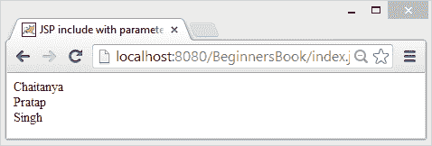

# JSP 包含带参数示例的操作

> 原文： [https://beginnersbook.com/2013/12/jsp-include-with-parameter-example/](https://beginnersbook.com/2013/12/jsp-include-with-parameter-example/)

之前我们已经分享了如何使用 [include 指令](https://beginnersbook.com/2013/11/jsp-include-directive/)和 [include action](https://beginnersbook.com/2013/11/jsp-include-action-tag/) 标签将页面包含到另一个 JSP 页面。我们还讨论了 include 指令和 include 动作标签之间的[区别。在这篇文章中，我们将看到如何在使用 jsp include action 标签（＆lt; JSP：Include＆gt;）时将参数传递给包含的页面。为了传递参数，我们需要使用**＆lt; jsp：param＆gt;动作标签**。](https://beginnersbook.com/2013/12/difference-between-include-directive-and-include-tag-in-jsp/)

## 例

在这个例子中，我们使用＆lt; jsp：include＆gt;将 JSP 页面（file.jsp）包含到主 JSP 页面（index.jsp）中。动作标签。要将参数从索引传递到文件页面，我们使用＆lt; jsp：param＆gt;动作标签。我们传递了三个参数 firstname，middlename 和 lastname，对于每个参数我们需要指定相应的参数名称和参数值。我们可以使用表达式语言或表达式标签＆amp; amp;隐含的对象。

的 index.jsp

```
<html>
<head>
<title>JSP include with parameters example</title>
</head>
<body>
<jsp:include page="file.jsp" >
  <jsp:param name="firstname" value="Chaitanya" />
  <jsp:param name="middlename" value="Pratap" />
  <jsp:param name="lastname" value="Singh" />
</jsp:include>
</body>
</html>
```

file.jsp

```
${param.firstname}<br>
${param.middlename}<br>
${param.lastname}
```

**输出：**



如您所见，包含的页面显示了从主页面传递的参数值。为了在 file.jsp 页面上显示参数，我们使用了[表达式语言（$ {}）](https://beginnersbook.com/2013/11/jsp-expression-language-el/)。但是，您也可以使用以下代码，该代码使用 JSP [表达式标记](https://beginnersbook.com/2013/11/jsp-expression-tag/)和[请求隐式对象](https://beginnersbook.com/2013/11/jsp-implicit-object-request-with-examples/)。

```
<%= request.getParameter("firstname")%>
<%= request.getParameter("middlename")%>
<%= request.getParameter("lastname")%>
```

这就是我们对这个话题的全部看法。在接下来的文章中，我们将讨论如何使用 include 指令将参数及其值传递到另一个页面。同时，如果您有任何疑问，请在下面的评论部分中提出相同的问题。