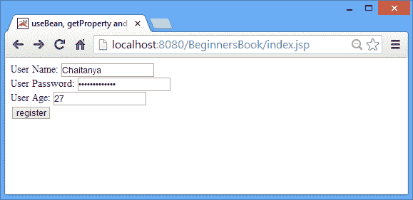
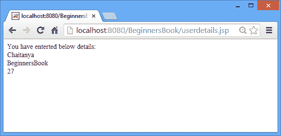

# `jsp:useBean`，`jsp:setProperty`和`jsp:getProperty`动作标签

> 原文： [https://beginnersbook.com/2013/11/jsp-usebean-setproperty-getproperty-action-tags/](https://beginnersbook.com/2013/11/jsp-usebean-setproperty-getproperty-action-tags/)

在本教程中，我们将看到如何在`jsp:useBean`，`jsp:setProperty`和`jsp:getProperty`动作标签的帮助下在 JSP 中使用 bean 类。

**`jsp:useBean`语法：**

```html
<jsp: useBean id="unique_name_to_identify_bean" 
class="package_name.class_name" />
```

**`jsp:setProperty`的语法：**

```html
<jsp:setProperty name="unique_name_to_identify_bean" 
property="property_name" />
```

**`jsp:getProperty`的语法：**

```html
<jsp:getProperty name="unique_name_to_identify_bean" 
property="property_name" />
```

### `useBean`，`setProperty`和`getProperty`的完整示例

1）我们有一个 bean 类详细信息，我们有三个变量用户名，年龄和密码。为了在 JSP 中使用 bean 类及其属性，我们在`userdetails.jsp`页面中初始化了这样的类：

```html
<jsp:useBean id="userinfo" class="beginnersbook.com.Details"></jsp:useBean>
```

我们使用了`useBean`动作来初始化类。我们的类在`beginnersbook.com`包中，所以我们给了一个完全限定的名字`beginnersbook.com.Details`。

2）我们使用`setProperty`动作标签映射了 bean 类和 JSP 的属性。我们在属性字段中给出`'*'`来根据它们的名称映射值，因为我们在 bean 类和`index.jsp` JSP 页面中使用了相同的属性名称。在`name`字段中，我们给出了我们在`useBean`标签中定义的唯一标识符。

```html
<jsp:setProperty property="*" name="userinfo"/>
```

3）要获取属性值，我们使用了`getProperty`动作标签。

```html
<jsp:getProperty property="propertyname" name="userinfo"/>
```

`Details.java`

```html
package beginnersbook.com;
public class Details {
	public Details() {
    }
    private String username;
    private int age;
    private String password;
	public String getUsername() {
		return username;
	}
	public void setUsername(String username) {
		this.username = username;
	}
	public int getAge() {
		return age;
	}
	public void setAge(int age) {
		this.age = age;
	}
	public String getPassword() {
		return password;
	}
	public void setPassword(String password) {
		this.password = password;
	}

}
```

`index.jsp`

```html
<html>
<head><title>
useBean, getProperty and setProperty example
</title></head>
<form action="userdetails.jsp" method="post"> 
User Name: <input type="text" name="username"><br> 
User Password: <input type="password" name="password"><br> 
User Age: <input type="text" name="age"><br> 
<input type="submit" value="register"> 
</form> 
</html>
```

`userdetails.jsp`

```html
<jsp:useBean id="userinfo" class="beginnersbook.com.Details"></jsp:useBean> 
<jsp:setProperty property="*" name="userinfo"/> 
You have enterted below details:<br> 
<jsp:getProperty property="username" name="userinfo"/><br> 
<jsp:getProperty property="password" name="userinfo"/><br> 
<jsp:getProperty property="age" name="userinfo" /><br>
```

**输出：**



