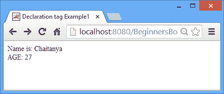
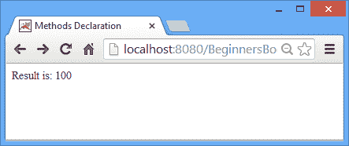

# JSP 声明标签

> 原文： [https://beginnersbook.com/2013/11/jsp-declaration-tag/](https://beginnersbook.com/2013/11/jsp-declaration-tag/)

声明标签是用于声明类级变量，方法和类的 java 代码块。这些标签内的任何内容都会在 JSP 初始化阶段初始化并具有类范围。 JSP 容器将此代码保留在服务方法（`_jspService()`）之外，以使它们成为类级变量和方法。

我们知道变量也可以使用 [scriptlet](https://beginnersbook.com/2013/05/jsp-tutorial-scriptlets/ "Scriptlet") 进行初始化，但这些声明放在`_jspService()`方法中，而不会使它们成为类范围的声明。另一方面，**声明标签**可用于定义类级变量，方法和类。

**声明标签语法：**

```html
<%!  Declaration %>
```

**示例 1：变量声明**

在此示例中，我们在声明标签内声明了两个变量，并使用[表达式标签](https://beginnersbook.com/2013/11/jsp-expression-tag/ "Expression tag")在客户端上显示它们。

```html
<html> 
<head>
 <title>Declaration tag Example1</title>
</head>
<body> 
<%! String name="Chaitanya"; %> 
<%! int age=27; %> 
<%= "Name is: "+ name %><br>
<%= "AGE: "+ age %> 
</body> 
</html>
```

**输出**：



**例 2：方法声明**

在这个例子中，我们使用 **JSP 声明标签**声明了一个方法`sum`。

```html
<html> 
<head>
 <title>Methods Declaration</title>
</head>
<body> 
  <%! 
  int sum(int num1, int num2, int num3){ 
  return num1+num2+num3; 
  } 
  %> 

  <%= "Result is: " + sum(10,40,50) %> 
</body> 
</html>
```

**输出：**

所有三个整数的总和将显示在浏览器上。



如果你有任何疑问，请告诉我们。