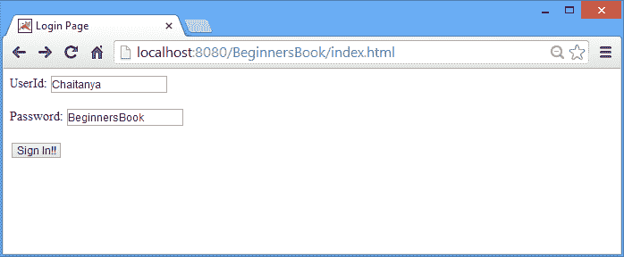
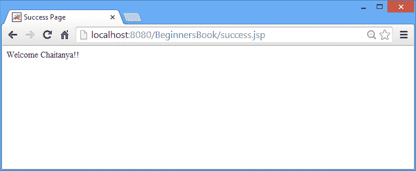
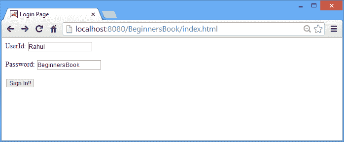
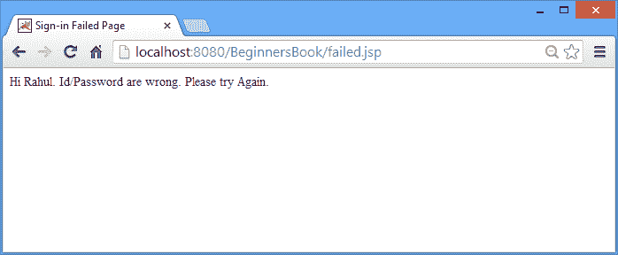

# 使用示例在 JSP 中响应隐式对象

> 原文： [https://beginnersbook.com/2013/11/jsp-implicit-object-response-with-examples/](https://beginnersbook.com/2013/11/jsp-implicit-object-response-with-examples/)

在这篇文章中，我们将讨论 JSP 中的响应隐式对象。它是 **javax.servlet.http.HttpServletRequest** 的一个实例，主要用于修改处理客户端请求后发送给浏览器的响应。

**快速链接：**

*   [响应隐式对象完成示例](#example)
*   [输出截图](#output)

### 响应隐式对象的方法

void setContentType（String type）
void sendRedirect（String address）
void addHeader（String name，String value）
void setHeader（String name，String value）
boolean containsHeader（String name）
void addCookie（Cookie 值）
void sendError（int status_code，String message）
boolean isCommitted（）
void setStatus（int statuscode）

让我们详细了解每种方法 -

1.  **void setContentType（String type） -** 此方法通过设置 MIME 类型和字符编码告诉浏览器，响应数据的类型。此方法设置的信息有助于浏览器解释响应。示例 -

    ```html
        response.setContentType("text/html");
        response.setContentType("image/gif");
        response.setContentType("image/png");
        response.setContentType("application/pdf");
    ```

2.  **void sendRedirect（String address） -** 它将控件重定向到新的 JSP 页面。对于例如当浏览器检测到以下语句时，它将从当前 JSP 页面重定向到 beginnersbook.com。

    ```html
        response.sendRedirect("http://beginnersbook.com");
    ```

3.  **void addHeader（String name，String value） -** addHeader 方法为响应添加一个标题，基本上它包含一个标题名称及其值。例如 - 以下语句将在响应中包含标题“Site”，其值为“BeginnersBook.com”。

    ```html
        response.addHeader("Site", "BeginnersBook.com");
    ```

4.  **void setHeader（String name，String value） -** 设置标头值。此方法使用新值覆盖标头的当前值。假设我正在修改 Header“ **Site** ”的值。以下声明会将当前值 BeginnersBook.com 修改为新值 BB.com

    ```html
        response.setHeader("Site", "BB.com");
    ```

5.  **boolean containsHeader（String name） -** 它返回一个布尔值 true / false。它基本上检查响应中是否存在标题。例如 - 在上面，在 addHeader 方法示例中，我们在响应中添加了 **Site** Header，因此以下语句将返回 true。

    ```html
        response.containsHeader("Site");
    ```

6.  **void addCookie（Cookie cookie） -** 此方法将 cookie 添加到响应中。以下陈述将在回复中添加 2 个 Cookie **作者**和 **Siteinfo** 。

    ```html
        response.addCookie(Cookie Author);
        response.addCookie(Cookie Siteinfo);
    ```

7.  **void sendError（int status_code，String message） -** 它用于通过代码和错误消息发送错误响应。例如 -

    ```html
        response.sendError(404, "Page not found error");
    ```

8.  **boolean isCommitted（）** - 检查 Http Response 是否已发送到客户端，如果是，则返回 true，否则返回 false。

    ```html
        &lt;% if(response.isCommited())
           {
               &lt;%--do something --%&gt;
           }else
            {
               &lt;%--do something else --%&gt;
            } %&gt;
    ```

9.  **void setStatus（int statuscode）** - 此方法用于将 HTTP 状态设置为给定值。对于例如以下语句将 HTTP 响应代码设置为 404（找不到页面）。

    ```html
        response.setStatus(404);
    ```

### 响应隐式对象示例

在下面的示例中，我们从登录页面接收 id 和密码，然后我们将它们与硬编码的正确 id / pass 匹配。如果凭据正确，则登录页面会重定向到成功页面，否则会重定向到登录失败的 JSP 页面。

index.html

```html
<html>
<head>
<title>Login Page</title>
</head>
<body>
<form action="checkdetails.jsp"> 
UserId: <input type="text" name="id" /> <br><br>
Password: <input type="text" name="pass" /> <br><br>
<input type="submit" value="Sign In!!"/> 
</form>
</body>
</html>
```

此 JSP 页面根据硬编码值验证输入 id / pass。

checkdetails.jsp

```html
<html> 
<head><title>Check Credentials</title>
</head>
<body> 
<% 
String uid=request.getParameter("id"); 
String password=request.getParameter("pass"); 
session.setAttribute("session-uid", uid);
if(uid.equals("Chaitanya") && password.equals("BeginnersBook"))
{
 response.sendRedirect("success.jsp");
}
else
{
 response.sendRedirect("failed.jsp");
}
%> 
</body> 
</html>
```

如果 id / pass 与硬编码的用户 ID /密码匹配，则会执行此 JSP 页面。

success.jsp

```html
<html> 
<head><title>Success Page</title>
</head>
<body> 
<% 
String data=(String)session.getAttribute("session-uid");
out.println("Welcome "+ data+"!!");
%> 
</body> 
</html>
```

如果用户输入的凭据错误，控件将重定向到此页面。

failed.jsp

```html
<html> 
<head><title>Sign-in Failed Page</title>
</head>
<body> 
<% 
String data2=(String)session.getAttribute("session-uid");
out.println("Hi "+ data2+". Id/Password are wrong. Please try Again.");
%> 
</body> 
</html>
```

### 输出截图：

登录页面



成功页面：当 userId 和密码正确时。



登录时错误的细节。



登录失败页面：当 Id 和密码错误时。



目前为止就这样了。如果您对 JSP 中的响应隐式对象有任何疑问和疑问，请告诉我们。