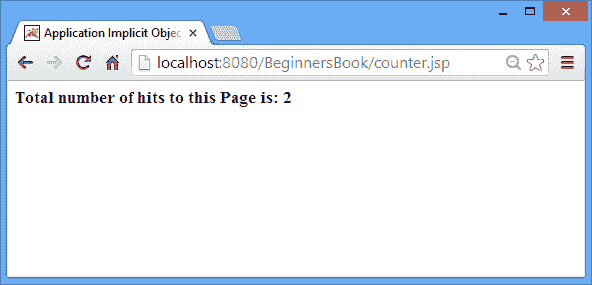

# JSP 中的应用隐式对象及其示例

> 原文： [https://beginnersbook.com/2013/11/jsp-implicit-object-application-with-examples/](https://beginnersbook.com/2013/11/jsp-implicit-object-application-with-examples/)

Application 隐式对象是 **javax.servlet.ServletContext** 的一个实例。它主要用于获取初始化参数和共享属性&amp;它们在整个 JSP 应用中的值，这意味着**应用隐式对象**设置的任何属性都可用于所有 JSP 页面。

**方法：**

*   Object getAttribute（String attributeName）
*   void setAttribute（String attributeName，Object object）
*   void removeAttribute（String objectName）
*   枚举 getAttributeNames（）
*   String getInitParameter（String paramname）
*   枚举 getInitParameterNames（）
*   String getRealPath（String value）
*   void log（String message）
*   URL getResource（String value）
*   InputStream getResourceAsStream（String path）
*   String getServerInfo（）
*   String getMajorVersion（）
*   String getMinorVersion（）

1.  **Object getAttribute（String attributeName）：**它返回存储在给定属性名称中的对象。例如，下面的语句将返回存储在属性“MyAttr”中的对象。

    ```
        String s = (String)application.getAttribute("MyAttr");
    ```

2.  **void setAttribute(String attributeName, Object object):** It sets the value of an attribute or in other words it stores an attribute and its value in application context, which is available to use across JSP application. Example –

    ```
        application.setAttribute(“MyAttribute”, “This is the value of Attribute”);
    ```

    上面的语句将存储属性及其值。如果我们在任何 JSP 页面中使用以下语句，那么's'的值是多少？

    ```
        String s= (String) application.getAttribute(“MyAttribute”);
    ```

    字符串的值将是“这是属性的值”，因为我们使用 setAttribute 方法设置它。

3.  **void removeAttribute（String objectName）：**此方法用于从应用中删除给定属性。对于例如 - 它将从应用中删除属性“MyAttr”。如果我们尝试使用 getAttribute 方法获取已删除属性的值，则它将返回 Null。

    ```
        application.removeAttribute(“MyAttr”);
    ```

4.  **Enumeration getAttributeNames（）：**此方法返回存储在应用隐式对象中的所有属性名称的枚举。

    ```
        Enumeration e= application.getAttributeNames();
    ```

5.  **String getInitParameter(String paramname):** It returns the value of Initialization parameter for a given parameter name. Example –web.xml

    ```
        &lt;web-app&gt;
        …
        &lt;context-param&gt;
        &lt;param-name&gt;parameter1&lt;/param-name&gt;
        &lt;param-value&gt;ValueOfParameter1&lt;/param-value&gt;
        &lt;/context-param&gt;
        &lt;/web-app&gt;
    ```

    假设上面是我的 web.xml 文件

    ```
        String s=application.getInitParameter(“parameter1”);
    ```

    s 的值将是“ValueOfParameter1”。仍然困惑它来自哪里？请参阅 web.xml 文件中的 param-value 标记。

6.  **Enumeration getInitParameterNames（）：**它返回所有 Initialization 参数的枚举。

    ```
        Enumeration e= application.getinitParameterNames();
    ```

7.  **String getRealPath(String value):** It converts a given path to an absolute path in the file system.

    ```
        String abspath = application.getRealPath(“/index.html”);
    ```

    abspath 的值将是基于现有文件系统的完整 http URL。

8.  **void log(String message):** This method writes the given message to the JSP Engine’s (JSP container’s) default log file associated to the application.

    ```
        application.log(“This is error 404 Page not found”);
    ```

    上面的调用会将消息“这是找不到错误 404 页面”写入默认日志文件。

9.  **String getServerInfo（）：**此方法返回 JSP 容器（JSP Engine）的名称和版本。

    ```
        application.getServerInfo();
    ```

**应用隐式对象示例**

一个 JSP 页面，用于捕获使用应用的命中数。在此示例中，我们使用应用隐式对象计算 JSP 页面的命中数。

counter.jsp

```
<%@ page import="java.io.*,java.util.*" %>
<html>
<head>
<title>Application Implicit Object Example</title>
</head>
<body>
<%
 //Comment: This would return null for the first time
 Integer counter= (Integer)application.getAttribute("numberOfVisits");
 if( counter ==null || counter == 0 ){
 //Comment: For the very first Visitor 
 counter = 1;
 }else{
 //Comment: For Others 
 counter = counter+ 1;
 }
 application.setAttribute("numberOfVisits", counter);
%>
<h3>Total number of hits to this Page is: <%= counter%></h3>
</body>
</html>
```

**输出截图**

首次访问者的点击次数为 1。


刷新页面时，点击次数增加了。



如果您喜欢该教程，请在 Facebook 和 Google+上与您的朋友分享。