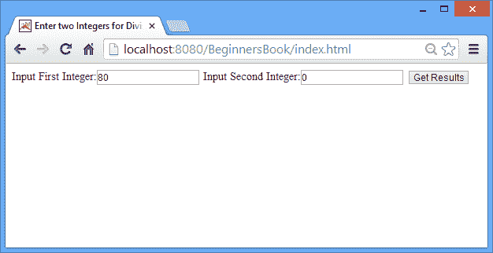
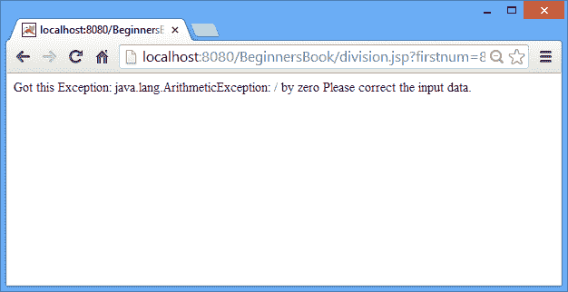

# JSP 中的`exception`隐式对象，带有示例

> 原文： [https://beginnersbook.com/2013/11/jsp-implicit-object-exception-with-examples/](https://beginnersbook.com/2013/11/jsp-implicit-object-exception-with-examples/)

在本教程中，我们将讨论 JSP 的`exception`隐式对象。它是 java.lang.Throwable 的一个实例，经常用于 JSP 中的异常处理。此对象仅适用于错误页面，这意味着 JSP 页面的 isErrorPage 应为 true，以便使用`exception`隐式对象。让我们在下面的例子的帮助下理解这一点 -

### `exception`隐式对象示例

在这个例子中，我们从用户那里获取两个整数输入，然后我们在它们之间进行划分。我们在下面的例子中使用了`exception`隐式对象来处理任何类型的异常。

index.html

```html
<html>
<head>
<title>Enter two Integers for Division</title>
</head>
<body>
<form action="division.jsp"> 
Input First Integer:<input type="text" name="firstnum" />
Input Second Integer:<input type="text" name="secondnum" /> 
<input type="submit" value="Get Results"/> 
</form>
</body>
</html>
```

这里我们将 exception.jsp 指定为 errorPage，这意味着如果在此 JSP 页面中发生任何异常，控件将立即转移到 exception.jsp JSP 页面。注意：我们使用了 Page Directive 的 **errorPage 属性来指定异常处理 JSP 页面（&lt;%@ page errorPage =“exception.jsp”%&gt;）。**

division.jsp

```html
<%@ page errorPage="exception.jsp" %> 
<% 
String num1=request.getParameter("firstnum"); 
String num2=request.getParameter("secondnum"); 
int v1= Integer.parseInt(num1);
int v2= Integer.parseInt(num2);
int res= v1/v2;
out.print("Output is: "+ res);
%>
```

在下面的 JSP 页面中，我们将 **isErrorPage 设置为 true** ，它也是 Page 指令的一个属性，用于使页面有资格进行异常处理。由于此页面在 division.jsp 中定义为异常页面，因此在任何异常情况下都将调用此页面。这里我们使用**`exception`隐式对象**向用户显示错误消息。

exception.jsp

```html
<%@ page isErrorPage="true" %> 
Got this Exception: <%= exception %> 
Please correct the input data.
```

**输出**

屏幕，带有两个输入字段，用于两个整数。



当我们提供第二个整数为零时的算术异常消息。



如果您对 JSP 中的`exception`隐式对象有任何疑问，请告诉我们。这是在 JSP 中构建应用时最常用的隐式对象之一。作为替代方案，您还可以通过在 JSP scriptlet 中使用 try catch 来处理 JSP 中的异常。