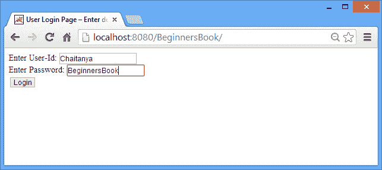
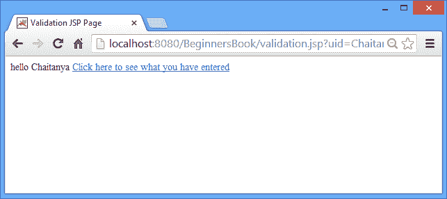
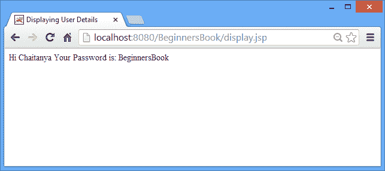

# JSP 中的`pageContext`隐式对象

> 原文： [https://beginnersbook.com/2013/11/jsp-implicit-object-pagecontext-with-examples/](https://beginnersbook.com/2013/11/jsp-implicit-object-pagecontext-with-examples/)

它是`javax.servlet.jsp.PageContext`的一个实例。使用此对象，您可以在以下任何级别找到属性，获取属性，设置属性和删除属性：

1.  JSP 页面 - 范围：`PAGE_CONTEXT`
2.  HTTP 请求 - 范围：`REQUEST_CONTEXT`
3.  HTTP 会话 - 范围：`SESSION_CONTEXT`
4.  应用级别 - 范围：`APPLICATION_CONTEXT`


### `pageContext`隐式对象的方法

1.  `Object findAttribute(String AttributeName)`：**此方法按以下顺序搜索所有四个级别中的指定属性 - 页面，请求，会话和应用。当在任何级别找不到属性时，它返回`NULL`。
2.  `Object getAttribute (String AttributeName, int Scope)`: 它在指定范围内查找属性。此方法类似于`findAttribute`方法。唯一的区别是`findAttribute`会按顺序在所有四个级别中查找，而`getAttribute`则在指定的范围中查找。 例如在以下语句中，`getAttribute`方法将在会话范围（或会话级别/层）中搜索属性`"BeginnersBook"`。如果找到该属性，则将其分配给`Object obj`，否则将返回`Null`。

    ```html
        Object obj = pageContext.getAttribute("BeginnersBook", PageContext.SESSION_CONTEXT);
    ```

    同样，该方法也可用于其他范围：

    ```html
        Object obj = pageContext.getAttribute("BeginnersBook", PageContext. REQUEST_CONTEXT);
        Object obj = pageContext.getAttribute("BeginnersBook", PageContext. PAGE_CONTEXT);
        Object obj = pageContext.getAttribute("BeginnersBook", PageContext. APPLICATION_CONTEXT);
    ```

3.  `void removeAttribute(String AttributeName, int Scope)`：此方法用于从给定范围中删除属性。例如 - 下面的 JSP 语句将从页面范围中删除属性`"MyAttr"`。

    ```html
        pageContext.removeAttribute(“MyAttr”, PageContext. PAGE_CONTEXT);
    ```

4.  `void setAttribute(String AttributeName, Object AttributeValue, int Scope)`：它在给定范围内写入属性。示例–下面的语句将在应用程序范围内存储值为`"This is my data"`的属性`"mydata"`。

    ```html
        pageContext.setAttribute(“mydata”, “This is my data”, PageContext. APPLICATION_CONTEXT);
    ```

    类似地，这将在请求范围中创建名为`attr1`的属性，其值为`"Attr1 value"`。

    ```html
        pageContext.setAttribute(“attr1”, “Attr1 value”, PageContext. REQUEST_CONTEXT);
    ```

### `pageContext`隐式对象示例

`index.html`

在这里，我们只是要求用户输入登录详细信息。

```html
<html>
<head>
<title> User Login Page – Enter details</title>
</head>
<body>
<form action="validation.jsp">
Enter User-Id: <input type="text" name="uid"><br>
Enter Password: <input type="text" name="upass"><br>
<input type="submit" value="Login">
</form>
</body>
</html>
```

`validation.jsp`

在此页面中，我们使用`pageContext`隐式对象和**会话范围**存储用户凭据，这意味着我们将能够访问详细信息，直到用户的会话处于活动状态。我们还可以使用其他范围参数存储属性，例如页面，应用和请求。

```html
<html>
<head> <title> Validation JSP Page</title>
</head>
<body>
<% 
String id=request.getParameter("uid");
String pass=request.getParameter("upass");
out.println("hello "+id);
pageContext.setAttribute("UName", id, PageContext.SESSION_SCOPE);
pageContext.setAttribute("UPassword", pass, PageContext.SESSION_SCOPE);
%>
<a href="display.jsp">Click here to see what you have entered </a>
</body>
</html>
```

`display.jsp`

在这个 JSP 页面中，我们使用`getAttribute`方法获取存储的属性。这里需要注意的是，我们已经使用会话范围存储了属性，因此我们必须将范围指定为会话才能获取这些属性的值。

```html
<html>
<head>
<title>Displaying User Details</title>
</head>
<body>
<%
String username= (String) pageContext.getAttribute("UName", PageContext.SESSION_SCOPE);
String userpassword= (String) pageContext.getAttribute("UPassword", PageContext.SESSION_SCOPE);
out.println("Hi "+username);
out.println("Your Password is: "+userpassword);
%>
</body>
</html>
```

**示例输出的屏幕截图：**

我们从用户接收用户 ID 和密码的登录页面。



有详细页面链接的页面：



用户凭据显示页面，我们已通过`pageContext`实例从登录页面传递到此页面。



如果您对`pageContext`隐式对象有任何疑问，请随时通过删除评论来询问。我们非常乐意为您提供帮助！