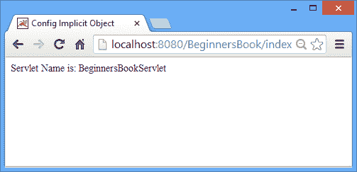

# 使用示例在 JSP 中配置隐式对象

> 原文： [https://beginnersbook.com/2013/11/jsp-implicit-object-config-with-examples/](https://beginnersbook.com/2013/11/jsp-implicit-object-config-with-examples/)

它是 **javax.servlet.ServletConfig** 的一个实例。 Config Implicit 对象用于获取特定 JSP 页面的配置信息。使用应用程序隐式对象，我们可以获得应用程序范围的初始化参数，但是使用 Config 我们可以获得单个 servlet 映射的初始化参数。

### 配置隐式对象的方法

1.  **String getInitParameter（String paramname）** - 与我们在应用程序隐式对象教程中讨论的相同。
2.  **Enumeration getInitParameterNames（）** - 返回 Initialization 参数的枚举。
3.  **ServletContext getServletContext（）** - 此方法返回对 Servlet 上下文的引用。
4.  **String getServletName（）** - 它返回我们在＆lt; servlet-name＆gt;里面的 web.xml 文件中定义的 servlet 的名称。标签。

**配置隐式对象示例**

web.xml

让我们说下面是我的 **web.xml** 文件。我只是在其中定义 servlet 名称和 servlet 映射。稍后，我将使用 config implicit object 从该文件中获取一些细节。

```
<web-app>
<servlet> 
<servlet-name>BeginnersBookServlet</servlet-name> 
<jsp-file>/index.jsp</jsp-file> 
</servlet> 

<servlet-mapping> 
<servlet-name>BeginnersBookServlet</servlet-name> 
<url-pattern>/index</url-pattern> 
</servlet-mapping> 
</web-app>
```

index.jsp

在这个 JSP 页面中，我们调用 config 对象的 getServletName（）方法，用于从 web.xml 文件中获取 servlet 名称。

```
<html>
<head> <title> Config Implicit Object</title>
</head>
<body>
<% 
String sname=config.getServletName(); 
out.print("Servlet Name is: "+sname); 
%>
</body>
</html>
```

**输出：**

这是上述 JSP 页面的输出屏幕。



这就是配置隐式对象的全部内容。如果您有任何问题，请随时在下面发表评论。