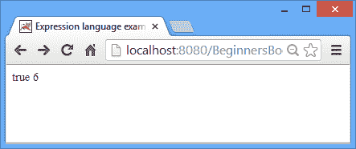
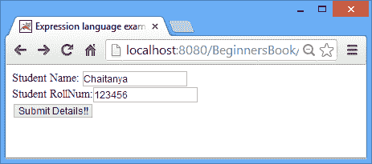
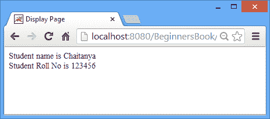
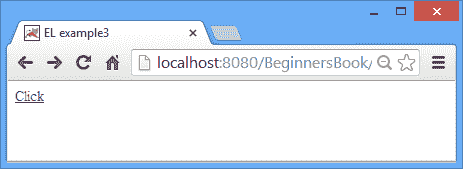

# JSP 表达式语言（EL） - JSP 教程

> 原文： [https://beginnersbook.com/2013/11/jsp-expression-language-el/](https://beginnersbook.com/2013/11/jsp-expression-language-el/)

表达式语言（EL）已在 JSP 2.0 中引入。它的主要目的是简化从 [bean](https://beginnersbook.com/2013/11/jsp-usebean-setproperty-getproperty-action-tags/) 属性和[隐式对象](https://beginnersbook.com/2013/11/jsp-implicit-objects/ "Implicit objects")访问数据的过程。 EL 也包括算术运算符，关系运算符和逻辑运算符。

**EL 语法：**

```
${expression}
```

大括号内的任何内容在运行时被评估并被发送到输出流。

**示例 1：表达式语言评估表达式**

在这个例子中，我们在 EL 的帮助下评估表达式。

```
<html> 
<head>
 <title>Expression language example1</title>
</head>
<body> 
${1<2}
${1+2+3}
</body> 
</html>
```

**输出：**



**示例 2：使用表达式语言**的 param 变量获取值

在此示例中，我们提示用户输入名称和卷号。在另一个 JSP 页面上，我们使用 EL 的 param 变量获取输入的详细信息。

index.jsp

```
<html> 
<head>
 <title>Expression language example2</title>
</head>
<body> 
<form action="display.jsp"> 
Student Name: <input type="text" name="stuname" /><br>
Student RollNum:<input type="text" name="rollno" /><br>
<input type="submit" value="Submit Details!!"/> 
</form> 
</body> 
</html>
```

display.jsp

```
<html>
<head>
<title>Display Page</title>
</head>
<body>
 Student name is ${ param.stuname } <br>
 Student Roll No is ${ param.rollno }
</body>
</html>
```

输出：





**示例 3：从应用对象获取值。**

在这个例子中，我们使用应用隐式对象设置了属性，在显示页面上我们使用表达式语言的 **applicationScope** 获得了这些属性。

的 index.jsp

```
<html>
 <head>
 <title>EL example3</title>
 </head>
 <body>
 <%
 application.setAttribute("author", "Chaitanya");
 application.setAttribute("Site", "BeginnesBook.com");
 %>
 <a href="display.jsp">Click</a>
 </body>
 </html>
```

display.jsp

```
<html>
 <head>
 <title>Display Page</title>
 </head>
 <body>
 ${applicationScope.author}<br>
 ${applicationScope.Site}
 </body>
 </html>
```

Output:




**EL 预定义变量：**

与 JSP 中的隐式对象类似，我们在 EL 中预定义了变量。在上面的例子中我们使用了 param 和 applicationScope，它们也是这些变量的一部分。

**pageScope** ：它有助于获取存储在 Page 范围中的属性。
**pageContext** ：与 JSP [PageContext 对象](https://beginnersbook.com/2013/11/jsp-implicit-object-pagecontext-with-examples/)相同。
**sessionScope** ：从[会话对象](https://beginnersbook.com/2013/11/jsp-implicit-object-session-with-examples/)设置的会话范围中获取属性。
**requestScope** ：用于从请求范围获取属性。由[设置的属性请求隐式对象](https://beginnersbook.com/2013/11/jsp-implicit-object-request-with-examples/)。
**param** ：类似于 **ServletRequest.getParameter** 。参考例 2\.
**applicationScope** ：用于获取 [Applicaton](https://beginnersbook.com/2013/11/jsp-implicit-object-application-with-examples/) 级别属性。与我们在示例 3 中看到的相同。
**标头**：它有助于将 HTTP 请求标头作为字符串获取。
**headerValues** ：用于获取所有 HTTP 请求头。
**initParam** ：它链接到上下文初始化参数。
**paramValues** ：与 ServletRequest.getParmeterValues 相同。
**cookie** ：它映射到 Cookie 对象。