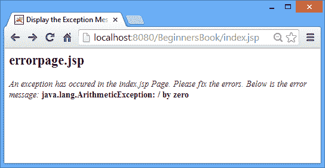
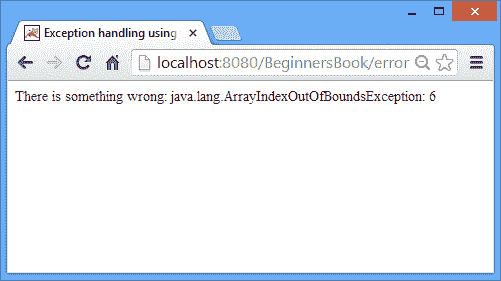

# JSP 中的异常处理

> 原文： [https://beginnersbook.com/2013/11/jsp-exception-handling/](https://beginnersbook.com/2013/11/jsp-exception-handling/)

在通过 JSP 中的异常处理之前，让我们了解什么是异常以及它与错误的区别。

**异常：**这些只是中断正常执行流程的异常情况。大多数情况下，它们是由于用户输入的错误数据而发生的。必须处理异常才能向用户提供有意义的消息，以便用户能够理解问题并采取适当的措施。

**错误：**这可能是代码或系统相关问题的问题。我们不应该处理错误，因为它们是要修复的。

**处理异常的方法：**

我们可以使用以下两种方法处理异常。

*   使用`exception`[隐式对象](https://beginnersbook.com/2013/11/jsp-implicit-objects/)进行异常处理
*   使用 scriptlet 中的`try catch`块进行异常处理

### 使用`exception`隐式对象进行异常处理

在下面的例子中 - 我们使用[`page`指令](https://beginnersbook.com/2013/05/jsp-tutorial-directives/ "Page Directive")的`errorPage`属性指定了异常处理页面。如果主 JSP 页面中发生任何异常，控件将被转移到`errorPage`属性中提到的页面。

处理程序页面应将`isErrorPage`设置为`true`，以便使用[`exception`隐式对象](https://beginnersbook.com/2013/11/jsp-implicit-object-exception-with-examples/ "Exception implicit object")。这就是我们为`errorpage.jsp`设置`isErrorPage`为`true`的原因。

`index.jsp`

```html
<%@ page errorPage="errorpage.jsp" %>
<html>
<head>
  <title>JSP exception handling example</title>
</head>
<body>
<%
     //Declared and initialized two integers
     int num1 = 122;
     int num2 = 0;

     //It should throw Arithmetic Exception
     int div = num1/num2;
%>
</body>
</html>
```

`errorpage.jsp`

```html
<%@ page isErrorPage="true" %>
<html>
<head>
  <title>Display the Exception Message here</title>
</head>
<body>
   <h2>errorpage.jsp</h2>
   <i>An exception has occurred in the index.jsp Page.
   Please fix the errors. Below is the error message:</i>
   <b><%= exception %></b>
</body>
</html>
```

**输出：**

### 

使用 scriptlet 中的`try catch`块进行异常处理

我们在下面的示例中使用`try catch`块处理了异常。因为`try catch`块是 java 代码所以它必须放在 [sciptlet](https://beginnersbook.com/2013/05/jsp-tutorial-scriptlets/ "Scriptlet") 中。在下面的例子中，我声明了一个长度为 5 的数组，并尝试访问不存在的第 7 个元素。它导致`ArrayIndexOutOfRange`异常。

`error.jsp`

```html
<html>
 <head>
 <title>Exception handling using try catch blocks</title>
 </head>
 <body>
 <%
 try{
     //I have defined an array of length 5
     int arr[]={1,2,3,4,5};
     //I'm assinging 7th element to int num
     //which doesn't exist
     int num=arr[6];
     out.println("7th element of arr"+num);
 }
 catch (Exception exp){
     out.println("There is something wrong: " + exp);
 }
 %>
 </body>
 </html>
```

示例 2 的**输出：**



让我们知道您更喜欢哪种方法来处理异常以及原因。如果您有任何疑问，请随时将其放在下面的评论部分。