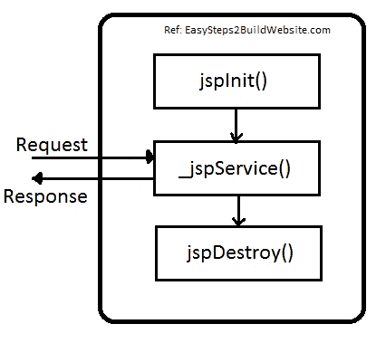

# Java 服务器页面（JSP）生命周期

> 原文： [https://beginnersbook.com/2013/05/jsp-tutorial-life-cycle/](https://beginnersbook.com/2013/05/jsp-tutorial-life-cycle/)


JSP 页面以`.jsp`扩展名保存，这使服务器知道这是一个 JSP 页面，需要经历 JSP 生命周期阶段。
在我之前关于 JSP 介绍的文章中，我解释说 JSP 不是这样处理的，它们首先被转换为 Servelts，然后相应的 Servlet 由服务器处理。

当客户端向服务器发出请求时，它首先转到容器。然后容器检查 Servlet 类是否比 JSP 页面旧（确保 JSP 文件被修改）。如果是这种情况，那么容器再次执行转换（将 JSP 转换为 Servlet），否则它会跳过转换阶段（即，如果 JSP 网页未被修改，那么它不会进行转换以提高性能，因为此阶段需要时间并且每次重复这一步都不是时间可行的）

**JSP 页面生命周期中的步骤是：**

1.  翻译
2.  汇编
3.  载入中
4.  实例化
5.  初始化
6.  请求处理
7.  销毁



**让我们更详细地看一下 JSP 的生命周期 -**

1）如上所述，只要容器收到来自客户端的请求，它只在`Servlet`类比 JSP 页面更旧时才进行转换。其他它跳过这个阶段（我上面解释的原因）。

2）然后容器 -

*   编译相应的`Servlet`程序
*   加载相应的`Servlet`类
*   实例化`Servlet`类
*   调用`jspInit()`方法**来初始化`Servlet`实例（仅当`Servlet`文件的实例未运行或者它比 JSP 文件旧时，JSP 容器才会执行此作业。）

```
public void jspInit() {
    //初始化 Servlet 实例的代码
}
```

3）然后创建一个新线程，它调用`_jspService()`方法，请求（`HttpServletRequest`）和响应（`HttpServletRespnse`）对象作为参数 - 如下所示。

```
void _jspService(HttpServletRequest req, HttpServletResponse res) {
    // 代码在这里
}
```

4）调用`jspDestroy()`方法**来销毁`Servlet`类的实例。代码如下所示 -

```
public void jspDestory()
{
    //删除 Servlet 类的实例的代码
}
```
