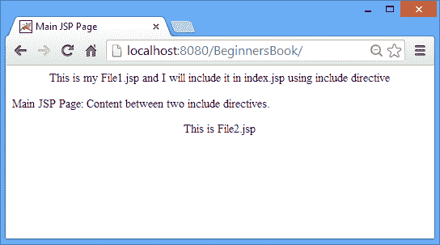

# 在 JSP 中包含指令

> 原文： [https://beginnersbook.com/2013/11/jsp-include-directive/](https://beginnersbook.com/2013/11/jsp-include-directive/)

**Include 指令**用于在转换阶段将外部文件合并到当前 JSP 页面（JSP 转换为等效 Servlet 的阶段）。

**为什么我们需要使用 include 指令？我们不能简单地在当前 JSP 中添加文件的内容而不是使用指令吗？**

我们可以复制外部文件的内容并将其粘贴到主 JSP 中，但是**不是一个好习惯**。让我们借助一个例子理解这一点 - 我有 100 个外部文件和 1 个主 JSP 文件。如果我只是复制主 JSP 中所有文件的内容，那么只要任何外部文件发生更改，我就必须编辑它，而是我们可以使用指令包含所有文件，并在需要时编辑特定文件。

此外，通过使用 include 指令，您可以增强**代码的可重用性** - 假设在您的应用程序的所有 JSP 页面中都需要存在某些代码或数据，那么您可以简单地使用该代码/数据在一个文件中，并在所有 JSP 页面中包含该文件。

以上两个原因可以被认为是使用 include 指令的优点。

### **语法：**

这是 JSP 中 **include 指令的语法。**

```
<%@ include file="URL of the file" %>
```

我们必须指定相对 URL -

如果 file 与当前 JSP 页面所在的文件夹相同，那么我们只需提及文件名，否则需要指定文件的相对路径。

### 包括指令示例

index.jsp

```
<html>
<head>
<title>Main JSP Page</title>
</head>
<body>
<%@ include file="file1.jsp" %>
Main JSP Page: Content between two include directives.
<%@ include file="file2.jsp" %>
</body>
</html>
```

file1.jsp

```
<p align="center">
This is my File1.jsp and I will include it in index.jsp using include directive
</p>
```

file2.jsp

```
<p align="center">
This is File2.jsp
</p>
```

**输出：**运行上面的代码时输出如下所示。如您所见，我们在 include 指令的帮助下将 file1 和 file2 的内容包含在主 JSP 页面中。



如果您对此有任何疑问，请告诉我们。