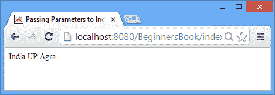

# JSP 带参数的`include`指令

> 原文： [https://beginnersbook.com/2013/12/jsp-include-directive-with-parameters-example/](https://beginnersbook.com/2013/12/jsp-include-directive-with-parameters-example/)

在上一个教程中，我们讨论了 [JSP `include`参数](https://beginnersbook.com/2013/12/jsp-include-with-parameter-example/)的动作。这里我们将看到在使用 [JSP `include`指令](https://beginnersbook.com/2013/11/jsp-include-directive/)时如何传递参数。

## 例

在这个例子中，我们将三个字符串参数传递给包含的 JSP 页面。

`index.jsp`

```html
<html>
<head>
<title>Passing Parameters to Include directive</title>
</head>
<body>
<%@ include file="file1.jsp" %>
<%!
String country="India"; 
String state="UP";
String city="Agra";
%>
<% 
session.setAttribute("co", country);
session.setAttribute("st", state);
session.setAttribute("ci", city);
%>
</body>
</html>
```

上面，我使用[声明标签](https://beginnersbook.com/2013/11/jsp-declaration-tag/)初始化字符串， [scriptlet](https://beginnersbook.com/2013/05/jsp-tutorial-scriptlets/) 用于在[`session`对象](https://beginnersbook.com/2013/11/jsp-implicit-object-session-with-examples/)中设置它们。由于 sciptlet 的使用被忽视了长背，或者你可以使用[`<c:set>` JSTL 标签](https://beginnersbook.com/2013/11/jstl-cset-core-tag/)做同样的事 - 代码就像这样 -

```html
<%@ taglib uri="http://java.sun.com/jsp/jstl/core" prefix="c" %>
<c:set var="co" value="India" scope="session"/>
<c:set var="st" value="UP" scope="session"/>
<c:set var="ci" value="Agra" scope="session"/>
<%@ include file="file1.jsp" %>
```

`file1.jsp`

```html
<%=session.getAttribute("co") %>
<%=session.getAttribute("st") %>
<%=session.getAttribute("ci") %>
```

输出：



在上面的例子中，我使用`session`隐式对象传递了参数，但是您也可以使用请求，页面和`application`隐式对象传递它们。